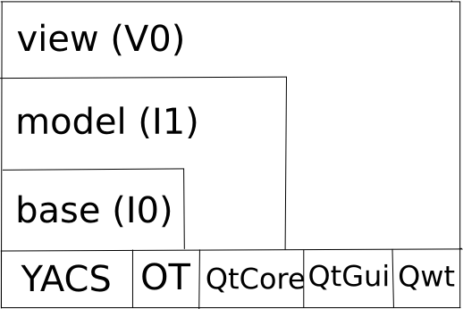
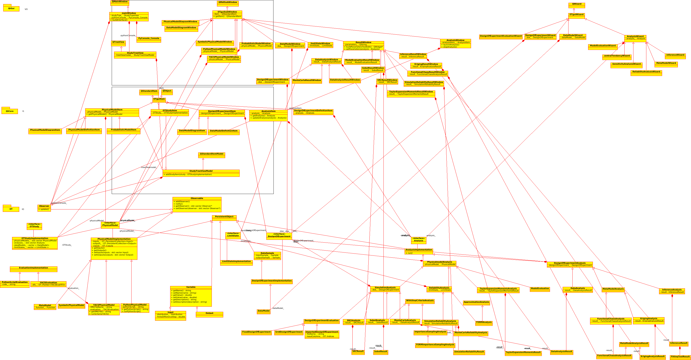

Architecture considerations
===========================

Dependencies
------------

Several dependencies are needed in order to build the GUI:

- OpenTURNS >= 1.9
- Qt >= 4
- Qwt >= 6
- Python >= 2.7, < 3
- Boost.regex
- Boost.filesystem
- SalomeYACS (optional, for YACS support
- Sphinx-doc (optional for this doc)

Compilation
-----------

.. code::

    cd persalys
    mkdir -p build && cd build
    cmake \
      -DCMAKE_INSTALL_PREFIX=$PWD/install \
      -DOpenTURNS_DIR=$PWD/../../openturns/build/install/lib/cmake/openturns \
      -DSalomeKERNEL_DIR=$ROOT_SALOME_MECA/V2015_1/modules/KERNEL_V7_5_1/salome_adm/cmake_files/ \
      -DSalomeGUI_DIR=$ROOT_SALOME_MECA/V2015_1/modules/GUI_V7_5_1/adm_local/cmake_files \
      -DSalomeYACS_DIR=$ROOT_SALOME_MECA/V2015_1/modules/YACS_V7_5_1/adm/cmake/ ..

Source code structure
---------------------

The GUI classes are organized by 3 layers: I0, I1, V0.
This layered organization is reflected in the sources with three different folders and their associated sub-libraries.

Here is the global class diagram for each layer:

