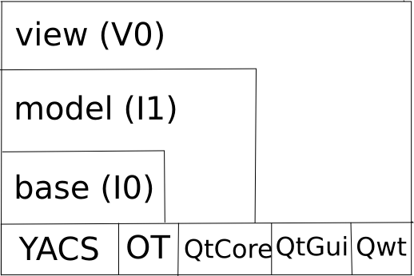
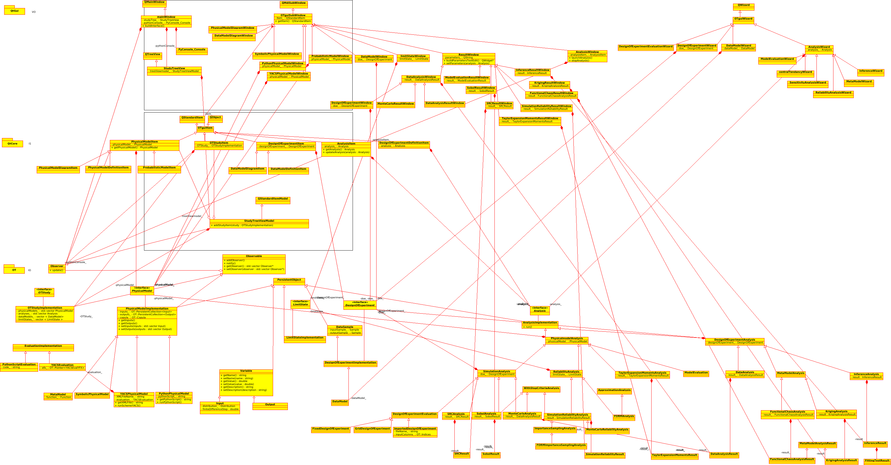

Architecture considerations
===========================

Dependencies
------------

Several dependencies are needed in order to build the GUI:

- CMake >=3.13
- OpenTURNS >=1.24
- `otfmi <https://github.com/openturns/otfmi>`_ >=0.14 (optional, for FMI support)
- `otmorris <https://github.com/openturns/otmorris>`_ >=0.17 (optional, for Morris support)
- Qt >=5
- Qwt >=6
- Python >=3.6
- SWIG >=4
- Boost.locale/program_options
- SalomeYACS (optional, for YACS support)
- Sphinx >=1.8 (optional, for doc)
- Numpydoc >=0.9 (optional, for doc)
- ParaView >=5.8 (optional, for visualization)

Compilation
-----------

.. code::

    git clone https://git.phimeca.com/ot-edf/otgui.git persalys
    cd persalys
    mkdir -p build && cd build
    cmake \
      -DCMAKE_INSTALL_PREFIX=$PWD/install \
      -DOpenTURNS_DIR=$PWD/../../openturns/build/install/lib/cmake/openturns \
      -DParaView_DIR=$PWD/../../paraview/build/install/lib/cmake/paraview \
      -DOTMORRIS_DIR=$PWD/../../otmorris/build/install/lib/cmake/otmorris \
      ..
    make install

To run it::

    persalys.sh

Translation
-----------

.. code::

    lupdate -verbose lib/ -ts translations/persalys_fr.ts -no-obsolete
    linguist translations/persalys_fr.ts

Python console menu translation::

    lupdate -verbose lib/src/view/PyConsole/ -ts lib/src/view/PyConsole/resources/PyConsole_msg_fr.ts  -no-obsolete
    linguist lib/src/view/PyConsole/resources/PyConsole_msg_fr.ts

publish ``PyConsole_msg_fr.qm`` in ``translations/``

Source code structure
---------------------

The GUI classes are organized by 3 layers: I0, I1, V0.
This layered organization is reflected in the sources with three different folders and their associated sub-libraries.

Here is the global class diagram for each layer:

Details on implementing a new type of object
~~~~~~~~~~~~~~~~~~~~~~~~~~~~~~~~~~~~~~~~~~~~

- Pull request ``!523`` shows the implementation of a new type of object intended to be used in a study, along with its associated analysis and results
- Start by implementing ``Object`` and ``ObjectImplementation`` classes
- A new type of object ``Object`` must belong to either one of the existing or a new ``Collection`` as ``StudyImplementation`` attributes, along with the appropriate ``StudyImplementation`` methods (``getObjects``, ``getObjectByName``, ``hasObjectNamed``, ``getAvailableObjectName``, ``add``, ``remove``)

- Implement in ``src/model``

  - ``ObjectItem`` : base class
  - ``ObjectDefinitionItem`` : for handling ``Object`` and study tree interactions
  - ``ObjectDiagramItem`` : for handling ``Object`` and diagram window interactions

- Create an action in ``src/model/ItemFactory`` intended to add the ``Object`` to the study
- This action is connected to a new button in ``src/view/StudyWindow``
- ``Observer`` class must implement a dedicated ``appendItem(const Object&)`` method, this allows to call a new ``ObjectWindow``

- Implement in ``src/view``

  - ``ObjectDiagramWindow`` : dedicated ``Object`` diagram window
  - ``ObjectWindow`` : dedicated ``Object`` window for ``Object`` definition

- Add a case in ``WindowFactory::GetWindow``, based on the ``src/model/ObjectItem`` to allow the instantiation of the two ``ObjectWindow`` and ``ObjectDiagramWindow``
