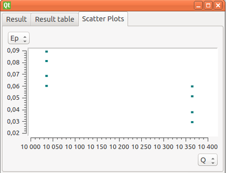
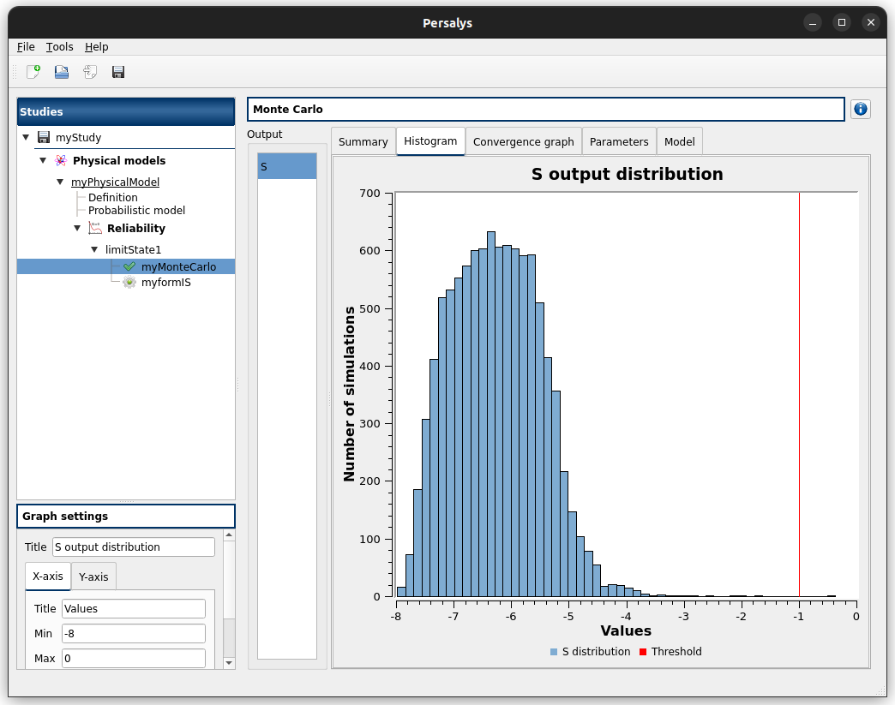
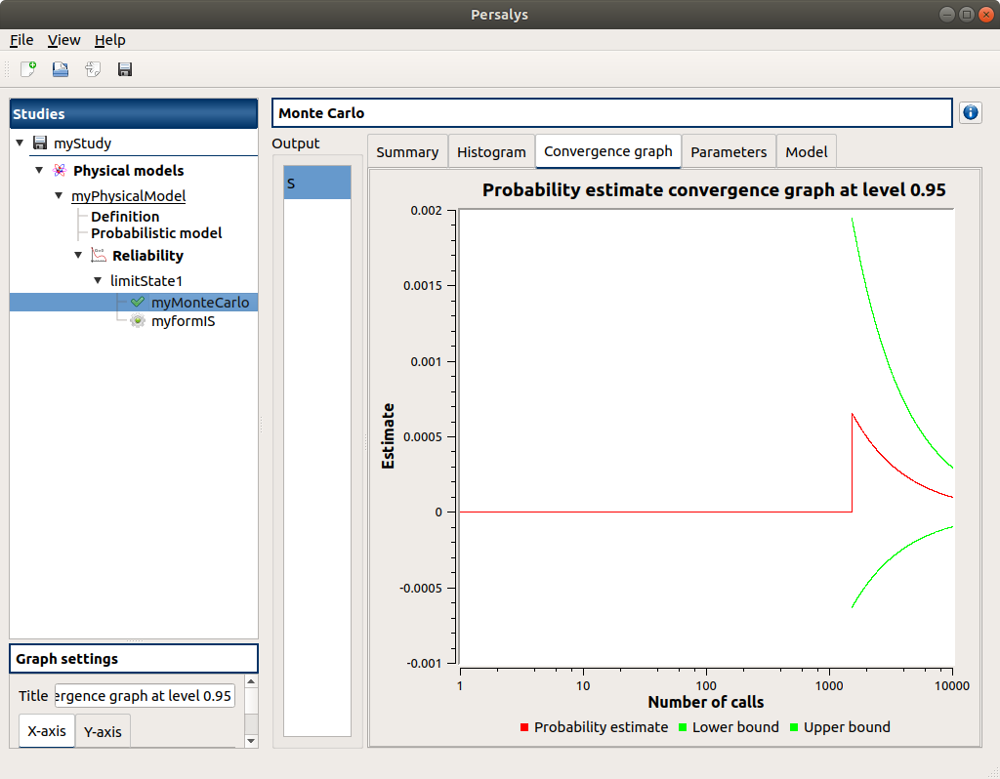
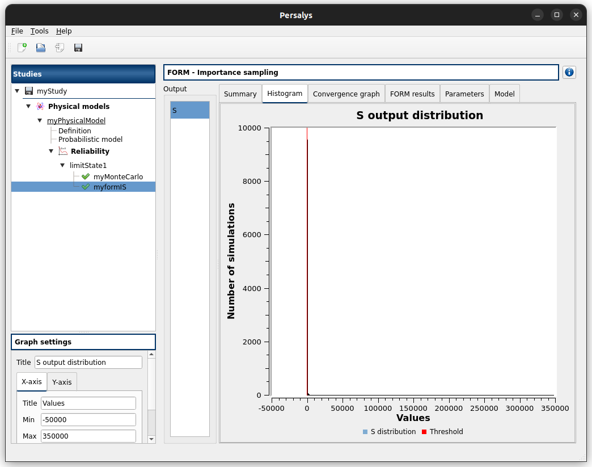
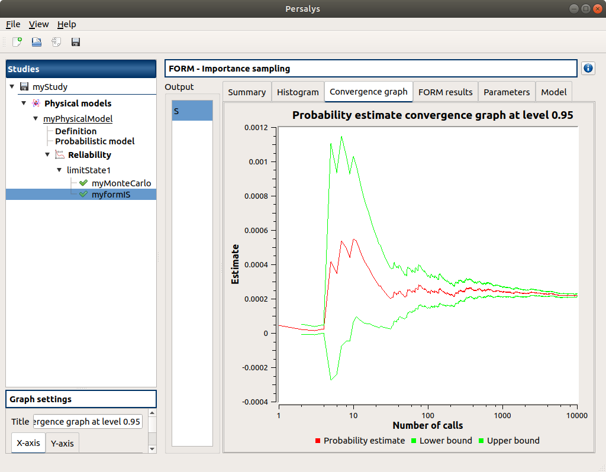

Validation
==========


Test case 1: Cogeneration
-------------------------

This test-case originates from [ProtoOTGUI2014]_ and can be found in python/test/t_Cogeneration_std.py.

The purpose of this example is to check:
  - The Central tendency analysis using the Taylor Expansions;
  - the default values calculated for the parameters of a parametric analysis.

The obtained results must be equal to the analytical values.

.. container:: toggle

    .. container:: header

        Show/Hide Code

    .. literalinclude:: ../../t_Cogeneration_std.py

1- Problem statement
````````````````````

1-1 Inputs
''''''''''

- Stochastic variables:

====== ======================== ==================
 Name  Description              Distribution
====== ======================== ==================
Q      Primary energy           Normal(10200, 100)
E      Produced electric energy Normal(3000, 15)
C      Valued thermal energy    Normal(4000, 60)
====== ======================== ==================

1-2 Output
''''''''''

Primary energy savings :math:`E_p`

.. math::

    Ep = 1-\frac{Q}{\frac{E}{0.54(1-0.05)}+\frac{C}{0.8}}


2- Central tendency analysis
````````````````````````````

2-1 Inputs
''''''''''

The central tendency analysis is performed with the Taylor Expansions method.

3-1 Results
'''''''''''

3-1-1 Values
************

================ ================= ================== ===========
First order mean Second order mean Standard deviation Variance
================ ================= ================== ===========
0.0597305        0.0596787         0.0115612          0.000133661
================ ================= ================== ===========

3- Deterministic parametric analysis
````````````````````````````````````

3-1 Inputs
''''''''''

The minimum and the maximum values are computed automatically thanks to
the distribution of the variables. The minimum value is the quantile at the
probability of 0.05 and the maximum one is the quantile at the probability of
0.95. The number of used values per variable is by default 2.

======== ======= ======= ================
Variable Min     Max     Number of values
======== ======= ======= ================
Q        10035.5 10364.5        2
E        2975.33 3024.67        2
C        3901.31 4098.69        2
======== ======= ======= ================

3-2 Results
'''''''''''

3-2-1 Values
************

======= ======= ======= =========
Q       E       C       Ep
======= ======= ======= =========
10035.5 2975.33 3901.31 0.0600385
10364.5 2975.33 3901.31 0.0292232
10035.5 3024.67 3901.31 0.0684305
10364.5 3024.67 3901.31 0.0378903
10035.5 2975.33 4098.69 0.0812696
10364.5 2975.33 4098.69 0.0511503
10035.5 3024.67 4098.69 0.0892884
10364.5 3024.67 4098.69 0.059432
======= ======= ======= =========

The points are generated according to the structure of a box design of experiments.
This deterministic design of experiments has 8 points obtained by regularly discretizing
the pavement :math:`[10035.5, 10364.5] \times [2975.33, 3024.67] \times [3901.31, 4098.69]`.

The minimum value of :math:`Ep` is 0.0292232 with X=[10364.5 2975.33 3901.31].
The maximum value of :math:`Ep` is 0.0892884 with X=[10035.5 3024.67 4098.69].


3-2-1 Figures
*************

.. image:: min_max_result_cogeneration.png
    :width: 443px
    :align: center
    :height: 340px



4- Reference
````````````

Test case 2: Flood
------------------

This test-case originates from [ProtoOTGUI2014]_ and can be found in python/test/t_Crue_std.py.

.. container:: toggle

    .. container:: header

        Show/Hide Code

    .. literalinclude:: ../../t_Crue_std.py

1- Problem statement
````````````````````

1-1 Inputs
''''''''''

- Stochastic variables:

====== ======================== ===================================
 Name  Description              Distribution
====== ======================== ===================================
Q      River flow               Gumbel(alpha=0.00179211, beta=1013)
Ks     Manning-Strickler factor Normal(30, 7.5)
Zm     River's depth upstream   Uniform(54,56)
Zv     River's depth downstream Uniform(49, 51)
====== ======================== ===================================

1-2 Output
''''''''''

Difference between the dike height and the water level :math:`S`

.. math::

    S = \left(\frac{Q}{Ks\times300\times\sqrt{(Zm-Zv)/5000}}\right)^{(3/5)} +Zv-55.5-3

2- Reliability analysis (MonteCarlo)
````````````````````````````````````

2-1 Inputs
''''''''''

The limit state is defined by

.. math::
    S > -1

The analysis is performed with the Monte Carlo method with the following parameters:

================================ ========
Name                             Value
================================ ========
Maximum calls                    10000
Maximum coefficient of variation 0.01
Seed                             0
Block size                       1
================================ ========

2-2 Results
'''''''''''

2-2-1 Values
************

=================== ======================== =============================================
Failure probability Coefficient of variation Confidence interval at 95%
=================== ======================== =============================================
0.0001              0.99995                  :math:`\left[0; 0.000295987\right]`
=================== ======================== =============================================

2-2-2 Figures
*************





3- Reliability analysis (Importance Sampling)
`````````````````````````````````````````````

3-1 Inputs
''''''''''

The limit state is defined by

.. math::
    S > -1

The analysis is performed with the Monte Carlo method with the following parameters:

================================ ====================
Name                             Value
================================ ====================
Maximum calls                    10000
Maximum coefficient of variation 0.01
Seed                             0
Block size                       1000
-------------------------------- --------------------
Algorithm                        Abdo-Rackwitz
Physical starting point          1013; 30.001; 50; 55
Number of evaluations            1000
Errors (abs., rel., res., con.)  1e-05
================================ ====================

3-2 Results
'''''''''''

3-2-1 Values
************

=================== ======================== =============================================
Failure probability Coefficient of variation Confidence interval at 95%
=================== ======================== =============================================
0.000221975         0.0206289                :math:`\left[0.000213; 0.000230945\right]`
=================== ======================== =============================================

3-2-2 Figures
*************





Graphical validation
--------------------

Find here the procedure to validate the graphical interface

Open
``````

- open persalys

  - there are a Menu bar, a Tool bar, a Python console, a status bar

  - a window with 3 buttons (New study/Open study/Import Python script) appears

  .. image:: /developer_manual/validation/welcomeWindow.png
      :align: center

Console Python
````````````````

- open persalys
- click Menu->View->Window->Python Console

  - console shown
- click Menu->View->Window->Python Console

  - console hidden
- click Menu->View->Window->Python Console

  - console shown
- close the console

  - console hidden

Open documentation
``````````````````

- click Menu->Help->User's manual

  - the documentation is opened in a web browser


New Study
```````````

- click on button New study in the mdiArea

  - item Study_0 appears in the tree view

  - a 'study' window with 6(+2) buttons appears:
    - Symbolic model
    - Python model
    - Coupling
    - YACS model (optional)
    - FMI model (optional)
    - Symoblic Field Model
    - Python Field Model
    - Data model

- click Menu->File->New

  - item Study_1 appears in the tree view
    - the item is associated with a 'study' window

- click icon New Study in the Tool bar

  - item Study_2 appears in the tree view
    - the item is associated with a 'study' window

- press keys CTRL + N

  - item Study_3 appears in the tree view
    - the item is associated with a 'study' window

  .. image:: /developer_manual/validation/otstudyWindow.png
      :align: center

Rename Study
``````````````

- double click on Study_1 item, rename Study_1 as myOTStudy, press enter

  - the item is renamed

- right click on Study_2 item, on the context menu which appears click on Rename, rename Study_2 as myOTStudy2, press enter

  - the item is renamed

- left-click select Study_3, press F2, rename Study_3 as myOTStudy3, press enter

Save/open Study
````````````````````

- save myOTStudy with Menu->File->save, close with Menu->File->close, reopen with Menu->File->open

- right click on myOTStudy, choose Rename, rename myOTStudy by myOTStudy1, save myOTStudy1 with the icon of the tool bar, close with right click + close, reopen with the icon of the tool bar

- rename myOTStudy1 by myOTStudy2, save myOTStudy2 in pressing CTRL + S, close with right click + close, reopen with press keys CTRL + O

- rename myOTStudy2 by myOTStudy3, save myOTStudy3 with right click + save, close with right click + close, reopen with press keys CTRL + O

Export/Import Study
`````````````````````

- export myOTStudy3 with right click + Export Python, name the file test.py

- close the interface with Menu->File->Exit

  - close without saving all the studies (except myOTStudy3)

- open the interface

- click on button Import Python script in the mdiArea

  - choose test.py

- click on the icon Import Python of the tool bar

  - a message box appears to close opened studies, click OK

  - a message box appears to save the current study, click close without saving

  - choose the script test.py

- close myOTStudy3

- click on Menu->File->Import Python...

  - choose test.py

- close the interface in pressing CTRL + Q

  - close without saving

Models
```````

- open the interface

  .. code-block:: console

      cd persalys_dir/build_dir
      ./persalys.sh

- Import the file ../python/test/test_deterministic_analyses.py

- click on 'Definition' child item of 'symbolicModel' item

  .. image:: /developer_manual/validation/model1.png
      :align: center

- click on 'Check model' button below the outputs table
    - fake_var is not evaluated

- select lines 1 of the outputs table
    - first header item is checked

- click on 'Check model' button
    - fake_var is evaluated

- change x2 value to 1.5 + press enter
    - outputs values are reinitialized

- unselect all outputs

- click on 'Check model' button
    - nothing appends

- check fake_var + change its formula to 'x1 +'

- click on 'Check model' button
    - error message 'Errors found when parsing expression etc.'

- unselect fake_var + select y0, fake_y0 and y1

- change x2 value to 1.2 + press enter

- check the doc link

- click on 'Definition' child item of 'pythonModel' item

  .. image:: /developer_manual/validation/model2.png
      :align: center

- check the doc link

- click on 'Definition' child item of 'couplingModel' item

  - click on 'Input' tab

    - Edit any input value and associated format

    - click on 'Check template' button

    - expand 'Template/Input comparison' group box and visually
      confirm the template has been correctly read and values have
      been correctly replaced

  .. image:: /developer_manual/validation/model5.png
      :align: center

  - click on 'Output' tab

    - click on check output button

      - select ../python/test/coupling_model/beam_output.txt

      - check that the value is correctly displayed below the button

    - click on 'Evaluate model' button

      - check that the ouput value for deviation has been updated in the table

- check the doc link

- click on 'Definition' child item of 'fixedDataModel' item

  .. image:: /developer_manual/validation/model4.png
      :align: center

  - click on reload button : nothing appends

- click on 'Definition' child item of 'importDataModel' item

  .. image:: /developer_manual/validation/model3.png
      :align: center

  - a message stating the sample contains invalid values should be displayed

  - find the troublesome line at the end of the sample, right-click on
    it and delete it using the popup menu

  - the message should disapprear

  - click on reload button : the troublesome line is back, along with the message

  - run the data cleaning wizard using the popop right click menu

  - choose one of the replacement/removing feature

  - the troublesome line and message are gone

- check the doc link


Deterministic analyses
``````````````````````

- Each analysis item is associated with a window with a table of parameters (optional), a progress bar and a button 'Run' and a disabled button 'Stop'

- Check all the analyses wizards -> Right click on each item and choose Modify :

  - Evaluation : item evaluation1

    .. image:: /developer_manual/validation/evaluation_wizard.png
        :align: center

    - deselect fake_y0

    - check the values : [0.2, 1.2, 1]

    - click on the Finish button

      - a window appears with a table of parameters, a progress bar and 2 buttons 'Run' and 'Stop'
      - click on the 'Run' button

      .. image:: /developer_manual/validation/evaluation_window.png
          :align: center

    - check result window

      .. image:: /developer_manual/validation/evaluation_result.png
          :align: center

      - results only for y0 and y1

  - Optimization : item optim

    - First page check the values :

      .. image:: /developer_manual/validation/optimization_wizard_1st_page.png
          :align: center

      - selected output : y1
      - method : TNC
      - continue

    - Second page check the values :

      - x1 and x2 checked
      - starting point : [0.2, 1.2, 1.]
      - check table behavior:

        - unselect line : lower and upper bounds columns are disabled
        - unselect a lower bound : -inf symbol
        - unselect an upper bound : +inf symbol
        - if lower > upper bound : variable name in red, tooltip on the name and can not validate the page
        - if upper < lower bound : variable name in red, tooltip on the name and can not validate the page
        - if starting point not in the interval [lower bound, upper bound] : variable name in red, tooltip on the name and can not validate the page
      - set lower bounds : [0, 0, 0.9]
      - set upper bounds : [10, 10, 1.1]

      .. image:: /developer_manual/validation/optimization_wizard_2nd_page.png
          :align: center

    - Third page check the values :

      .. image:: /developer_manual/validation/optimization_wizard_3rd_page.png
          :align: center

      - Problem type : Minimization
      - Number of function evaluations : 150
      - Absolute/Relative/Residual/Constraint error : 1e-6

    - click on the Finish button

      - a window appears with a table of parameters, a progress bar and 2 buttons 'Run' and 'Stop'
      - click on the 'Run' button

    - check result window :

      .. image:: /developer_manual/validation/optimization_result.png
          :align: center

      - left side : 1 variable in the list view
      - right side, tabs : Result - Convergence - Parameters - Model
      - Convergence tab : 2 tabs : Optimal value - Error
      - when a plot is displayed, a Graph setting widget appears at the bottom of the tree view : check its behavior

  - Morris : aMorris item

    - First page check the values :

      .. image:: /developer_manual/validation/morris_wizard_1st_page.png
          :align: center

      - selected output : y0
      - method : Morris
      - continue

    - Second page check the values :

      - 3 lines
      - check table behavior:

        - if lower > upper bound : variable name in red, tooltip on the name and can not validate the page
        - if upper < lower bound : variable name in red, tooltip on the name and can not validate the page
      - set lower bounds : [0, 0, 0.9]
      - set upper bounds : [10, 10, 1.1]

      .. image:: /developer_manual/validation/morris_wizard_2nd_page.png
          :align: center

    - Third page check the values :

      .. image:: /developer_manual/validation/morris_wizard_3rd_page.png
          :align: center

      - Number of trajectories : 10
      - Level : 4
      - Seed : 2
      - Number of simulations : 40
      - check page behavior:

        - if Number of trajectories : 11 -> Number of simulations : 44

    - click on the Finish button

      - a window appears with a table of parameters, a progress bar and 2 buttons 'Run' and 'Stop'
      - click on the 'Run' button

    - check result window :

      .. image:: /developer_manual/validation/morris_result.png
          :align: center

      - left side : 1 variable in the list view
      - right side, tabs : Elementary effects - Table - Cobweb plot - Plot matrix - Scatter plots - Parameters - Model
      - Elementary effects tab : 2 tabs : Graph (mu*, sigma) - Graph (mu*, mu)
      - when a plot is displayed, a Graph setting widget appears at the bottom of the tree view : check its behavior
      - check the tabs (Table - Cobweb plot - Plot matrix - Scatter plots) are linked :
        do several selections in a tab and check the selection is the same in the others tabs

      - check Elementary effects tab behavior:

        - selection of points in the graphs (right click + draw rectangle) : a context menu appears with items : De/select the points
        - click on the x-axis : move the green vertical line. Check the line's position is synchronized on the two graphs
        - all points at the left of the green line on the graphs correspond to the lines of the table with a cross in the No effect column
        - the blue points on the graphs correspond to the selected lines of the table
        - the red points on the graphs correspond to the unselected lines of the table

    - check the reuse of the Morris result by the Probabilistic model :

      - create a Probabilistic model for symbolicModel (right click on Definition item below symbolicModel)
      - On the window which appears, select all variables of the table

        .. image:: /developer_manual/validation/probaModelAll.png
            :align: center

      - Click on the 'Import Morris result' button below the table
      - a wizard appears

        .. image:: /developer_manual/validation/morrisResultWizard.png
            :align: center

      - check the table is read-only
      - click on Finish
      - check that x_2 and x_3 are unselected
      - uncheck x_1

  - Calibration : item calibration

    - First page check the values :

      .. image:: /developer_manual/validation/calibrationWizard_1stPage.png
          :align: center

      - Observations : observations
      - Observed variables : [x1, y0]
      - Number of observations : 100
      - method : Non linear Gaussian
      - continue

    - Second page check the values :

      .. image:: /developer_manual/validation/calibrationWizard_2ndPage.png
          :align: center

      - x2 checked, x3 unchecked
      - values : [1.2, 1.1]
      - continue

    - Third page check the values :

      .. image:: /developer_manual/validation/calibrationWizard_3rdPage.png
          :align: center

      - only x2 in the table.
      - the mean is disabled
      - the mean is 1.2 and sigma is 0.12
      - continue

    - Fourth page :

      .. image:: /developer_manual/validation/calibrationWizard_4thPage.png
          :align: center

      - only y0 in the table
      - the mean is disabled
      - continue

    - Fifth page :

      .. image:: /developer_manual/validation/calibrationWizard_5thPage.png
          :align: center

      - confidence interval length : 0.99
      - estimation by Bootstrap resampling : checked
      - sample size : 25
      - Number of evaluations : 50
      - Errors : 1e-6
      - Maximum number of evaluations : 1250

    - click on the Back button 3 times to go on the second page :

      - select x3
      - change the value of x2 to 1.3
      - click on Continue button
      - the table of the third page has 2 rows : x2 and x3
      - the mean of x2 is 1.3 and sigma is 0.13

    - click on the Back button 2 times to go on the first page :

      - select Linear Gaussian method
      - continue
      - the table of the second page has not been changed
      - continue
      - the third and fourth pages are the same
      - continue
      - the next page is :

      .. image:: /developer_manual/validation/calibrationWizard_lastPage_linear.png
          :align: center

    - click on the Back button 4 times to go on the first page :

      - select Linear least squares method
      - continue
      - the table of the second page has not been changed
      - the next page is the last one :

      .. image:: /developer_manual/validation/calibrationWizard_lastPage_linear.png
          :align: center

      - confidence interval length : 0.99

    - click on the Back button 2 times to go on the first page :

      - select Nonlinear least squares method
      - continue
      - the table of the second page has not been changed
      - the next page is the last one :

      .. image:: /developer_manual/validation/calibrationWizard_5thPage.png
          :align: center


    - click on the Cancel button

      - a window appears with a table of parameters, a progress bar and 2 buttons 'Run' and 'Stop'
      - click on the 'Run' button

    - check result window :

      .. image:: /developer_manual/validation/calibration_result_optimal.png
          :align: center

      - left side : 1 variable in the list view
      - right side, tabs : θ - Prediction - Parameters - Model
      - θ tab : 2 tabs : Optimal - PDF
      - Prediction tab : 4 tabs : Table - vs Observations - vs Inputs - Residuals
          - check the 3 first tabs with Paraview graphs are linked (do several selections in a tab and check the selection is the same in the others tabs)
      - when a plot is displayed, a Graph setting widget appears at the bottom of the tree view : check its behavior


Designs of experiments
''''''''''''''''''''''

- check the wizards:

  - right click on fixedDesign and choose Modify :

    - First page :

      .. image:: /developer_manual/validation/design_1_wizard_1st_page.png
          :align: center

      - type : Full factorial design

      - check the doc link (Help button)

      - continue

    - Second page :

      .. image:: /developer_manual/validation/design_1_wizard_2nd_page.png
          :align: center

      - no selected line
      - first and second columns are not editable
      - the bounds and levels are disabled
      - all levels are equal to 1
      - check wizard behavior :

        - sixth column items : change combo box item to Delta

          - values changed : all deltas values are '-'

        - first header item : check all

          - third column is disabled
          - other columns are enabled
          - the Deltas are [0.04, 0.24, 0.2]

        - sixth column items : change combo box item to Levels

          - values changed : all levels values are equal to 2

        - first header item : uncheck all

        - check second line

        - line 2 : change lower bound to 10, press enter

          - 'x2' is red and its tooltip is: 'The lower bound must be less than the upper bound'

        - line 2 : change upper bound to 0, press enter

          - 'x2' is red and its tooltip is: 'The lower bound must be less than the upper bound'

        - sixth column items : change combo box item to Delta

          - all deltas values are '-'

        - line 2 : change upper bound to 20 and Delta to 15, press enter

          - error message : The delta must be greater or equal to 0 and less than the interval length

        - line 2 : change delta to 0.5, press enter

          - size of the design of experiments : 21

        - check all lines one by one :

          - first header item is checked
          - size of the design of experiments : 84

      - click on Finish button:

          - the window is updated : check the sample size is 84
          - the Evaluation item is removed

  - right click on grid and choose Modify :

    - First page :
        - type : Full factorial design
        - continue

    - Second page :

      .. image:: /developer_manual/validation/design_2_wizard_2nd_page.png
          :align: center

      - x1 and x2 checked
      - lower bounds : [0.5, 0.5]
      - upper bounds : [9.5, 9.5]
      - levels : [7, 7]
      - sixth column items : change combo box item to Delta
          - deltas : [1.5, 1.5]
      - size of the design of experiments : 49
      - cancel

  - right click on importDesign and choose Modify :

    - First page :
        - type : Imported design
        - continue

    - Second page :

      .. image:: /developer_manual/validation/design_3_wizard_2nd_page.png
          :align: center

      - Data file : data.csv
      - header items : ['x1', '', 'x2', 'x3']
      - when changing a combo box item : the error message 'Each variable must be associated with one column' appears
      - set the second header item to 'x2' and the third one to ''
      - finish
      - check the design of experiments window is updated : check the values of x2 have changed


- check the evaluation result window :

  - right click on importDesign, choose Evaluate :

    .. image:: /developer_manual/validation/design_3_evaluation_wizard.png
        :align: center

    - deselect fake_y0
    - click on the Finish button
    - an item 'Evaluation' appears in the tree view
    - a window appears with a progress bar and 2 buttons 'Run' and 'Stop'
    - click on the run button
    - the evaluation is launched
    - check result window :

      .. image:: /developer_manual/validation/design_3_Table.png
          :align: center

      - 10 tabs : Summary - PDF/CDF - Boxplots - Dependence - Table - Cobweb plot - Plot matrix - Scatter plot - Parameters - Model
      - Summary and PDF/CDF tabs :

        - when changing the variable, the tabs are updated

      - Other Plots tabs and Table tab :

        - when clicking on the tab, the list view has been hidden
        - when a plot is displayed, a Graph setting widget appears at the bottom of the tree view : check its behavior
        - check the tabs with Paraview graphs are linked (do several selections in a tab and check the selection is the same in the others tabs)

  - right click on onePointDesign, choose Evaluate :

      - a wizard appears, click on the Finish button
      - an item 'Evaluation' appears in the tree view
      - a window appears with a progress bar and 2 buttons 'Run' and 'Stop'
      - click on 'Run' button
      - check result window :

        .. image:: /developer_manual/validation/DOE_result_model2_one_point.png
            :align: center

        - 4 tabs : Summary - Table - Parameters - Model

        - Summary tab :

          - a list view with a variable appears at the left side of the window

  - right click on twoPointsDesign, choose Evaluate :

      - a wizard appears, click on the Finish button
      - an item 'Evaluation' appears in the tree view
      - a window appears with a progress bar and 2 buttons 'Run' and 'Stop'
      - click on 'Run' button
      - check result window :

        .. image:: /developer_manual/validation/DOE_result_model2_two_points.png
            :align: center

        - 4 tabs : Summary - Table - Parameters - Model
        - Summary tab :

          - a list view with a variable appears at the left side of the window

        - Table tab has 3 tabs: Table - Failed points - Cobweb plot

          - check the cobweb plot has 2 columns. The last one is named 'Status 0: failed; 1: ok'.

          - additional columns can be displayed by checking them in the graph setting widget in the window bottom left corner


- save the study, close it, reopen it, check all windows are correctly build, close the study.

Probabilistic analyses
``````````````````````

- Import the file python/test/test_probabilistic_analyses.py

- Each analysis item is associated with a window with a table of parameters (optional), a progress bar and a button 'Run' and a disabled button 'Stop'

- Check all the analyses wizards -> Right click on each item and choose Modify :

  - Monte Carlo : MonteCarlo item

    - First page check the values :

      .. image:: /developer_manual/validation/monteCarlo_central_tendency_wizard_1st_page.png
          :align: center

      - method : Monte-Carlo
      - selected outputs : y0 and y1
      - continue

    - Second page check the values :

      .. image:: /developer_manual/validation/monteCarlo_central_tendency_wizard_2nd_page.png
          :align: center

      - Accuracy disabled : 0.01
      - max time : 16m40s
      - max calls : 1000
      - block size : 100
      - confidence interval disabled : 0.95
      - seed : 2

    - click on the Finish button

      - a window appears with a table of parameters, a progress bar and 2 buttons 'Run' and 'Stop'
      - click on the 'Run' button

    - check result window :

      .. image:: /developer_manual/validation/monteCarlo_central_tendency_result.png
          :align: center

      - left side : 4 variables in the list view
      - right side, tabs : Summary - PDF/CDF - Box plots - Table - Cobweb plot - Plot matrix - Scatter plots - Parameters - Model
      - when changing the variable, the tabs are updated
      - when a plot is displayed, a Graph setting widget appears at the bottom of the tree view : check its behavior
      - check the tabs (Table - Cobweb plot - Plot matrix - Scatter plots) are linked :
        do several selections in a tab and check the selection is the same in the others tabs
      - Summary tab :

        - 2 types of extrema tables: one for the outputs y0 and y1 and one for the inputs x1 and x2

        .. image:: /developer_manual/validation/monteCarlo_central_tendency_result_input_table.png
            :align: center

        - Moments estimates table has only 2 columns : Estimate and Value

      - check on the tabs (Table - Cobweb plot - Plot matrix - Scatter plots - Parameters - Model) : the list view is hidden
      - check tables are well drawn

  - Taylor : Taylor item

    .. image:: /developer_manual/validation/taylor_central_tendency_wizard.png
        :align: center

    - check the values:

      - selected outputs : y1 and y0
      - method : Taylor expansion

    - click on the Finish button

      - a window appears with a table of parameters, a progress bar and 2 buttons 'Run' and 'Stop'
      - click on the 'Run' button

    - check result window :

      .. image:: /developer_manual/validation/taylor_central_tendency_result.png
          :align: center

      - left side : 2 variables in the list view
      - right side : 1 Summary tab
      - check table is well drawn
      - when changing the variable, the tabs are updated

  - Monte Carlo reliability : MonteCarloReliability item

    - First page check the values :

      .. image:: /developer_manual/validation/monteCarlo_reliability_wizard_1st_page.png
          :align: center

      - limit state : aLimitState
      - method : Monte-Carlo
      - continue

    - Second page check the values :

      .. image:: /developer_manual/validation/monteCarlo_reliability_wizard_2nd_page.png
          :align: center

      - Accuracy is disabled : 0.01
      - max time : 16m40s
      - max calls : 1000
      - block size : 100
      - seed : 2

    - click on the Finish button

      - a window appears with a table of parameters, a progress bar and 2 buttons 'Run' and 'Stop'
      - click on the 'Run' button

    - check result window :

      .. image:: /developer_manual/validation/monteCarlo_reliability_result.png
          :align: center

      - left side : 1 variable in the list view

      - right side, tabs : Summary - Histogram - Convergence graph - Parameters - Model

      - when a plot is displayed, a Graph setting widget appears at the bottom of the tree view : check its behavior

      - check tables are well drawn

  - FORM IS reliability : FORM_IS item

    - First page check the values :

      .. image:: /developer_manual/validation/FORM_IS_reliability_1st_page.png
          :align: center

      - method : FORM - Importance sampling

      - continue

    - Second page check the values :

      .. image:: /developer_manual/validation/FORM_IS_reliability_2nd_page.png
          :align: center

      - Accuracy is disabled : 0.01
      - max time : 16m40s
      - max calls : 1000
      - block size : 100
      - seed : 2
      - continue

    - Third page check the values:

      .. image:: /developer_manual/validation/FORM_IS_reliability_3rd_page.png
          :align: center

      - Algorithm : Abdo-Rackwitz

      - Physical starting point : 5; 5

        - click on button '...'
        - set the value of x2 to 5.5
        - press Finish button
        - Physical starting point : 5; 5.5

        .. image:: /developer_manual/validation/FORM_IS_reliability_starting_point_wizard.png
            :align: center

      - Maximum number of evaluations : 100000
      - Absolute error : 0.001
      - Relative/Residual/Constraint error : 1e-5

    - click on the Finish button

      - a window appears with a table of parameters, a progress bar and 2 buttons 'Run' and 'Stop'
      - click on the 'Run' button

    - check result window :

      .. image:: /developer_manual/validation/FORM_IS_reliability_result.png
          :align: center

      - left side : 1 variable in the list view
      - right side, tabs : Summary - Histogram - Convergence graph - FORM results - Parameters- Model
      - when a plot is displayed, a Graph setting widget appears at the bottom of the tree view : check its behavior
      - FORM results tab :

        .. image:: /developer_manual/validation/FORM_IS_reliability_FORM_results_tab.png
            :align: center

        - 4 sub-tabs : Summary - Design point - Sensitivities - Parameters

      - check tables are well drawn

  - FORM : FORM item

    - First page check the values :

      .. image:: /developer_manual/validation/FORM_wizard_1st_page.png
          :align: center

      - method : FORM
      - continue

    - Second page check the values :

      .. image:: /developer_manual/validation/FORM_wizard_2nd_page.png
          :align: center

      - Algorithm : Abdo-Rackwitz
      - Physical starting point : 5; 5
      - Maximum number of evaluations : 100000
      - Absolute error : 0.001
      - Relative/Residual/Constraint error : 1e-5

    - click on the Finish button

      - a window appears with a table of parameters, a progress bar and 2 buttons 'Run' and 'Stop'
      - click on the 'Run' button

    - check result window :

      .. image:: /developer_manual/validation/FORM_result.png
          :align: center

      - left side : 1 variable in the list view
      - right side, tabs : Summary - Design point - Sensitivities - Parameters - Model
      - check tables are well drawn

  - SORM : SORM item

    - First page check the values :

      .. image:: /developer_manual/validation/SORM_wizard_1st_page.png
          :align: center

      - method : SORM
      - continue

    - Second page check the values :

      .. image:: /developer_manual/validation/FORM_wizard_2nd_page.png
          :align: center

      - Algorithm : Abdo-Rackwitz
      - Physical starting point : 5; 5
      - Maximum number of evaluations : 100000
      - Absolute error : 0.001
      - Relative/Residual/Constraint error : 1e-5

    - click on the Finish button

      - a window appears with a table of parameters, a progress bar and 2 buttons 'Run' and 'Stop'
      - click on the 'Run' button

    - check result window :

      .. image:: /developer_manual/validation/SORM_result.png
          :align: center

      - left side : 1 variable in the list view
      - right side, tabs : Summary - Design point - Sensitivities - Parameters - Model
      - check tables are well drawn

  - Sobol : Sobol item

    - Pop-up with an error message appears : 'The model must have an independent copula etc'

    - click on the 'Probabilistic model' item

      - click on the 'Dependence' tab of the window which appears
      - remove x1-x2 copula from the list on the right
      - click on the Sobol item, right click on it and choose Modify

    - First page check the values :

      .. image:: /developer_manual/validation/sobol_wizard_1st_page.png
          :align: center

      - selected outputs : y0 and y1
      - method : Sobol
      - continue

    - Second page check the values :

      .. image:: /developer_manual/validation/sobol_wizard_2nd_page.png
          :align: center

      - max confidence interval length : 0.01
      - max time : 16m40s
      - max calls : 1000
      - replication size : 100
      - block size : 100
      - number of calls by iteration : 400
      - confidence level : 0.95
      - seed : 2

    - click on the Finish button

      - a window appears with a table of parameters, a progress bar and 2 buttons 'Run' and 'Stop'
      - click on the 'Run' button

    - check result window :

      .. image:: /developer_manual/validation/sobol_result.png
          :align: center

      - left side : 2 variables in the list view
      - right side, tabs : Indices - Aggregated Indices - Stopping criteria - Parameters - Model
      - when changing the variable, the Indices tab is updated
      - when indices plot is displayed, a Graph setting widget appears at the bottom of the tree view : check its behavior
      - Indices tab :

        - can not zoom the plot
        - Click on the 2 last sections headers of the table :

          - the table values are sorted

          - the plot is updated

      - check tables are well drawn


  - SRC : SRC item

    - First page check the values:

      .. image:: /developer_manual/validation/src_wizard_1st_page.png
          :align: center

      - selected outputs : y0 and y1
      - method : SRC
      - continue

    - Second page check the values :

      .. image:: /developer_manual/validation/src_wizard_2nd_page.png
          :align: center

      - sample size : 1000
      - block size : 1
      - seed : 2

    - click on the Finish button

      - a window appears with a table of parameters, a progress bar and 2 buttons 'Run' and 'Stop'
      - click on the 'Run' button

    - check result window :

      .. image:: /developer_manual/validation/src_result.png
          :align: center

      - left side : 2 variables in the list view
      - right side, tabs : Indices - Parameters - Model
      - when changing the variable, the Indices tab is updated
      - when indices plot is displayed, a Graph setting widget appears at the bottom of the tree view : check its behavior
      - Indices tab :

        - can not zoom the plot
        - click on the 'Input'/'Index'/'Signed index' section headers of the table :

          - the table values are sorted
          - the plot is updated

  - Kriging : kriging item

    - First page check the values:

      .. image:: /developer_manual/validation/kriging_wizard_1st_page.png
          :align: center

      - design of experiments : design_1
      - selected outputs : y0, y1
      - method : Kriging
      - continue

    - Second page check the values :

      .. image:: /developer_manual/validation/kriging_wizard_2nd_page.png
          :align: center

      - covariance model : Matérn
      - nu : 1.5
      - trend : Linear
      - optimize covariance model parameters : checked
      - scale : 1; 1
      - amplitude : 1

    - on the line Scale click on the button '...'

      - a wizard appears : stochastic inputs x1 and x2 are listed

    - change the scale value of x1 to 2, then finish

      .. image:: /developer_manual/validation/kriging_scale_wizard.png
          :align: center

    - change the amplitude value to 2

      .. image:: /developer_manual/validation/kriging_wizard_scale_amplitude_updated.png
          :align: center

    - continue

    - Third page check the values :

      .. image:: /developer_manual/validation/kriging_wizard_3rd_page.png
          :align: center

      - all methods are checked

    - click on the Finish button

      - a window appears with a table of parameters, a progress bar and 2 buttons 'Run' and 'Stop'
      - click on the 'Run' button

    - check the Kriging result window :

      .. image:: /developer_manual/validation/kriging_result.png
          :align: center

      - left side : 2 variables in the list view
      - right side, tabs : MetaModel - Results - Validation - Parameters - Model
      - when changing the variable, the tabs are updated
      - Metamodel tab : only the plot on the tab
      - when a plot is displayed, a Graph setting widget appears at the bottom of the tree view : check its behavior
      - check tables are well drawn
      - Validation tab has 3 tabs : Analytical, Test sample, K-Fold

        .. image:: /developer_manual/validation/kriging_validation_result.png
            :align: center


    - right click on the kriging item : choose 'Convert metamodel into physical model'

      - a new item MetaModel_0 appears in the tree view
      - click on its sub-item named 'Definition'
      - change the value of x2 to 1.6
      - click on the Check model button

      .. image:: /developer_manual/validation/kriging_new_model.png
          :align: center

    - right click on the sub-item of design_3 named 'Evaluation' and choose New metamodel

      - choose the Kriging method, select all the output variables, continue:

      .. image:: /developer_manual/validation/design_3_kriging_wizard.png
          :align: center

      - default kriging parameters : Squared exponential covariance model, Constant trend basis type, optimize covariance omdel parameters checked, Scale 1;1, Amplitude 1, continue

      - metamodel validation: for the computation of the predictivity factor Q2, only analytically is checked, finish

      - a window appears with a table of parameters, a progress bar and 2 buttons 'Run' and 'Stop'
      - click on the 'Run' button and click immediately on the Stop button
      - The result window does not contain the Validation tab

      .. image:: /developer_manual/validation/design_3_result.png
          :align: center

  - Functional chaos : chaos_1 item

    - First page check the values :

      .. image:: /developer_manual/validation/chaos_1_wizard_1st_page.png
          :align: center

      - design of experiments : probaDesign
      - selected outputs : y1
      - method : Functional chaos
      - continue

    - Second page check the values :

      .. image:: /developer_manual/validation/chaos_1_wizard_2nd_page.png
          :align: center

      - degree : 7
      - sparse : checked
      - continue

    - Third page check the values :

      .. image:: /developer_manual/validation/chaos_1_wizard_3rd_page.png
          :align: center

      - all validation methods are checked

    - click on the Finish button

      - a window appears with a table of parameters, a progress bar and 2 buttons 'Run' and 'Stop'
      - click on the 'Run' button

    - check result window :

      .. image:: /developer_manual/validation/chaos_result.png
          :align: center

      - left side : 1 variable in the list view
      - right side, tabs : MetaModel - Summary - Sobol indices - Validation - Parameters - Model
      - Metamodel tab : plot + Relative error table
      - when metamodel plot is displayed, a Graph setting widget appears at the bottom of the tree view : check its behavior
      - check tables are well drawn
      - Validation tab has 3 tabs : Analytical, Test sample, K-Fold


  - chaos_2

    - click on the 'Run' button
    - error message : 'No results are available...'
    - right click on the item design_2 and choose Evaluate
    - a wizard appears, deselect fake_y0, click one the Finish button
    - a window appears, click on the 'Run' button
    - right click on the item chaos_2 and click on Modify

    .. image:: /developer_manual/validation/chaos_2_wizard.png
        :align: center

    - First page check the values :

      - design of experiments : design_2
      - selected outputs : y0, y1
      - method : Functional chaos

    - Second page check the values :

      - degree : 2
      - sparse : checked
      - continue

    - Third page check the values :

      - only Analytically is checked

    - click on the Finish button

      - a window appears with a table of parameters, a progress bar and 2 buttons 'Run' and 'Stop'
      - click on the 'Run' button

    - check result window :

      .. image:: /developer_manual/validation/chaos_2_result.png
          :align: center

      - left side: 2 variables in the list view
      - right side: tabs MetaModel - Summary - Sobol indices - Validation - Parameters
      - Metamodel tab : plot + Relative error table
      - when changing the variable, the tabs are updated
      - when metamodel plot is displayed, a Graph setting widget appears at the bottom of the tree view : check its behavior
      - check tables are well drawn

  - Data analysis : DataAnalysis item

    - the item is associated with a window with a progress bar and 2 buttons 'Run' and 'Stop'
    - click on the 'Run' button

    - check result window :

      .. image:: /developer_manual/validation/data_analysis_result.png
          :align: center

      - left side: 4 variables in the list view

        - x_1 the output is the first item of the list

      - right side, tabs : Summary - PDF/CDF - Box plots - Dependence - Table - Cobweb plot - Plot matrix - Scatter plots
      - when changing the variable, the tabs (Summary - PDF/CDF - Box plots) are updated
      - when a plot is displayed, a Graph setting widget appears at the bottom of the tree view : check its behavior
      - check the tabs (Table - Cobweb plot - Plot matrix - Scatter plots) are linked :
        do several selections in a tab and check the selection is the same in the others tabs
      - check on the tabs (Table - Cobweb plot - Plot matrix - Scatter plots - Parameters) : the list view is hidden
      - Summary tab:

        - check tables are well drawn
        - 2 types of extrema tables: one for the output x_1 and one for inputs x_0, x_1 and x_3
        - Moments estimates table has the columns : Estimate - Value - Confidence interval at 95%
        - there are bounds only for Mean and Standard deviation
        - check probability and quantile spinboxes behavior

  - Inference analysis : inference item

    .. image:: /developer_manual/validation/inference_wizard.png
        :align: center

    - right click on the item 'inference' and choose 'Modify'. Check the wizard behavior :

      - check all / uncheck all
      - no wheel event on Add button
      - an uncheck line == right side of the wizard disabled
      - choose item 'All' in the list of Add button => add all distributions in the list
      - remove items in the distributions table : use ctrl key (to select items one by one), use shift key (to select adjacent items)
      - select a variable + empty the distributions list + click on Finish

        - error message 'At least one distribution etc.'

      - unselect all
      - select x_0 and add all the distributions
      - select x_1 and add the Beta distribution

    - click on the Finish button

      - a window appears with a progress bar and 2 buttons 'Run' and 'Stop'
      - click on the 'Run' button

    - check result window :

      .. image:: /developer_manual/validation/inference_result.png
          :align: center

      - left side : 2 variables in the list view
      - right side, tab : Summary
      - when changing the variable, the tabs are updated
      - when a plot is displayed, a Graph setting widget appears at the bottom of the tree view : check its behavior
      - the right side of the window contains 2 parts : a distributions list and 3 tabs PDF/CDF - Q-Q Plot - Parameters
      - when selecting a distribution, the tab widget is updated
      - check tables are well drawn
      - select x_0
      - select InverseNormal/LogUniform :

        - PDF/CDF and Q-Q Plot tabs are disabled
        - the Parameters tab contains an error message

        .. image:: /developer_manual/validation/inference_result_error.png
            :align: center

    - check the reuse of the inference result by the Probabilistic model :

      - go on the Probabilistic model window of model1, tab 'Marginals'
      - select the x3 variable
      - choose Inference result in the combo box of the variable x_3
      - a wizard appears, check its behavior (update of the tables when changing the items selection, etc.)

        .. image:: /developer_manual/validation/inferenceResultWizard.png
            :align: center

      - choose inference/x_0/Weibull, click on Finish
      - check that the distribution of x_3 is Weibull now
      - unselect x_3

  - Copula inference : copulaInference item

    .. image:: /developer_manual/validation/copula_inference_wizard.png
        :align: center

    - right click on the item 'copulaInference' and choose 'Modify'. Check the wizard behavior :

      - check all / uncheck all + left/right arrow buttons
      - no wheel event on Add button
      - choose item 'All' in the list of Add button => add all copulas in the list
      - remove items in the copulas table : use ctrl key (to select items one by one), use shift key (to select adjacent items)
      - add/remove groups with the arrows
      - if there are at least 3 variables in a group : only the Normal copula is proposed
      - select a variable + empty the copulas list + click on Finish

        - error message 'At least one copula etc.'

      - unselect all
      - select [x_0,x_3] and add the Normal and Gumbel copulas
      - select [x_2,x_3] and add all the copulas

    - click on the Finish button

      - a window appears with a progress bar and 2 buttons 'Run' and 'Stop'
      - click on the 'Run' button


    - check result window :

      .. image:: /developer_manual/validation/copula_inference_result.png
          :align: center

      - left side: 1 set of variables in the list view
      - right side, 1 tab : Summary
      - the right side of the window contains 2 parts : a copulas list and 3 tabs : PDF/CDF - Kendall Plot - Parameters
      - when selecting a copula, the tab widget is updated
      - when a plot is displayed, a Graph setting widget appears at the bottom of the tree view : check its behavior
      - check tables are well drawn
      - select [x_2,x_3]
      - select Ali-Mikhail-Haq / Farlie-Gumbel-Morgenstern :

        - PDF/CDF and Kendall Plot tabs are disabled
        - the Parameters tab contains an error message

        .. image:: /developer_manual/validation/copula_inference_resultError.png
            :align: center

    - check the reuse of the copula inference result by the Probabilistic model :

      - go on the Probabilistic model window of model1, tab 'Dependence'
      - choose Inference result in the combo box of the [x_1,x_2] group
      - a wizard appears, check its behavior (update of the tables when changing the items selection, etc.)

        .. image:: /developer_manual/validation/copulaInferenceResultWizard.png
            :align: center

      - choose copulaInference/[x_2, x_3]/Gumbel, click on Finish
      - check that the copula is Gumbel now

Designs of experiments
''''''''''''''''''''''

- check the wizard:

  - right click on probaDesign and choose Modify :

    - First page :
        - type : Probabilistic design
        - continue

    - Second page :

      .. image:: /developer_manual/validation/design_4_wizard_2nd_page.png
          :align: center

      - Monte Carlo selected
      - LHS disabled: check the tooltip is 'The physical model does not have an independent copula'
      - sample size : 100
      - seed : 0
      - cancel


- save the study, close it, reopen it, check all windows are correctly built, close the study.


Field analyses
``````````````

- Import the file python/test/test_field_analyses.py

- Each analysis item is associated with a window with a table of parameters (optional), a progress bar and a button 'Run' and a disabled button 'Stop'

- Check all the analyses wizards -> Right click on each item and choose Modify :

  - Monte Carlo : mcAnalysis item

    - First page check the values :

      .. image:: /developer_manual/validation/fieldMonteCarlo_Wizard.png
          :align: center

      - selected output : z
      - max time : 16m40s
      - max calls : 10
      - block size : 5
      - Karhunen-Loeve threshold : 2e-5
      - seed : 2

    - click on the Finish button

      - a window appears with a table of parameters, a progress bar and 2 buttons 'Run' and 'Stop'
      - click on the 'Run' button

    - check result window :

      .. image:: /developer_manual/validation/fieldMonteCarlo_result.png
          :align: center

      - left side : 1 variable in the list view
      - right side, tabs : Result - Input - Decomposition - Correlation - Parameters - Model
      - Result tab, tabs : Trajectories - Mean trajectory - Functional bag chart - Bag chart - Table
      - Input tab, tabs : Table - Plot matrix
      - Decomposition tab, tabs : Modes - Eigenvalues - ξi
      - ξi tab, tabs : PDF - Plot matrix
      - when a plot is displayed, a Graph setting widget appears at the bottom of the tree view : check its behavior
      - check the tabs (Trajectories - Functional bag chart - Bag chart - Table) are linked :
        do several selections in a tab and check the selection is the same in the others tabs

    - right-click on analysis item, "Extract data at nodes", select only t0, it must create a new data model with the selected data

  - Evaluation : item evaluation

    .. image:: /developer_manual/validation/fieldEvaluation_Wizard.png
        :align: center

    - selected outputs : z, z2
    - check the values : [100, 55, 80, 16]

    - click on the Finish button

      - a window appears with a table of parameters, a progress bar and 2 buttons 'Run' and 'Stop'
      - click on the 'Run' button

    - check result window

      .. image:: /developer_manual/validation/fieldEvaluation_result.png
          :align: center

      - left side : 2 variables in the list view
      - right side, tabs : Result - Input - Parameters - Model
      - Result tab, tabs : Trajectory - Table
      - Input tab, tabs : Table
      - when a plot is displayed, a Graph setting widget appears at the bottom of the tree view : check its behavior

- save the study, close it, reopen it, check all windows are correctly built, close the study.


Diagrams
`````````

Physical model
''''''''''''''''

- open the interface
- create a new Study
- click on 'Symbolic model' button of the window of myOTStudy
    - the item SymbolicModel_0 appears in the tree view
    - a new Physical model diagram window appears in the mdiArea, check its behavior (cursor, arrow colors, buttons availability, messages text)
    - only the 'Model definition' button is enabled

  .. image:: /developer_manual/validation/physicalModelDiagramWindow.png
      :align: center

- click on 'Model definition' button of the diagram: an item 'Definition' appears
    - add an input : the 'Design of experiments creation' and 'Probabilistic model definition' buttons of the diagram are enabled
    - add an output, set its formula to X0 : the 'Model evaluation', 'Optimization' buttons of the diagram are enabled

- click on the 'Model evaluation' button of the diagram
    - a wizard appears, click on Cancel

- In the model window : add a second input
    - the 'Screening' and 'Observations' buttons of the diagram is enabled

- click on the 'Screening' button of the diagram
    - a wizard appears, click on Cancel

- click on the 'Optimization' button of the diagram
    - a wizard appears, click on Cancel

- click on the 'Observations' button of the diagram
    - a wizard appears, import a sample with at least 2 columns, click on Finish
    - the 'Calibration' button of the diagram is enabled

- redo the previous action

- click on the 'Calibration' button of the diagram
    - a wizard appears, there are 2 items in the combo box in Observations group box, click on Cancel

- click on the 'Design of experiments creation' button of the diagram
    - a wizard appears, click on Continue button on the first page
    - on the second page : select X0, set Levels = 20, click on Finish
    - the 'Design of experiments evaluation' button of the diagram is enabled

- redo the previous action with Levels = 40

- click on the 'Design of experiments evaluation' button of the diagram
    - a wizard appears, there are 2 items in the combo box in Design of experiments group box, click on Finish, an item 'Evaluation' appears, click on it
    - click on the 'Run' button
    - the 'MetaModel creation' button of the diagram is enabled

- click on the 'MetaModel creation' button of the diagram
    - a wizard appears, click on Continue button then on Finish button

- click on the 'Probabilistic model definition' button of the diagram
    - a window appears, select X0
    - the 'Sensitivity', 'Central tendency' and 'Limit state definition' buttons of the diagram are enabled

- click on the 'Sensitivity' button of the diagram
    - a wizard appears, click on Cancel

- click on the 'Central tendency' button of the diagram
    - a wizard appears, click on Cancel

- click on the 'Limit state definition' button of the diagram
    - a window appears
    - the 'Reliability' button of the diagram is enabled

- redo the previous action

- click on the 'Reliability' button of the diagram
    - a wizard appears, there are 2 items in the combo box in Limit state group box, click on Cancel

Data model
''''''''''''''''

- click on 'Data model' button of the window of myOTStudy
    - the item dataModel_0 appears in the tree view
    - a new Data model diagram window appears in the mdiArea, check its behavior (cursor, arrow colors, buttons availability, messages text)
    - only the 'Model definition' button is enabled

  .. image:: /developer_manual/validation/dataModelDiagramWindow.png
      :align: center

- click on 'Model definition' button of the diagram: an item 'Definition' appears
    - click on the '...' button, import the file data.csv
    - the first three columns are inputs and the last one is an output
    - all the buttons are enabled in the diagram
    - check that 'Dependence inference' button is enabled only if there are more than one variable
    - check that 'Metamodel creation' button is enabled only if there are at least one output and one input
    - if all the columns are disabled, all the buttons of the diagram are disabled

- save the current study, reopen
    - in the window of the 'Definition' item of the data model : click on the reload button


Field model
''''''''''''''''

- click on 'Symbolic Field model' button of the window of myOTStudy
    - the item SymbolicModel_1 appears in the tree view
    - a new model diagram window appears in the mdiArea, check its behavior (cursor, arrow colors, buttons availability, messages text)
    - only the 'Model definition' button is enabled

  .. image:: /developer_manual/validation/fieldModel_diagramWindow.png
      :align: center

- click on 'Model definition' button of the diagram: an item 'Definition' appears
    - add an input : the 'Probabilistic model definition' button of the diagram is enabled
    - add an output : the 'Model evaluation' button of the diagram is enabled

- click on the 'Model evaluation' button of the diagram
    - a wizard appears, click on Cancel

- click on the 'Probabilistic model definition' button of the diagram
    - a window appears, select X0
    - the  'Central tendency' button of the diagram is enabled

- click on the 'Central tendency' button of the diagram
    - a wizard appears, click on Cancel
