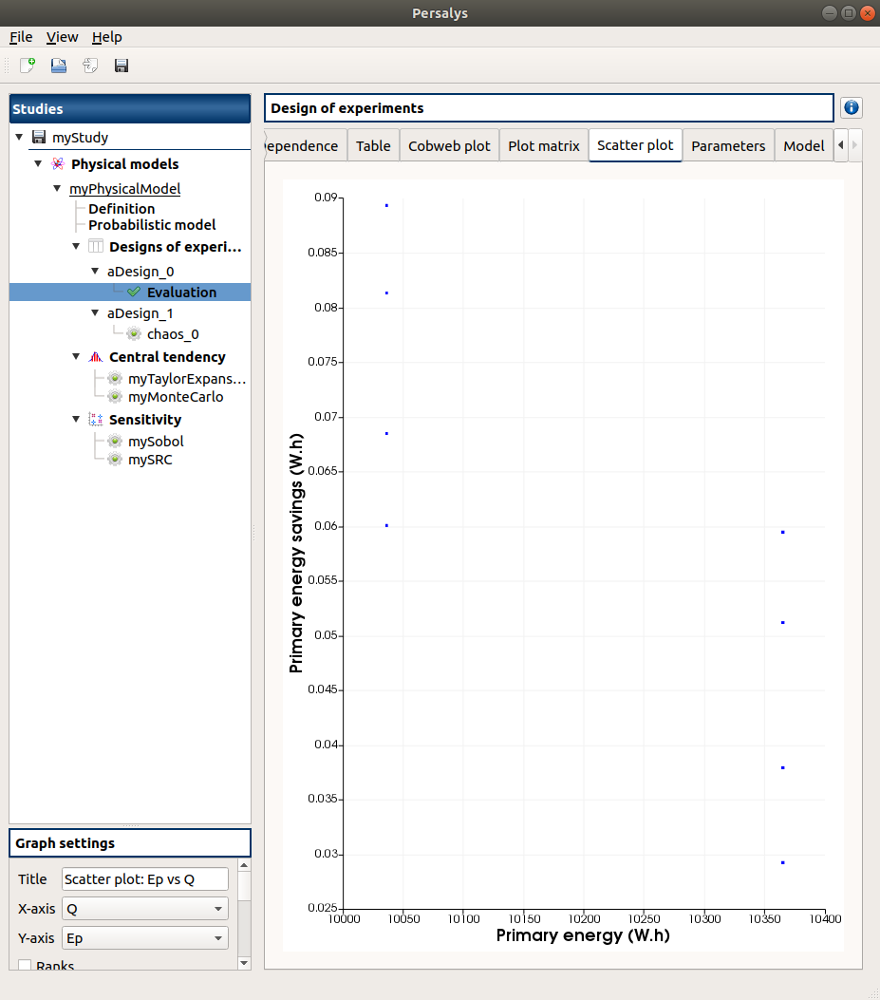

Validation
==========


Test case 1: Cogeneration
-------------------------

This test-case originates from [ProtoOTGUI2014]_ and can be found in python/test/t_Cogeneration_std.py.

The purpose of this example is to check:
  - The Central tendency analysis using the Taylor Expansions;
  - the default values calculated for the parameters of a parametric analysis.

The obtained results must be equal to the analytical values.

.. container:: toggle

    .. container:: header

        Show/Hide Code

    .. literalinclude:: ../../t_Cogeneration_std.py

1- Problem statement
````````````````````

1-1 Inputs
''''''''''

- Stochastic variables:

====== ======================== ==================
 Name  Description              Distribution
====== ======================== ==================
Q      Primary energy           Normal(10200, 100)
E      Produced electric energy Normal(3000, 15)
C      Valued thermal energy    Normal(4000, 60)
====== ======================== ==================

1-2 Output
''''''''''

Primary energy savings :math:`E_p`

.. math::

    Ep = 1-\frac{Q}{\frac{E}{0.54(1-0.05)}+\frac{C}{0.8}}


2- Central tendency analysis
````````````````````````````

2-1 Inputs
''''''''''

The central tendency analysis is performed with the Taylor Expansions method.

3-1 Results
'''''''''''
================ ================= ================== ===========
First order mean Second order mean Standard deviation Variance
================ ================= ================== ===========
0.0597305        0.0596787         0.0115612          0.000133661
================ ================= ================== ===========

3- Deterministic parametric analysis
````````````````````````````````````

3-1 Inputs
''''''''''

The minimum and the maximum values are computed automatically thanks to
the distribution of the variables. The minimum value is the quantile at the
probability of 0.05 and the maximum one is the quantile at the probability of
0.95. The number of used values per variable is by default 2.

======== ======= ======= ================
Variable Min     Max     Number of values
======== ======= ======= ================
Q        10035.5 10364.5        2
E        2975.33 3024.67        2
C        3901.31 4098.69        2
======== ======= ======= ================

3-2 Results
'''''''''''

3-2-1 Values
************

======= ======= ======= =========
Q       E       C       Ep 
======= ======= ======= =========
10035.5 2975.33 3901.31 0.0600365
10364.5 2975.33 3901.31 0.0292239
10035.5 3024.67 3901.31 0.0684295
10364.5 3024.67 3901.31 0.037892
10035.5 2975.33 4098.69 0.0812679
10364.5 2975.33 4098.69 0.0511513
10035.5 3024.67 4098.69 0.0892877
10364.5 3024.67 4098.69 0.0594339
======= ======= ======= =========

The points are generated according to the structure of a box design of experiments.
This deterministic design of experiments has 8 points obtained by regularly discretizing
the pavement :math:`[10035.5, 10364.5] \times [2975.33, 3024.67] \times [3901.31, 4098.69]`.

The minimum value of :math:`Ep` is 0.0292239 with X=[10364.5 2975.33 3901.31].
The maximum value of :math:`Ep` is 0.0892877 with X=[10035.5 3024.67 4098.69].


3-2-1 Figures
*************



4- Reference
````````````

Test case 2: Flood
------------------

This test-case originates from [ProtoOTGUI2014]_ and can be found in python/test/t_Crue_std.py.

.. container:: toggle

    .. container:: header

        Show/Hide Code

    .. literalinclude:: ../../t_Crue_std.py

1- Problem statement
````````````````````

1-1 Inputs
''''''''''

- Stochastic variables:

====== ======================== ===================================
 Name  Description              Distribution
====== ======================== ===================================
Q      River flow               Gumbel(alpha=0.00179211, beta=1013)
Ks     Manning-Strickler factor Normal(30, 7.5)
Zm     River's depth uptream    Uniform(54,56)
Zv     River's depth downstream Uniform(49, 51)
====== ======================== ===================================

1-2 Output
''''''''''

Difference between the dike height and the water level :math:`S`

.. math::

    S = \left(\frac{Q}{Ks\times300\times\sqrt{(Zm-Zv)/5000}}\right)^{(3/5) +Zv-55.5-3}

2- Reliability analysis
```````````````````````

2-1 Inputs
''''''''''

The limit state is defined by

.. math::
    S > 0

The analysis is performed with the Monte Carlo method with the following parameters:

================================ ========
Name                             Value
================================ ========
Maximum outer sampling           10000
Maximum coefficient of variation 0.1
Seed                             0
Block size                       1
================================ ========

3-1 Results
'''''''''''

3-1-1 Values
************

=================== ======================== =============================================
Failure probability Coefficient of variation Confidence interval at 95%
=================== ======================== =============================================
0.0006              0.408126                 :math:`\left[0.000120053; 0.00107995\right]`
=================== ======================== =============================================

3-1-1 Figures
*************

.. image:: result_crue_MC_histo_S.png
    :width: 443px
    :align: center
    :height: 340px

.. image:: result_crue_MC_convergence.png
    :width: 443px
    :align: center
    :height: 340px

.. Test case 3: Gauge
.. ------------------

.. This test-case originates from [Jauge2014]_ and can be found in python/test/t_Jauge_std.py.

.. The purpose of this example is to check the average value of the output against some exact reference value.

.. .. image:: case_gauge.png
..     :width: 420px
..     :align: center
..    :height: 294px

.. 1- Problem statement
.. ````````````````````
.. The purpose of this example is to realize analysises with data loaded from an XML file
.. previously generated with SALOME.

.. 1-1 Inputs
.. ''''''''''

.. - Stochastic variables:

.. ====== =========================== =================
.. Name   Description                 Distribution
.. ====== =========================== =================
.. conduc Heat conduction coefficient Normal(0.5, 0.01)
.. ====== =========================== =================

.. 1-2 Output
.. ''''''''''

.. An average temperature on the superior surface 'temptop'.

.. 2- Analysis
.. ```````````

.. 2-1 Inputs
.. ''''''''''


.. 2-2 Results
.. '''''''''''


.. 3- Reference
.. ````````````
