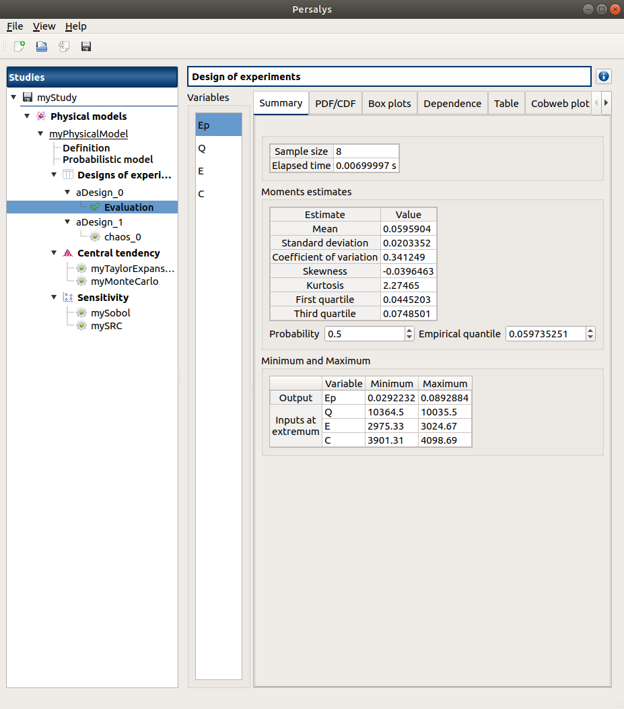

Validation
==========


Test case 1: Cogeneration
-------------------------

This test-case originates from [ProtoOTGUI2014]_ and can be found in python/test/t_Cogeneration_std.py.

The purpose of this example is to check:
  - The Central tendency analysis using the Taylor Expansions;
  - the default values calculated for the parameters of a parametric analysis.

The obtained results must be equal to the analytical values.

.. container:: toggle

    .. container:: header

        Show/Hide Code

    .. literalinclude:: ../../t_Cogeneration_std.py

1- Problem statement
````````````````````

1-1 Inputs
''''''''''

- Stochastic variables:

====== ======================== ==================
 Name  Description              Distribution
====== ======================== ==================
Q      Primary energy           Normal(10200, 100)
E      Produced electric energy Normal(3000, 15)
C      Valued thermal energy    Normal(4000, 60)
====== ======================== ==================

1-2 Output
''''''''''

Primary energy savings :math:`E_p`

.. math::

    Ep = 1-\frac{Q}{\frac{E}{0.54(1-0.05)}+\frac{C}{0.8}}


2- Central tendency analysis
````````````````````````````

2-1 Inputs
''''''''''

The central tendency analysis is performed with the Taylor Expansions method.

3-1 Results
'''''''''''

3-1-1 Values
************

================ ================= ================== ===========
First order mean Second order mean Standard deviation Variance
================ ================= ================== ===========
0.0597305        0.0596787         0.0115612          0.000133661
================ ================= ================== ===========

3- Deterministic parametric analysis
````````````````````````````````````

3-1 Inputs
''''''''''

The minimum and the maximum values are computed automatically thanks to
the distribution of the variables. The minimum value is the quantile at the
probability of 0.05 and the maximum one is the quantile at the probability of
0.95. The number of used values per variable is by default 2.

======== ======= ======= ================
Variable Min     Max     Number of values
======== ======= ======= ================
Q        10035.5 10364.5        2
E        2975.33 3024.67        2
C        3901.31 4098.69        2
======== ======= ======= ================

3-2 Results
'''''''''''

3-2-1 Values
************

======= ======= ======= =========
Q       E       C       Ep 
======= ======= ======= =========
10035.5 2975.33 3901.31 0.0600365
10364.5 2975.33 3901.31 0.0292239
10035.5 3024.67 3901.31 0.0684295
10364.5 3024.67 3901.31 0.037892
10035.5 2975.33 4098.69 0.0812679
10364.5 2975.33 4098.69 0.0511513
10035.5 3024.67 4098.69 0.0892877
10364.5 3024.67 4098.69 0.0594339
======= ======= ======= =========

The points are generated according to the structure of a box design of experiments.
This deterministic design of experiments has 8 points obtained by regularly discretizing
the pavement :math:`[10035.5, 10364.5] \times [2975.33, 3024.67] \times [3901.31, 4098.69]`.

The minimum value of :math:`Ep` is 0.0292239 with X=[10364.5 2975.33 3901.31].
The maximum value of :math:`Ep` is 0.0892877 with X=[10035.5 3024.67 4098.69].


3-2-1 Figures
*************



.. image:: result_cogeneration_ep_vs_q.png
    :width: 443px
    :align: center
    :height: 340px

4- Reference
````````````

Test case 2: Flood
------------------

This test-case originates from [ProtoOTGUI2014]_ and can be found in python/test/t_Crue_std.py.

.. container:: toggle

    .. container:: header

        Show/Hide Code

    .. literalinclude:: ../../t_Crue_std.py

1- Problem statement
````````````````````

1-1 Inputs
''''''''''

- Stochastic variables:

====== ======================== ===================================
 Name  Description              Distribution
====== ======================== ===================================
Q      River flow               Gumbel(alpha=0.00179211, beta=1013)
Ks     Manning-Strickler factor Normal(30, 7.5)
Zm     River's depth uptream    Uniform(54,56)
Zv     River's depth downstream Uniform(49, 51)
====== ======================== ===================================

1-2 Output
''''''''''

Difference between the dike height and the water level :math:`S`

.. math::

    S = \left(\frac{Q}{Ks\times300\times\sqrt{(Zm-Zv)/5000}}\right)^{(3/5) +Zv-55.5-3}

2- Reliability analysis
```````````````````````

2-1 Inputs
''''''''''

The limit state is defined by

.. math::
    S > 0

The analysis is performed with the Monte Carlo method with the following parameters:

================================ ========
Name                             Value
================================ ========
Maximum outer sampling           10000
Maximum coefficient of variation 0.1
Seed                             0
Block size                       1
================================ ========

3-1 Results
'''''''''''

3-1-1 Values
************

=================== ======================== =============================================
Failure probability Coefficient of variation Confidence interval at 95%
=================== ======================== =============================================
0.0006              0.408126                 :math:`\left[0.000120053; 0.00107995\right]`
=================== ======================== =============================================

3-1-1 Figures
*************


.. image:: result_crue_MC_convergence.png
    :width: 443px
    :align: center
    :height: 340px

Test case 3: Gauge
------------------

This test-case originates from [Jauge2014]_ and can be found in python/test/t_Gauge_std.py.

The purpose of this example is to check:
  - Test the xml file loading;
  - The Central tendency analysis using the Taylor Expansions.

.. image:: case_gauge.png
    :width: 443px
    :align: center
    :height: 340px

1- Problem statement
````````````````````

1-1 Inputs
''''''''''

- Deterministic variable:

============ =========================== =====
Name         Description                 Value
============ =========================== =====
Hauteur      Height of the cube          1.
============ =========================== =====

- Stochastic variable:

============ =========================== =================
Name         Description                 Distribution
============ =========================== =================
Conductivity Heat conduction coefficient Normal(0.5, 0.01)
============ =========================== =================

1-2 Output
''''''''''

An average temperature on the superior surface 'temptop'.

2- XML file loading
````````````````````

When loading the XML file the window illustrated bellow is completed. When clicking
on the **Evaluate** button, the computed output value must be :math:`1906.79`.

2-1 Figure
''''''''''

.. image:: case_Gauge_loading.png
    :width: 443px
    :align: center
    :height: 340px

3- Central tendency analysis
````````````````````````````

3-1 Inputs
''''''''''

Because of a temporary problem with the module of Code_Aster, it is necessary to
uncheck **Parallelize status** before launching analyses using Code_Aster solver.
In the same window, choose the machine which will launch the analysis.

.. image:: YACS_scheme_parameters.png
    :align: center

The central tendency analysis is performed with the Taylor Expansions method.

3-2 Results
'''''''''''

3-2-1 Values
************

================ ================= ================== ===========
First order mean Second order mean Standard deviation Variance
================ ================= ================== ===========
2020             2020.8            40                 1600
================ ================= ================== ===========


Graphical validation
--------------------

Find here the procedure to validate the graphical interface:

Open
``````

- open otgui

  - there are a Menu bar, a Tool bar, a Python console, a status bar

  - a window with 3 buttons (New study/Open study/Import Python script) appears

Console Python
````````````````

- open otgui
- click Menu->View->Window->Python Console

  - console hidden
- click Menu->View->Window->Python Console

  - console shown
- close the console

  - console hidden
- click Menu->View->Window->Python Console

  - console shown

New OTStudy
```````````

- click on button New study in the mdiArea

  - item OTStudy_0 appears in the tree view

  - a window with 3(+1) buttons (New symbolic physical model/New Python physical model(+New YACS physical model)/New data model) appears

- click Menu->File->New

  - item OTStudy_1 appears in the tree view

  - a window with 3(+1) buttons (New symbolic physical model/New Python physical model(+New YACS physical model)/New data model) appears

- click icon New OTStudy in the Tool bar

  - item OTStudy_2 appears in the tree view

  - a window with 3(+1) buttons (New symbolic physical model/New Python physical model(+New YACS physical model)/New data model) appears

- press keys CTRL + N

  - item OTStudy_3 appears in the tree view

  - a window with 3(+1) buttons (New symbolic physical model/New Python physical model(+New YACS physical model)/New data model) appears

Rename OTStudy
``````````````

- double click on OTStudy_2 item, rename OTStudy_2 by myOTStudy, press enter

  - the item is renamed

- click on New symbolic physical model button of the mdiArea

  - a new Symbolic physical model window and the item PhysicalModel_0 appears

Save/open OTStudy
````````````````````

- save myOTStudy with Menu->File->save, close with Menu->File->close, reopen with Menu->File->open

- rename myOTStudy by myOTStudy1, save myOTStudy1 with the icon of the tool bar, close with right click + close, reopen with the icon of the tool bar

- rename myOTStudy1 by myOTStudy2, save myOTStudy2 in pressing CTRL + S, close with right click + close, reopen with press keys CTRL + O

- rename myOTStudy2 by myOTStudy3, save myOTStudy3 with right click + save, close with right click + close, reopen with press keys CTRL + O

Export/Import OTStudy
`````````````````````

- export myOTStudy3 with Menu->File->Export Python, name the file test.py

- close the interface with Menu->File->Exit

  - close without saving all the studies (except myOTStudy3)

- open the interface

- click on button Import Python script in the mdiArea

  - choose test.py

- click on the icon Import Python of the tool bar

  - a message box appears to close opened studies, click OK

  - a message box appears to save the current study, click close without saving

  - choose the script test.py

- close myOTStudy3

- click on Menu->File->Import Python...

  - choose test.py

- close the interface in pressing CTRL + Q

  - close without saving

Models
```````

- open the interface

- Import the file python/test/test_analyses.py

- click on model1 item

- click on Evaluate button

  - only y0 and y1 are evaluated

- select lines 1 and 3

  - first header item is checked

- click on Evaluate button

  - fake_var and fake_y0 are evaluated

- change x2 value to 1.5 + press enter

  - outputs values are reinitialized

- uncheck all

- click on Evaluate button

  - nothing appends

- check fake_var + change its formula to 'x1 +'

- click on Evaluate button

  - error message 'Impossible to evaluate etc.'

- unselect fake_var + select y0, fake_y0 and y1


Analyses
`````````````

- Launch all the analyses -> Right click on each item and choose Run :

  - Evaluation

    - check the values are the same as the values written in the physical model window

    - click on the Finish button

      - widget with a progress bar appears at the bottom of the tree view

    - check result window

      - results only for y0 and y1

  - Monte Carlo

    - check the values:

      - selected outputs: y1 and y0

      - method : Monte Carlo

      - Accuracy disable : 0.01

      - max time : 16m40s

      - max calls : 1000

      - block size : 100

      - confidence interval disable : 0.95

      - seed : 2

    - click on the Finish button

      - widget with a progress bar appears at the bottom of the tree view

    - check result window :

      - left side: 4 variables in the list view

      - right side: 6 tabs Summary - PDF/CDF - Box plots - Scatter plots - Table - Parameters

      - when changing the variable, the tabs are updated

      - when a plot is displayed, a Graph setting widget appears at the bottom of the tree view : check its behavior

      - Summary tab:

        - 2 types of extrema tables: one for the output y1 and one for inputs x1 and x2

        - Moments estimates table has only 2 columns: Estimate and Value

      - Scatter plots tab:

        - 3 sub-tabs Scatter plots - Plot matrix X-X - Plot matrix Y-X

        - when clicking on the tab, the list view is hidden

      - check tables are well drawn

  - Taylor

    - check the values:

      - selected outputs: y1 and y0

      - method : Taylor expansion

    - click on the Finish button

      - widget with a progress bar appears at the bottom of the tree view

    - check result window :

      - left side: 2 variables in the list view

      - right side: 1 Summary tab

      - check table is well drawn

      - when changing the variable, the tabs are updated

  - Monte Carlo reliability

    - First page check the values:

      - checked: Simulation methods

      - continue

    - Second page check the values:

      - method : Monte Carlo

      - Accuracy disable : 0.01

      - max time : 16m40s

      - max calls : 1000

      - block size : 100

      - seed : 2

    - click on the Finish button

      - widget with a progress bar appears at the bottom of the tree view

    - check result window :

      - left side: 1 variable in the list view

      - right side: 4 tabs Summary - Histogram - Covergence graph - Parameters

      - when a plot is displayed, a Graph setting widget appears at the bottom of the tree view : check its behavior

      - check tables are well drawn

  - FORM IS reliability

    - First page check the values:

      - checked: Simulation methods

      - continue

    - Second page check the values:

      - method : FORM - Importance sampling

      - Accuracy disable : 0.01

      - max time : 16m40s

      - max calls : 1000

      - block size : 100

      - seed : 2

      - continue

    - Third page check the values:

      - Algorithm : Abdo-Rackwitz

      - Physical starting point : 5; 5

        - click on button '...'

        - set the value of x2 to 5.5

        - press Finish button

        - Physical starting point : 5; 5.5

      - Number of iterations : 150

      - Absolute error : 0.001

      - Relative/Residual/Constraint error : 1e-5

    - click on the Finish button

      - widget with a progress bar appears at the bottom of the tree view

    - check result window :

      - left side: 1 variable in the list view

      - right side: 5 tabs Summary - Histogram - Covergence graph - FORM results - Parameters

      - when a plot is displayed, a Graph setting widget appears at the bottom of the tree view : check its behavior

      - tab FORM results:

        - 4 sub-tabs : Summary - Design point - Sensitivities - Parameters

      - check tables are well drawn

  - FORM

    - First page check the values:

      - checked: Approximation methods

      - continue

    - Second page check the values:

      - Method : FORM

      - Algorithm : Abdo-Rackwitz

      - Physical starting point : 5; 5

      - Number of iterations : 150

      - Absolute error : 0.001

      - Relative/Residual/Constraint error : 1e-5

    - click on the Finish button

      - widget with a progress bar appears at the bottom of the tree view

    - check result window :

      - left side: 1 variable in the list view

      - right side: 4 tabs Summary - Design point - Sensitivities - Parameters

      - check tables are well drawn

  - Sobol

    - check the values:

      - selected output: y1

      - method : Sobol

      - Accuracy disable : 0.01

      - max time : 16m40s

      - max calls : 1000

      - block size : 100

      - number of calls by iteration : 400

      - seed : 2

    - click on the Finish button

      - widget with a progress bar appears at the bottom of the tree view

    - check result window :

      - left side: 1 variable in the list view

      - right side: 3 tabs Indices - Summary - Parameters

      - when changing the variable, the Indices tab is updated

      - when indices plot is displayed, a Graph setting widget appears at the bottom of the tree view : check its behavior

      - tab Indices:

        - can not zoom the plot

        - Total indices and Interactions are associated with a warning icon with Tooltip

        - Click on the 2 last sections headers of the table:

          - the table values are sorted

          - the plot is updated

        - At the bottom: error message 'The model has not independant copula, the result could be false.'

      - check tables are well drawn


  - SRC

    - check the values:

      - selected output: y1

      - method : SRC

      - sample size : 1000

      - seed : 2

    - click on the Finish button

      - widget with a progress bar appears at the bottom of the tree view

    - check result window :

      - left side: 1 variable in the list view

      - right side: 2 tabs Indices - Parameters

      - when changing the variable, the Indices tab is updated

      - when indices plot is displayed, a Graph setting widget appears at the bottom of the tree view : check its behavior

      - Indices tab :

        - can not zoom the plot

        - click on the last section header of the table:

          - the table values are sorted

          - the plot is updated

        - At the bottom: error message 'The model has not independant copula, the result could be false.'

  - Designs of experiment

    - check the wizards:

      - right click on design_1 and choose Modify :

        - First page :

          - type : Deterministic

          - continue

        - Second page :

          - no checked line

          - first and second columns are not editable

          - 3 last columns are disable

          - all levels are equal to 1

          - check wizard behavior :

            - fifth header item : change combo box item to Delta

              - values changed : all deltas values are null

            - first header item : check all

              - third column is disable

              - 3 last columns are enabled

            - fifth header item : change combo box item to Levels

              - values changed : all levels values are equal to 2

            - first header item : uncheck all

            - check second line

            - line 2 : change lower bound to 10, press enter

              - error message : 'The lower bound be inferior to the upper bound'

            - line 2 : change upper bound to 0, press enter

              - error message : 'The upper bound be superior to the lower bound'

            - fifth header item : change combo box item to Delta

            - line 2 : change delta to 15, press enter

              - error message : 'Delta must be inferior to the upper bound - the lower bound'

            - line 2 : change delta to 0.5, press enter

              - size of the design of experiment : 19

            - check all lines one by one :

              - fifth header item is checked

              - size of the design of experiment : 76

          - cancel

      - right click on design_2 and choose Modify :

        - First page :

          - type : Deterministic

          - continue

        - Second page :

          - x1 and x2 checked

          - lower bounds : [0.5, 0.5]

          - upper bounds : [9.5, 9.5]

          - levels : [7, 7]

          - fifth header item : change combo box item to Delta :

            - deltas : [1.5, 1.5]

          - size of the design of experiment : 49

          - cancel

      - right click on design_3 and choose Modify :

        - First page :

          - type : Import data

          - continue

        - Second page :

          - Data file : data.csv

          - header items : ['x1', '', 'x2', 'x3']

          - when changing a combo box item : the error message 'Each variable must be associated with one column' appears

          - set the second header item to 'x2' and the third one to ''

          - finish

            - check the design of experiment window is updated : check the values of x2 have changed

      - right click on design_3 and choose New metamodel :

        - error message box : 'The model must have at least one output

      - right click on design_3 and choose Evaluate :

        - the valuation is launched, a widget with a progress bar appears at the bottom of the tree view

      - check result window :

        - 3 tabs Table - Min/Max - Scatter plots

        - Min/Max tab :

          - a list view with 2 variables appears at the left side of the window

          - when changing the variable, the Min/Max tab is updated

        - Scatter plots tab :

          - 3 sub-tabs Scatter plots - Plot matrix X-X - Plot matrix Y-X

          - when clicking on the tab, the list view is hidden

          - when a plot is displayed, a Graph setting widget appears at the bottom of the tree view : check its behavior

      - right click on design_3 and choose New metamodel

        - choose the Kriging method and click on the Finish button

        - a widget with a progress bar appears at the bottom of the tree view : click immediately on the Stop button

        - there is only y0 in the list view at the left side of the result window

  - Kriging

    - check the values:

      - selected outputs : y0 and y1

      - method : Kriging

      - covariance model : Matérn

      - nu : 1.5

      - trend : Linear

      - compute Q2 : checked

      - optimize covariance model parameters : checked

      - scale : 1; 1

      - amplitude : 1

    - on the line Scale click on the button ...

      - a wizard appears : stochastic inputs x1 and x2 are listed

    - change the scale value of x1 to 2, then finish

    - change the amplitude value to 2

    - click on the Finish button

      - widget with a progress bar appears at the bottom of the tree view

    - check result window :

      - left side: 1 variable in the list view

      - right side: 4 tabs MetaModel - Results - Validation - Parameters

      - when changing the variable, the tabs are updated

      - Metamodel tab : only the plot on the tab

      - when a plot is displayed, a Graph setting widget appears at the bottom of the tree view : check its behavior

      - check tables are well drawn

  - chaos_1

    - check the values:

      - selected output : y1

      - method : Functional chaos

      - degree : 2

      - nu : 1.5

      - compute Q2 : unchecked

      - sparse : checked

    - click on the Finish button

      - widget with a progress bar appears at the bottom of the tree view

    - check result window :

      - left side: 1 variable in the list view

      - right side: 4 tabs MetaModel - Moments - Sobol indices - Parameters

      - Metamodel tab : plot + R2 table

      - Moments and Sobol indices tabs : error message 'Impossible to compute Sobol indices and moments etc.'

      - when changing the variable, the tabs are updated

      - when metamodel plot is displayed, a Graph setting widget appears at the bottom of the tree view : check its behavior

      - check tables are well drawn


  - chaos_2

    - error message box : 'The model must have at least one output'

    - evaluate design_2

    - check the values:

      - selected outputs : y0, y1

      - method : Functional chaos

      - degree : 2

      - nu : 1.5

      - compute Q2 : unchecked

      - sparse : checked

    - click on the Finish button

      - widget with a progress bar appears at the bottom of the tree view

    - check result window :

      - left side: 1 variable in the list view

      - right side: 4 tabs MetaModel - Moments - Sobol indices - Parameters

      - Metamodel tab : plot + R2 table

      - Moments and Sobol indices tabs : error message 'Imposible to compute Sobol indices and moments etc.'

      - when changing the variable, the tabs are updated

      - when metamodel plot is displayed, a Graph setting widget appears at the bottom of the tree view : check its behavior

      - check tables are well drawn

  - Data analysis

    - check result window :

      - left side: 4 variables in the list view

        - x_1 the output is the first item of the list

      - right side: 4 tabs Summary - PDF/CDF - Box plots - Scatter plots

      - when changing the variable, the tabs are updated

      - when a plot is displayed, a Graph setting widget appears at the bottom of the tree view : check its behavior

      - Summary tab:

        - check tables are well drawn

        - 2 types of extrema tables: one for the output x_1 and one for inputs x_0, x_1 and x_3

        - Moments estimates table has 4 columns: Estimate - Value - Lower bound - Upper bound

        - bounds only for Mean and Standard deviation

        - check probability and quantile spinboxes behavior

      - Scatter plots tab:

        - 3 sub-tabs Scatter plots - Plot matrix X-X - Plot matrix Y-X

        - when clicking on the tab, the list view is hidden

  - Inference analysis

    - check the wizard behavior :

      - check all / uncheck all

      - no wheel event on Add button

      - an uncheck line == right side of the wizard disable

      - choose item 'All' in the list of Add button => add all distributions in the list

      - remove items in the distributions table : use ctrl key (to select items one by one), use shift key (to select adjacent items)

      - select a variable + empty the distributions list + click on Finish

        - error message 'At least one distribution etc.'

      - unselect all

      - select x_0 and add all the distributions

      - select x_1 and add the Beta distribution

    - click on the Finish button

      - widget with a progress bar appears at the bottom of the tree view

    - check result window :

      - left side: 2 variables in the list view

      - right side: 2 tabs Summary - Parameters

      - when changing the variable, the tabs are updated

      - when a plot is displayed, a Graph setting widget appears at the bottom of the tree view : check its behavior

      - the right side of the window contains 2 parts : a distributions list and 3 tabs PDF/CDF - Q-Q Plot - Parameters

      - when selecting a distribution, the tab widget is updated

      - check tables are well drawn

      - select x_0

      - select ChiSquare/InverseNormal/LogUniform/Student :

        - PDF/CDF and Q-Q Plot tabs are disable

        - the Parameters tab contains an error message

  - Copula inference

    - check result window :

      - left side: 2 sets of variables in the list view

      - right side: 1 tab Summary

      - when changing the set of variables, the tabs are updated

      - the right side of the window contains 2 parts : a copulas list and 3 tabs PDF/CDF - Kendall Plot - Parameters

      - when selecting a copula, the tab widget is updated

      - when a plot is displayed, a Graph setting widget appears at the bottom of the tree view : check its behavior

      - check tables are well drawn


