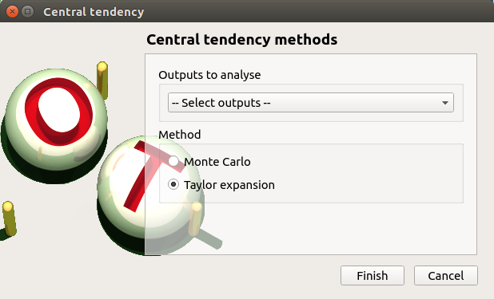
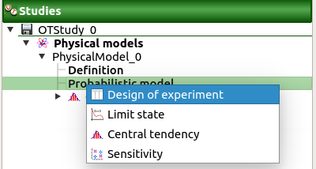
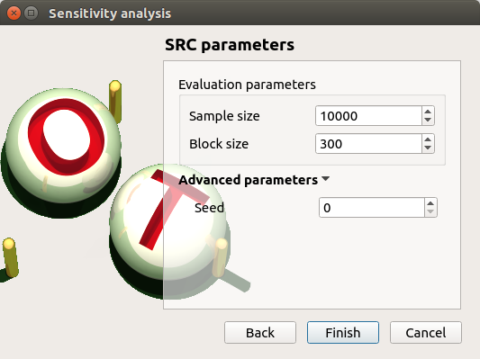
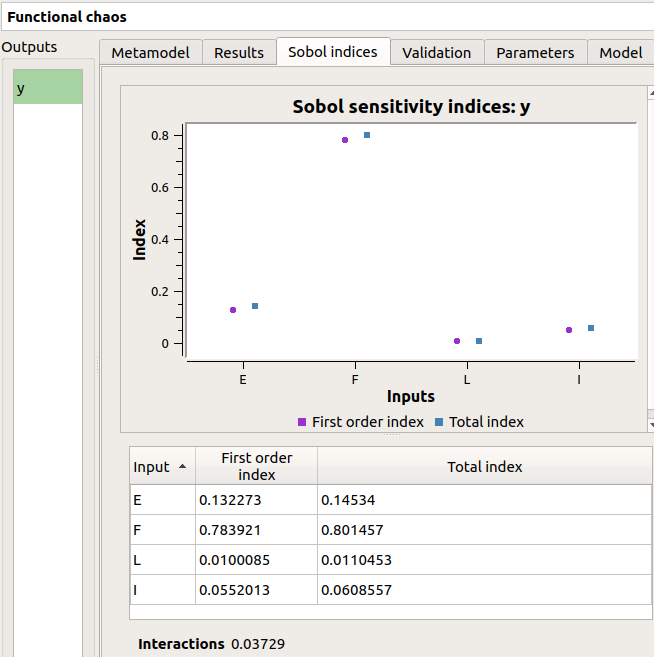
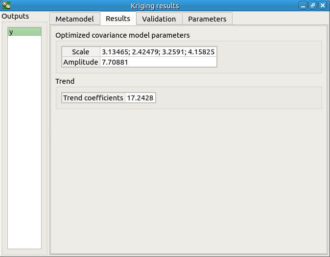

Deviation of a cantilever beam
------------------------------

This example has been presented in the ESREL 2007 conference in the paper [Dutfoy2009]_.
It is described in the OpenTURNS examples.

This example is a simple beam, restrained at one side and stressed by a
concentrated bending load F at the other side.

1- Problem statement
````````````````````

.. _Inputs:

a- Inputs
'''''''''

- Stochastic variables:

====== ======================== ==============================================
 Name  Description              Distribution
====== ======================== ==============================================
E      Young's modulus          Beta(r=0.93, t=3.2, a=2.8e7, b=4.8e7)
F      Charge applied           LogNormal(mu=30000., sigma=9000., gamma=15000)
L      Length                   Uniform(a=250, b=260)
I      Section modulus          Beta(r=2.5, t=4., a=3.1e2, b=4.5e2))
====== ======================== ==============================================

The input variables :math:`L` and :math:`I` are dependent. The dependence structure
is modelised by a Normal copula (the only copula available for now in the GUI).
The Spearman correlation matrix of the input random vector :math:`E, F, L, I` is :

.. math ::

    R_{S} = \left(
        \begin{array}{cccc}
        1 & 0 & 0 & 0 \\
        0 & 1 & 0 & 0 \\
        0 & 0 & 1 & -0.2 \\
        0 & 0 & -0.2 & 1
        \end{array} \right)

b- Output
'''''''''

The deviation :math:`y` of the free end of the beam equals to:

.. math::

    y = \frac{FL^3}{3EI}

2- Define the model
```````````````````

2-1 Create the study
''''''''''''''''''''

.. |newButton| image:: /user_manual/graphical_interface/getting_started/document-new22x22.png

Click on |newButton| in the tool bar to create a new study.

.. image:: /user_manual/graphical_interface/getting_started/window_OTStudy_startUp.png
    :align: center


2-2 Create the analytical physical model
''''''''''''''''''''''''''''''''''''''''

To define the physical model, click on the button **Symbolic model**
of the window shown above.

The following window appears and a physicalModel item is added in the study tree:

.. image:: /user_manual/graphical_interface/physical_model/physicalModelDiagram.png
    :align: center


Click on the **Model definition** box of the model diagram to create the
following window.

.. image:: modelDefinition.png
    :align: center

Use the **Add** buttons below the tables to add as many lines as number of variables
in the :ref:`physical model <Inputs>`.

.. image:: add_variables_in_tables.png
    :align: center

Fill the tables and rename variables to correspond to the physical model.
Click on the **Evaluate** button below the output variables table in order to check
if the formula is not badly defined.

.. _exevaluationresult:

.. image:: good_defined_physicalModel.png
    :align: center


The value of the output :math:`y` must be :math:`13.8178` if:

======= ======= ======= =======
E       F       L       I
======= ======= ======= =======
3e7     3e4     255     400
======= ======= ======= =======


2-3 Create the probabilistic model
''''''''''''''''''''''''''''''''''

To define the probabilistic model, choose **Probabilistic model** in the
context menu of the sub item **Definition** of the model in the study tree.
Only one probabilistic model by physical model can be defined.

  .. image:: /user_manual/graphical_interface/physical_model/physicalModelDefinitionContextMenu.png
      :align: center

The probabilistic model is defined by associating a distribution to input variables
(**Marginals** tab) and specifying dependence between them if necessary (**Dependence** tab).

.. image:: proba_model_default.png
    :align: center

The **Marginals** tab lists automatically all the input variables defined
in the physical model window.
By default, all the lines are unchecked (then all the inputs
variables are deterministic) and the right side shows the variable value
(the one defined in the model window).

To make a variable stochastic, check its line. Then the combobox in the second
column of the table is available and the current text is **Normal**.
By default, the Normal distribution is used with a mean value :math:`E[Input]`
equal to the value defined in the physical model window and with a standard
deviation equal to :math:`0.1 * |E[Input]|`

.. image:: proba_model_default_distribution.png
    :align: center

- Check all the lines
- Choose the right distribution for each input (**Distribution** column)
- Change the distribution parameters values (right side)
  (Refer to the :ref:`Inputs <Inputs>` section).

.. _probaModelExample:

.. image:: proba_model.png
    :align: center

.. _dependenceTab:

On the left of the **Dependence** tab, all the stochastic input variables are listed.
By default, no dependence is set between these variables.

To add dependence between the variables :math:`L` and :math:`I`:
  - Select :math:`L` and :math:`I` in the list
  - Click on the right arrow:
     - these variables are disabled in the first table (a variable can belong to only one group)
     - [I, L] appears in the second table:
        - the default copula is the Normal copula defined by a correlation matrix equal to
          the identity matrix. So, at this step, :math:`L` and :math:`I` are still independent.
        - on the right side: set the correlation matrix

.. image:: correlation.png
    :align: center


3- Central tendency analysis
````````````````````````````

3-1 Taylor Expansions
'''''''''''''''''''''

For more details on the
`Linear Taylor Expansions <http://openturns.github.io/openturns/latest/theory/reliability_sensitivity/taylor_moments.html>`_,
you can consult the OpenTURNS documentation.

3-1-1 Definition
****************

To perform a central tendency analysis with the Taylor expansions for the
estimation of moments, choose **New central tendency** in the
context menu of the probabilistic model item in the study tree.

    .. image:: /user_manual/graphical_interface/probabilistic_analysis/probabilisticModelContextMenu.png
        :align: center

Check the radio button **Taylor expansions** in the wizard which appears.



Click on **Finish** button. A new item with a default name appears in the study
tree and a window is created.

.. image:: taylor_window.png
    :align: center

Click on **Run** button to launch the analysis. When the analysis is finished
a result window is created.

3-1-2 Results
*************

The results window contains a table.

.. image:: taylor_results_table.png
    :align: center

3-2 Monte Carlo
'''''''''''''''

For more details on the `Monte Carlo method <http://openturns.github.io/openturns/latest/theory/reliability_sensitivity/monte_carlo_moments.html>`_,
you can consult the OpenTURNS documentation.

3-2-1 Definition
****************

To perform a central tendency analysis with the Monte Carlo method,
click on the **Central tendency** box of the model diagram.

.. image:: modelDiagramCentralTendency.png
    :align: center

Check the radio button **Monte Carlo** in the wizard which appears.


Click on the **Continue** button to parametrize the Monte Carlo method.

.. image:: mc_2nd_page_wizard.png
    :align: center

To see advanced parameters, expand the **Advanced parameters** group.

Click on **Finish** button. A new item with a default name appears in the study
tree and a window is created.

.. image:: MonteCarlo_window.png
    :align: center

Click on **Run** button to launch the analysis. When the analysis is finished
a result window is created.

.. _exmonteCarloResult:

3-2-2 Results
*************

There are 8 tabs in the result window. The first tab must contain the following
values :

.. image:: MonteCarlo_results_window.png
    :align: center


4- Min/Max study with deterministic design of experiments
`````````````````````````````````````````````````````````

For more details on the `Min/Max approach <http://openturns.github.io/openturns/latest/theory/reliability_sensitivity/monte_carlo_moments.html>`_,
you can consult the OpenTURNS documentation.

4-1 Definition
''''''''''''''

To perform a Min/Max study, choose **Design of experiments** in the
context menu of the probabilistic model item in the study tree.



Check the radio button **Deterministic** in the wizard which appears and click on
**Continue** button.

.. image:: DOE_wizard.png
    :align: center

In the next table, you can set the grid parameters. By default, all lines are unchecked: the design of experiments contains only point. Check the **Name** column to make all the inputs variable.

.. image:: deterministic_design_of_experiment.png
    :align: center

The minimum and the maximum values are computed automatically from
the range of the distribution of the variables.
The number of used values per variable is by default 2.

Click on **Finish** button. A new item with a default name appears in the study
tree and a window is created.

4-2 Results
'''''''''''

4-2-1 Input variables
*********************

The result window shows the input sample of the design of experiments and an analysis of this sample.

.. image:: DOE_inputs.png
    :align: center

The points are generated according to the structure of a box design of experiments.
This deterministic design of experiments has 16 points obtained by regularly discretizing
the pavement:

:math:`[2.8e7, 4.8e7] \times [15000, 47021.278] \times [250, 260] \times [310, 450]`.

Click on **Evaluate** in the context menu of the design of experiments item.
Click on the **Finish** button of the window which appears.

.. image:: doe_eval_wizard.png
    :align: center

To launch the analysis click on the **Run** button of the new window.

4-2-2 Min/Max values
********************

When the computation is finished, a new window is created.
The **Table** tab contains the input and output values.

.. image:: DOE_results.png
    :align: center

The first tab must contain the following values:

.. image:: min_max_values_DOE.png
    :align: center


5- Sensitivity analysis
```````````````````````

.. _SobolExample:

5-1 Sobol indices
''''''''''''''''''

For more details on the computation of the `Sobol indices <http://openturns.github.io/openturns/latest/theory/reliability_sensitivity/sensitivity_sobol.html>`_,
check the OpenTURNS documentation.

5-1-1 Definition
****************

To perform a sensitivity analysis with the Sobol method, the input variables must
be independent (In the **Dependence** :ref:`tab <dependenceTab>`
of the probabilistic model window replace -0.2 by 0). Choose **Sensitivity** in the
context menu of the probabilistic model item in the study tree.

    .. image:: /user_manual/graphical_interface/probabilistic_analysis/probabilisticModelContextMenu.png
        :align: center

Check the radio button **Sobol** in the wizard which appears.

.. image:: sensibilityAnalysis_defaultWizard.png
    :align: center

Click on **Continue** button. On the new page, you can parametrize the Sobol
method. To access advanced parameters, expand the **Advanced parameters** group.

.. image:: sobol_parameters.png
    :align: center

Define at least one criterion to stop the algorithm.

In the current example, add a third criterion by selecting the **Maximum calls**
check button. 

Changing **Replication size** will update the max number of calls by iteration:
Indeed the algorithm build two input samples with a size equal to the block size value
and combines these samples to build *nbInputs* other samples
(*nbInputs* is the number of input variables).
Thus, the maximum number of calls by iteration is computed with the formula:
:math:`(nbInputs + 2) * blockSize`.

If the Replication size is 1000: the maximum number of calls by iteration is 6000.

In that case the algorithm will perform two iterations. Indeed, at the second iteration
the maximum number of calls will not be reached yet.
The effective maximum total number of calls will be 12000.

Click on **Finish** button. A new item with a default name appears in the study
tree and a results window is created.

.. _exsobolResult:

5-1-2 Results
*************

The result window shows a table with the first and total order indices
for each variable. Values must correspond to the values of the table below.

.. image:: sobol_results_window.png
    :align: center

The interaction between the variables are mentioned below the table.
It is the sum of second order indices. It can be visualize on the graphic by
the distances between the first order indices and the total order indices.

The warnings inform the user that a total order index is smaller than the first
order index. When increasing the sample size, these warnings disappear.

On the **Summary** tab the value of the effective stopping criteria is written in
a table.

.. image:: sobol_results_window_summary.png
    :align: center

5-2 SRC indices
'''''''''''''''

For more details on the computation of the SRC indices (
`Standard Regression Coefficients <http://openturns.github.io/openturns/latest/theory/reliability_sensitivity/ranking_src.html>`_),
you can consult the OpenTURNS documentation.

5-2-1 Definition
****************

To perform a sensitivity analysis with the SRC method, the input variables must
be independent (In the **Dependence** :ref:`tab <dependenceTab>` of the probabilistic model window replace
-0.2 by 0), then choose **Sensitivity** in the
context menu of the probabilistic model item in the study tree.

    .. image:: /user_manual/graphical_interface/probabilistic_analysis/probabilisticModelContextMenu.png
        :align: center

Check the radio button **SRC** in the wizard which appears.

.. image:: sensibilityAnalysis_defaultWizard.png
    :align: center

Click on **Continue** button. On the new page, you can parametrize the SRC
method. To access advanced parameters, expand the **Advanced parameters** group.



Set the block size to 300. In that case the algorithm will generate a sample
with 34 iterations (33 iterations with a size of 300 and the last iteration with
a size of 100).

Click on **Finish** button. A new item with a default name appears in the study
tree and a results window is created.

5-2-2 Results
*************

The result window contains a table with the SRC indices values
for each variable. These values are plotted in a graph.

.. image:: SRC_results_window.png
    :align: center

6- Threshold exceedance
```````````````````````

To perform the following analyses use again a Gaussian copula
(In the **Dependence** :ref:`tab <dependenceTab>`
of the probabilistic model window replace 0 by -0.2).

6-1 Limit state
'''''''''''''''

To create the limit state function which enables the definition of the failure
event, choose **Limit state** in the context menu of the
probabilistic model item in the study tree.

    .. image:: /user_manual/graphical_interface/probabilistic_analysis/probabilisticModelContextMenu.png
        :align: center

After clicking, a new item with a default name appears in the study
tree and the following window appears:

.. image:: default_limitState.png
    :align: center

We consider the event where the deviation exceeds :math:`30cm`. Choose the right
operator in the combobox and set the value of the threshold in order to obtain
the following limit state window:

.. image:: good_limit_state.png
    :align: center

6-2 Monte Carlo
'''''''''''''''

For more details on the computation of the failure probability by the method of
`Monte Carlo <http://openturns.github.io/openturns/latest/theory/reliability_sensitivity/monte_carlo_simulation.html>`_,
you can consult the OpenTURNS documentation.

6-2-1 Definition
****************

To perform the Monte Carlo simulation, choose **Threshold exceedance** in the
context menu of the limit state item in the study tree.

.. image:: reliability_wizard.png
    :align: center

Select the **Monte Carlo** method and click on **Continue** button.
The new page enables to change the parameters of the analysis.

.. image:: MonteCarloSimulation_wizard.png
    :align: center

The user has to define at least one criterion to stop the algorithm.

Add the third criterion by selecting the check button **Maximum calls**.
The maximum number of calls is 10000. Set the block size to 300.

In that case the algorithm will perform 34 iterations with 300 calls to the
model function.

Effective maximum total number of calls: 10200

Click on **Finish** button. A new item with a default name appears in the study
tree and a results window is created.

.. _exmonteCarloReliabilityResult:

6-2-2 Results
*************

The result window contains the following table:

.. image:: FailureProbabilityTable.png
    :align: center

The values of the output :math:`y` computed during the simulation are stored
and plotted in the second tab of the window:

.. image:: histogram.png
    :align: center


The convergence graph is in the third tab:

.. image:: convergence_graph.png
    :align: center

This graph shows the value of the probability estimate at each iteration.

6-3 FORM
''''''''

For more details on the computation of the failure probability by the method of
`FORM <http://openturns.github.io/openturns/latest/theory/reliability_sensitivity/form_approximation.html>`_,
you can consult the OpenTURNS documentation.

6-3-1 Definition
****************

To perform the FORM (First Order Reliability Method) analysis, choose **Threshold exceedance** in the
context menu of the limit state item in the study tree.

.. image:: reliability_wizard.png
    :align: center

Select the **FORM** method and click on **Continue** button.
The new page enables to change the parameters of the analysis.

.. image:: FORM_page.png
    :align: center

The starting point is defined by default with the means of the distributions of the stochastic inputs.
:math:`E[E] = 3.38e7; E[F] = 30000; E[L] = 255; E[I] = 397.5`

6-3-2 Results
*************

The result window includes the following tables.


When the maximum number of iterations has been reached, a warning icon appears
nearby the iterations number value: it warns the user that the optimization result may not be accurate enough.

The **Design point** tab indicates the value of the design point in the standard space and in
the physical space. The table contains the importance factors which are displayed in
the pie chart.

.. image:: FORM_designPoint_result.png
    :align: center

For more details on the `Importance factors <http://openturns.github.io/openturns/latest/theory/reliability_sensitivity/importance_form.html>`_,
you can consult the OpenTURNS documentation.

The **Sensitivity** tab indicates the sensitivity factors.
For more details on the `Sensitivity factors <http://openturns.github.io/openturns/latest/theory/reliability_sensitivity/sensitivity_form.html>`_,
you can consult the OpenTURNS documentation.

6-4 FORM-Importance sampling
''''''''''''''''''''''''''''

For more details on the computation of the failure probability by the method of
`Importance sampling <http://openturns.github.io/openturns/latest/theory/reliability_sensitivity/importance_simulation.html>`_,
you can consult the OpenTURNS documentation.

6-4-1 Definition
****************

To perform the FORM-IS (First Order Reliability Method-Importance sampling) analysis,
choose **Threshold exceedance** in the context menu of the limit state item in the study tree.

.. image:: reliability_wizard.png
    :align: center

Select the **FORM-Importance sampling** method and click on **Continue** button.
The following page allows one to change the parameters of the Importance sampling analysis.
It’s the same page as the one for the Monte Carlo method.

Click on **Continue** button.
The following page enables setting the parameters of the FORM analysis.
It’s the same page as the one for the FORM method.

The analysis consists in performing firstly a FORM analysis, then the computed design point
is used to initialize the Importance sampling analysis.

6-4-2 Results
*************

The FORM-IS result window contains the same tabs as the Monte Carlo result window
as well as a **FORM result**
tab, which displays the tabs of a FORM result window.

.. image:: FORM-IS_FORMresult.png
    :align: center

We can see in the following table, the design point from the FORM analysis result.

.. image:: FORM-IS_ParametersResult.png
    :align: center

The following histogram shows that, by contrast of the :ref:`Monte Carlo method <exmonteCarloReliabilityResult>`,
the sampling is centered on the threshold of the event failure with the Importance sampling method.

.. image:: FORM-IS_HitogramResult.png
    :align: center

7- Construction of response surfaces
````````````````````````````````````

A response surface is built from samples. So we first create a design
of experiments.

7-1 Design of experiments
'''''''''''''''''''''''''

Create a design of experiments by choosing **New design of experiments** in the
context menu of the **Designs of experiments** item.

.. image:: DOE_proba_wizard.png
    :align: center

Select **Probabilistic** and click on **Continue** button.

.. image:: DOE_probaParamPage.png
    :align: center

The methods LHS and Quasi-Monte Carlo are not available because the model
contains dependent stochastic input variables.

Keep the default values. Click on **Finish** button 

Choose **Evaluate** in the context menu of the new design of experiments item.
Launch the evaluation by clicking on the **Run** button of the window which
appears.


7-2 Functional chaos
''''''''''''''''''''

For more details on the computation of a metamodel by the method of
`Functional chaos <http://openturns.github.io/openturns/latest/theory/meta_modeling/functional_chaos.html>`_,
you can consult the OpenTURNS documentation.

The functional chaos allows one to compute the Sobol indices. Beware that these indices
cannot be used for correlated stochastic variables. In order to use these indices,
replace the value -0.2 by 0 in the **Dependence** :ref:`tab <dependenceTab>` of the probabilistic model window.

7-2-1 Definition
****************

Choose **Metamodel** in the context menu of the sub-item **Evaluation** of the
design of experiments item.

.. image:: metamodel_wizard.png
    :align: center

Select the **Functional chaos** method and click on **Continue** button.

.. image:: chaos_page.png
    :align: center

Set the chaos degree to 4 and click on **Continue** and then on **Finish** button
in the next page.

Launch the analysis.

7-2-2 Results
*************

The first tab of the result window displays the metamodel.
The relative error expresses the quality of the metamodel.

.. image:: chaos_result_metamodel.png
    :align: center

The moments retrieved from the polynomial basis correspond to the result of
the :ref:`central tendency analyses <exmonteCarloResult>`.

.. image:: chaos_result_summary.png
    :align: center

The windows shows the Sobol indices.
We can see that the values are similar to the ones obtained with the :ref:`sensitivity analysis <exsobolResult>`.



The analysis computes a surrogate model which can be retrieved and checked:
 - Click on the context menu of the metamodel item.

    .. image:: metamodel_contextMenu.png
        :align: center

    - Choose **Convert metamodel into physical model**.
      A new item **MetaModel_0** appears in the study tree.
 - Click on its sub-item **Definition**. A model definition window appears:
    - Evaluate the model by clicking on the **Evaluate** button.
      The output value is close to the value obtained with the :ref:`analytical formula <exevaluationresult>`.

      .. image:: metamodel_definition.png
          :align: center

7-3 Kriging
'''''''''''

For more details on the computation of a metamodel by the method of
`Kriging <http://openturns.github.io/openturns/latest/theory/meta_modeling/kriging.html>`_,
you can consult the OpenTURNS documentation.

7-3-1 Definition
****************

Choose **Metamodel** in the context menu of the sub-item **Evaluation** of the
design of experiments item.

.. image:: metamodel_wizard.png
    :align: center

Select the **Kriging** method and click on **Continue** button.

.. image:: kriging_page.png
    :align: center

Check the button **By K-Fold method**.
For more details on the
`K-Fold <http://openturns.github.io/openturns/latest/theory/meta_modeling/cross_validation.html>`_
method, check the OpenTURNS documentation.
Beware the computation may be expensive: In the current example, the K-Fold method builds a metamodel five times.

.. image:: kriging_validation_page.png
    :align: center

Click on **Finish** button.

Launch the analysis.

7-3-2 Results
*************


The window contains a **Validation** tab, which presents:

    - the metamodel predictivity coefficient: :math:`\displaystyle Q2 = 1 - \frac{\sum_{i=0}^N (y_i - \hat{y_i})^2}{\sum_{i=0}^N {(\bar{y} - y_i)^2}}`
    - the residual: :math:`\displaystyle res = \frac{\sqrt{\sum_{i=0}^N (y_i - \hat{y_i})^2}}{N}`.

    with :math:`N`, the sample size; :math:`y_i`, the real values and :math:`\hat{y_i}`, the predicted values.

.. image:: kriging_LOO_result.png
    :align: center

Here the Q2 value is nearly equal to 1, so we can conclude that the metamodel is valid.

The **Results** tab displays the optimized covariance model parameters and
the trend coefficients.




8- Data analysis
````````````````

To perform the following analyses use again a Gaussian copula
(In the **Dependence** :ref:`tab <dependenceTab>`
of the probabilistic model window replace 0 by -0.2).

8-1 Data
''''''''

We first create a sample for our example:

- Create a design of experiments by choosing **New design of experiments** in the
  context menu of the **Designs of experiments** item.

  .. image:: DOE_proba_wizard.png
      :align: center

.. _probaExperimentExample:

- Select **Probabilistic** and click on **Continue** button.
  Note the probabilistic experiment uses the distribution of the model to generate the sample (marginals and copula).

.. image:: DOE_probaParamPage.png
    :align: center

- Set the sample size to 1000. Click on **Finish** button.

- In the **Table** tab of the window click on **Export** button.
- Save the sample in a file.


8-2 Data model
''''''''''''''

On the study window click on **Data model**.

A new item and a new window appear:

.. image:: dataModel_diagram.png
    :align: center

Click on the **Model definition** box of the diagram.

A window is created to define the model. Click on the **...** button and load
the file created in the previous part. Define the last variable as an input by finding the right item
in the combo box on the line **Type**.

.. image:: dataModel_definition.png
    :align: center

8-3 Analysis
''''''''''''

Choose **Data analysis** in the context menu of the sub-item **Definition** of the model.

Launch the analysis.

The following window appears.

.. image:: dataAnalysisResult.png
    :align: center

.. _correlationEstimate:

In the **dependence** tab, we can see that the variables L and I are correlated:
this is in agreement with the :ref:`distribution <probaModelExample>` used to
:ref:`generate <probaExperimentExample>` this variable.


9- Inference
````````````

9-1 Definition
''''''''''''''

Choose **Inference** in the context menu of the sub-item **Definition** of the model.

A window appears:
  - In the current example, we choose to select 3 variables (E,F,I) : uncheck L.
  - Add all the distributions for the other variables by choosing the **All** item in the combo box **Add**.
  - Click on the **Finish** button.


Launch the analysis.

9-2 Results
'''''''''''

.. image:: inferenceResultWindow.png
    :align: center

The inference analysis recognized a Beta distribution for the variable E:
this is in agreement with the :ref:`distribution <probaModelExample>` used to
:ref:`generate <probaExperimentExample>` this variable.


10- Dependence inference
````````````````````````

To explore dependence between variables, the user can use dependence inference analysis.

10-1 Definition
'''''''''''''''

Choose **Dependence inference** in the context menu of the sub-item **Definition** of the model.

The window which appears, may have default defined groups.
There are detected from the Spearman's matrix estimate. In the current example,
the variables **L** and **I** are :ref:`dependent <correlationEstimate>`.

By default, the Normal copula is tested.
Add all the copulas by choosing the **All** item in the combo box **Add**.

.. image:: dependenceWizard.png
    :align: center

Launch the analysis.

10-2 Results
''''''''''''

The dependence inference analysis recognized a Normal copula for the group [L, I]:
this is in agreement with the :ref:`distribution <probaModelExample>` used to
:ref:`generate <probaExperimentExample>` this variable.
The Spearman coefficient is not exactly equal to -0.2 because the sample is not
large enough.

.. image:: dep_inferenceResultWindow.png
    :align: center


.. image:: dep_inferenceParamResult.png
    :align: center


