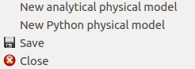
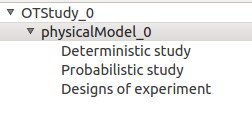
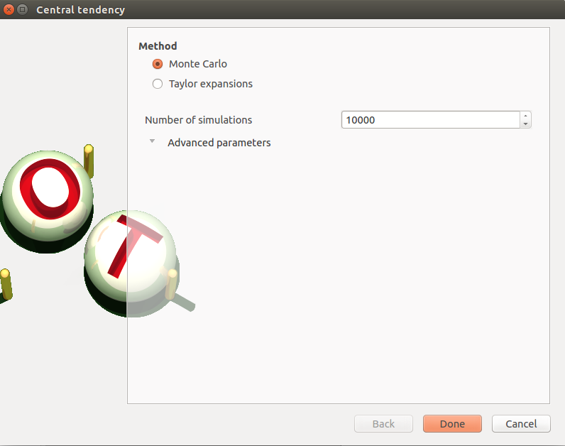
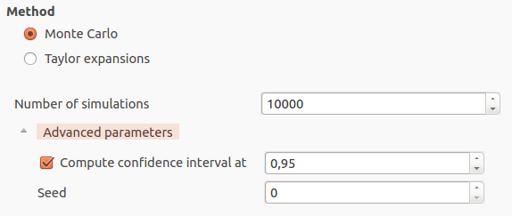
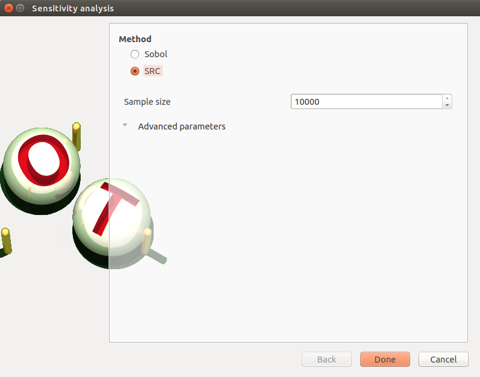

Examples
========

Example 1: Deviation of a cantilever beam
-----------------------------------------

This example has been presented in the ESREL 2007 conference in the paper [Dutfoy2009]_.
It is described in the OpenTURNS Example Guide.

This example is a simple beam, restrained at one side and stressed by a
concentrated bending load F at the other side.

1- Problem statement
````````````````````

a- Inputs
'''''''''

- Stochastic variables:

====== ======================== ===============================
 Name  Description              Distribution
====== ======================== ===============================
E      Young's modulus          Beta(0.93, 3.2, 2.8e7, 4.8e7)
F      Charge applied           LogNormal(30000., 9000., 15000)
L      Length                   Uniform(250, 260)
I      Section modulus          Beta(2.5, 4., 3.1e2, 4.5e2))
====== ======================== ===============================

The input variables :math:`L` and :math:`I` are dependent. The dependence struture
is modelised by a Normal copula (the only copula available for now in the GUI).
The Spearman correlation matrix of the input random vector :math:`E, F, L, I` is :

.. math ::

    R_{S} = \left(
        \begin{array}{cccc}
        1 & 0 & 0 & 0 \\
        0 & 1 & 0 & 0 \\
        0 & 0 & 1 & -0.2 \\
        0 & 0 & -0.2 & 1
        \end{array} \right)

b- Output
'''''''''

The deviation :math:`y` of the free end of the beam equals to:

.. math::

    y = \frac{FL^3}{3EI}

2- Define the model
```````````````````

2-1 Create the study
''''''''''''''''''''

.. |newButton| image:: /user_manual/graphical_interface/getting_started/document-new22x22.png

There are three ways to create a new study:

- Use the dialog box which appears when the application is launched;

- Click on |newButton| in the tool bar;

- Click on **New OTStudy** in the file menu.

.. image:: new_study.png
    :align: center


2-1 Create the analytical physical model
''''''''''''''''''''''''''''''''''''''''

To define the physical model, choose **New analytical physical model** in the
context menu (right click) in the study tree.



We obtain the following window :

.. image:: new_analyticalPhysicalModel.png
    :align: center

The creation of a physical model adds a physicalModel item in the study tree which gathers three
sub-items:

- Deterministic study
- Probabilistic study
- Designs of experiment



Use the **Add** buttons below the tables to add as many lines as number of variables
in the physical model.

.. image:: add_variables_in_tables.png
    :align: center

Fill the tables and rename variables to correspond to the physical model.

.. image:: good_defined_physicalModel.png
    :align: center

Click on the **Evaluate** button below the output variables table in order to check
if the formula is not badly defined.

.. image:: evaluation_output_PM_window.png
    :align: center

The value of the output :math:`y` must be :math:`13.0208` if:

======= ======= ======= =======
E       F       L       I
======= ======= ======= =======
3e7     3e4     250     400
======= ======= ======= =======


2-1 Create the probabilistic model
''''''''''''''''''''''''''''''''''

To define the probabilistic model, choose **New probabilistic model** in the
context menu (right click) of the probabilistic study item in the study tree.
Only one probabilistic model can be defined by physical model.

.. image:: contextual_menu_proba_study.png
    :align: center

The probabilistic model is defined by associated a distribution to input variables
and specify correlation between them if needed.

.. image:: proba_model_default.png
    :align: center

The first tab **Marginals** list automatically all the input variables defined
in the physical model window.
By default all the lines are unchecked which means all the inputs
variables are deterministic. In the right side of the window the variable value
is the value mentioned in the physical model window.

To make a variable stochastic, check its line. Then the combobox in the second
column of the table is available and the current text is **Normal**.
By default the Normal distribution is used with a mean value :math:`E[Input]`
equal to the value defined in the physical model window and with a standard
deviation equal to :math:`0.1 |E[Input]|`

.. image:: proba_model_default_distribution.png
    :align: center

Check all the lines and choose the good distribution in the list and change
the parameters values in the right side of the window.

.. image:: proba_model.png
    :align: center

The second tab **Correlation** show the Spearman correlation matrix.
The symmetry of the correlation matrix is automatically handled. The Gaussian
copula is used to model the dependency. By default all variables are independent.
To specify the correlation between the variables :math:`L` and :math:`I`
change the value in the corresponding cell.

.. image:: correlation.png
    :align: center


3- Central tendency analysis
````````````````````````````

3-1 Taylor Expansions
'''''''''''''''''''''

For more details on the
`Linear Taylor Expansions <http://doc.openturns.org/openturns-latest/html/ReferenceGuide/cid6.xhtml#uid1006>`_
see the OpenTURNS documentation.

3-1-1 Inputs
************

To perform a central tendency analysis with the Taylor expansions for the
estimation of moments, choose **New central tendency** in the
context menu (right click) of the probabilistic model item in the study tree.

.. image:: contextual_menu_proba_model.png
    :align: center

Check the radio button **Taylor expansions** in the wizard which appears.

.. image:: central_tendency_wizard_Taylor.png
    :align: center

Click on **Done** button. A new item with a default name appears in the study
tree and a results window is created.

3-1-2 Results
*************

The results window contains a table.

.. image:: taylor_results_table.png
    :align: center

3-2 Monte Carlo
'''''''''''''''

For more details on the `Monte Carlo method <http://doc.openturns.org/openturns-latest/html/ReferenceGuide/cid4.xhtml#uid626>`_
see the OpenTURNS documentation.

3-2-1 Inputs
************

To perform a central tendency analysis with the Monte Carlo method,
choose **New central tendency** in the
context menu (right click) of the probabilistic model item in the study tree.

.. image:: contextual_menu_proba_model.png
    :align: center

Check the radio button **Monte Carlo** in the wizard which appears.



To see advanced parameters, collapse the **Advanced parameters** group.



Click on **Done** button. A new item with a default name appears in the study
tree and a results window is created.

3-2-2 Results
*************

The results window contains 7 tabs. When requiring 10000 simulations, the seed
number equal to 0 and the computation of the confidence interval of the mean and
the standard deviation at 0.95%, the second tab must contain the following
values :

.. image:: MonteCarlo_results_window.png
    :align: center


4- Min/Max study with deterministic design of experiments
`````````````````````````````````````````````````````````

For more details on the `Min/Max approach <http://doc.openturns.org/openturns-latest/html/ReferenceGuide/cid4.xhtml#uid599>`_
see the OpenTURNS documentation.

4-1 Inputs
''''''''''

To perform a Min/Max study, choose **New design of experiment** in the
context menu (right click) of the designs of experiment item in the study tree.

.. image:: contextual_menu_DOE.png
    :align: center

Check the radio button **Deterministic** in the wizard which appears and click on
**Continue** button.

.. image:: DOE_wizard.png
    :align: center

After clicking a table appears.

.. image:: deterministic_design_of_experiment.png
    :align: center

By default all the lines are checked which all the inputs are variable.
The minimum and the maximum values are computed automatically thanks to
the distribution of the variables. The minimum value is the quantile at the
probability of 0.05 and the maximum one is the quantile at the probability of
0.95. The number of used values per variable is by default 2.
Uncheck a line consist in making the variable constant equal to the value set in
the column **Value**.

Click on **Done** button. A new item with a default name appears in the study
tree and a results window is created.

4-2 Results
'''''''''''

4-2-1 Input variables
*********************

The results window contains the design of experiment.

.. image:: DOE_inputs.png
    :align: center

The points are generated according to the structure of a box design of experiments.
This deterministic design of experiments has 8 points obtained by regularly discretizing
the pavement
:math:`[28350160, 42414817] \times [20166.601, 47021.278] \times [250.5, 259.5] \times [342.97477, 441.26225]`.

Click on **Evaluate** button to compute the output variables.

4-2-2 Min/Max values
********************

When the computation is finished, columns corresponding to the output variables
values are added in the table and other tabs appear in the window.

.. image:: DOE_results.png
    :align: center

The second tab must contain the following values:

.. image:: min_max_values_DOE.png
    :align: center


5- Sensibility analysis
```````````````````````

5-1 Sobol' indices
''''''''''''''''''

For more details on the computation of the `Sobol' indices <http://doc.openturns.org/openturns-latest/html/ReferenceGuide/cid5.xhtml#uid949>`_
see the OpenTURNS documentation.

5-1-1 Inputs
************

To perform a sensibility analysis with the Sobol method, the input variables must
be independent (In the Correlation tab of the probabilistic model window replace
-0.2 by 0). Choose **New sensibility analysis** in the
context menu (right click) of the probabilistic model item in the study tree.

.. image:: contextual_menu_proba_model.png
    :align: center

Check the radio button **Sobol** in the wizard which appears.

.. image:: sensibilityAnalysis_defaultWizard.png
    :align: center

To see advanced parameters, collapse the **Advanced parameters** group.

.. image:: sobol_parameters.png
    :align: center

Click on **Done** button. A new item with a default name appears in the study
tree and a results window is created.

5-1-2 Results
*************

The results window contains a table with the first and total order indices value
for each variable. These values are represented in a graphic.
When requiring 100000 simulations, the values must be:

.. image:: sobol_results_window.png
    :align: center

The interaction between the variables are mentioned below of the table.
It is the sum of second order indices. It can be visualize on the graphic by
the distances between the first order indices and the total order indices.

The warnings inform the user that a total order index is smaller than the first
order index. When increasing the sample size, these warnings disappear.

To perform the following analyses use again a Gaussian copula.

5-1 SRC indices
'''''''''''''''

For more details on the computation of the
`Standard Regression Coefficients <http://doc.openturns.org/openturns-latest/html/ReferenceGuide/cid5.xhtml#uid916>`_
see the OpenTURNS documentation.

5-1-1 Inputs
************

To perform a sensibility analysis with the SRC method, choose
**New sensibility analysis** in the
context menu (right click) of the probabilistic model item in the study tree.

.. image:: contextual_menu_proba_model.png
    :align: center

Check the radio button **SRC** in the wizard which appears.



To see advanced parameters, collapse the **Advanced parameters** group.

.. image:: SRC_parameters.png
    :align: center

Click on **Done** button. A new item with a default name appears in the study
tree and a results window is created.

5-1-2 Results
*************

The results window contains a table with the SRC indices values
for each variable. These values are represented in a graphic.
When requiring 100000 simulations, the values must be:

.. image:: SRC_results_window.png
    :align: center


6- Threshold exceedance
```````````````````````

For more details on the computation of the failure probability by the method of
`Monte Carlo <http://doc.openturns.org/openturns-latest/html/ReferenceGuide/cid4.xhtml#docref_C321_MonteCarloStd>`_
see the OpenTURNS documentation.

6-1 Input
'''''''''

To create the limit state function which enables the definition of the failure
event, choose **New limit state** in the context menu (right click) of the
probabilistic model item in the study tree.

.. image:: contextual_menu_proba_model.png
    :align: center

After clicking, a new item with a default name appears in the study
tree and the following window appears:

.. image:: default_limitState.png
    :align: center

We consider the event where the deviation exceeds :math:`30cm`. Choose the good
operator in the combobox and set the value of the threshold in order to obtain
the following limit state window:

.. image:: good_limit_state.png
    :align: center

To perform the Monte Carlo simulation, choose **New threshold exceedance** in the
context menu (right click) of the limit state item in the study tree.

Then change the parameters in the wizard which appears.

.. image:: MonteCarloSimulation_wizard.png
    :align: center

Click on **Done** button. A new item with a default name appears in the study
tree and a results window is created.

5-1-2 Results
*************

The results window contains a table with the SRC indices values
for each variable. These values are represented in a graph.
When requiring a maximum outer sampling of 40000, a block size of 100 and
a coefficient of variation of 0.1, the results must be:

.. image:: FailureProbabilityTable.png
    :align: center

The values of the output :math:`y` computed during the simulation are stored
and plotted in the second tab of the window:

.. image:: histogram.png
    :align: center


The convergence graph is in the third tab:

.. image:: convergence_graph.png
    :align: center


