Examples
========

Example 1: Deviation of a cantilever beam
-----------------------------------------

This example has been presented in the ESREL 2007 conference in the paper [Dutfoy2009]_.
It is described in the OpenTURNS Example Guide.

This example is a simple beam, restrained at one side and stressed by a
concentrated bending load F at the other side.

1- Problem statement
````````````````````

a- Inputs
'''''''''

- Stochastic variables:

====== ======================== ===============================
 Name  Description              Distribution
====== ======================== ===============================
E      Young's modulus          Beta(0.93, 3.2, 2.8e7, 4.8e7)
F      Charge applied           LogNormal(30000., 9000., 15000)
L      Length                   Uniform(250, 260)
I      Section modulus          Beta(2.5, 4., 3.1e2, 4.5e2))
====== ======================== ===============================

The input variables :math:`L` and :math:`I` are dependent. The dependence structure
is modelised by a Normal copula (the only copula available for now in the GUI).
The Spearman correlation matrix of the input random vector :math:`E, F, L, I` is :

.. math ::

    R_{S} = \left(
        \begin{array}{cccc}
        1 & 0 & 0 & 0 \\
        0 & 1 & 0 & 0 \\
        0 & 0 & 1 & -0.2 \\
        0 & 0 & -0.2 & 1
        \end{array} \right)

b- Output
'''''''''

The deviation :math:`y` of the free end of the beam equals to:

.. math::

    y = \frac{FL^3}{3EI}

2- Define the model
```````````````````

2-1 Create the study
''''''''''''''''''''

.. |newButton| image:: /user_manual/graphical_interface/getting_started/document-new22x22.png

Click on |newButton| in the tool bar to create a new study.

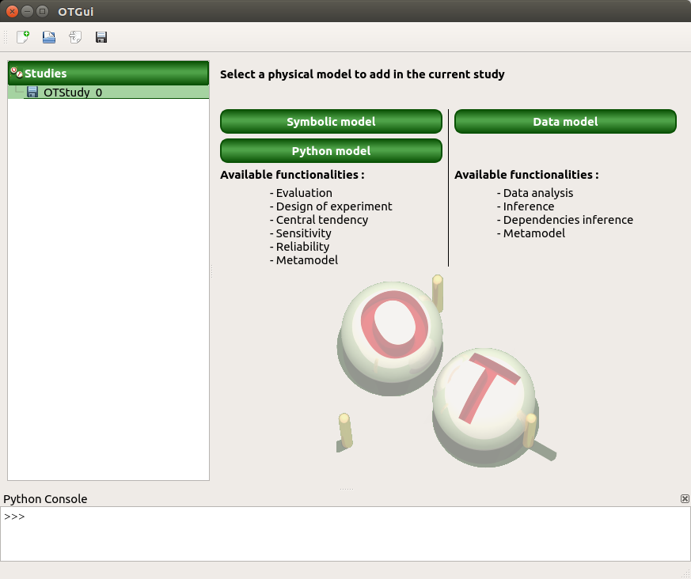


2-1 Create the analytical physical model
''''''''''''''''''''''''''''''''''''''''

To define the physical model, click on the button **Symbolic model**
of the window shown above.

The following window appears and a physicalModel item is added in the study tree:

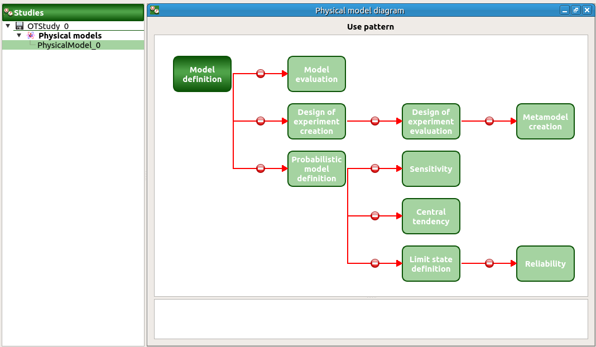

Click on the **Model definition** box of the model diagram to create the
following window.

.. image:: modelDefinition.png
    :align: center

Use the **Add** buttons below the tables to add as many lines as number of variables
in the physical model.

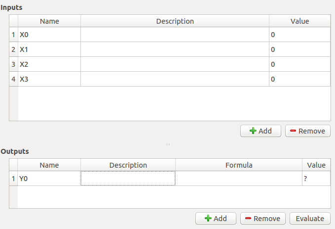

Fill the tables and rename variables to correspond to the physical model.

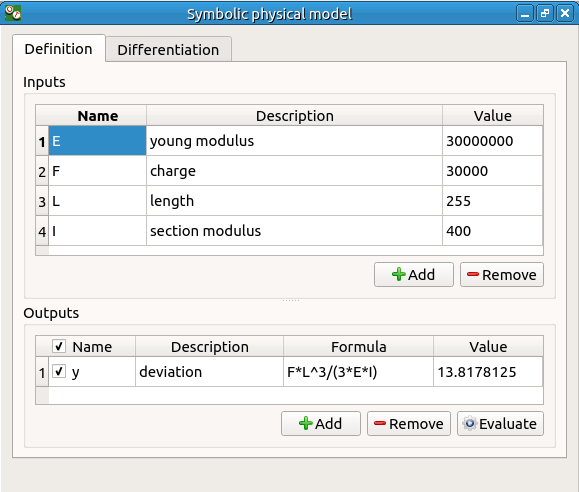

.. _evaluationresult:

Click on the **Evaluate** button below the output variables table in order to check
if the formula is not badly defined.

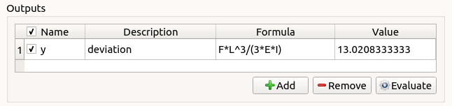

The value of the output :math:`y` must be :math:`13.0208` if:

======= ======= ======= =======
E       F       L       I
======= ======= ======= =======
3e7     3e4     250     400
======= ======= ======= =======


2-1 Create the probabilistic model
''''''''''''''''''''''''''''''''''

To define the probabilistic model, choose **Probabilistic model** in the
context menu of the sub item **Definition** of the model in the study tree.
Only one probabilistic model can be defined by physical model.

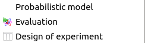

The probabilistic model is defined by associating a distribution to input variables
and specifying correlation between them if needed.

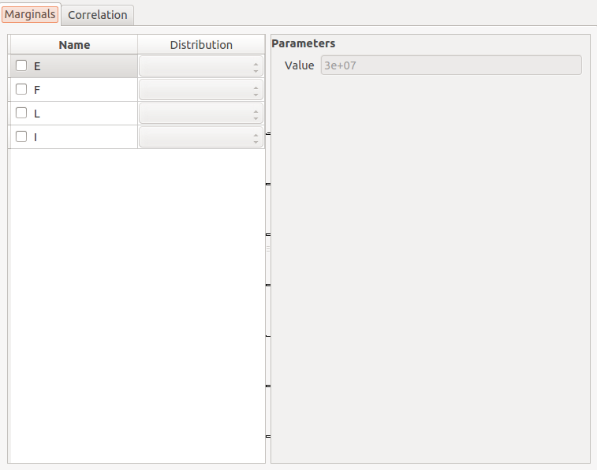

The first tab **Marginals** list automatically all the input variables defined
in the physical model window.
By default all the lines are unchecked which means all the inputs
variables are deterministic. In the right side of the window the variable value
is the value mentioned in the physical model window.

To make a variable stochastic, check its line. Then the combobox in the second
column of the table is available and the current text is **Normal**.
By default the Normal distribution is used with a mean value :math:`E[Input]`
equal to the value defined in the physical model window and with a standard
deviation equal to :math:`0.1 |E[Input]|`

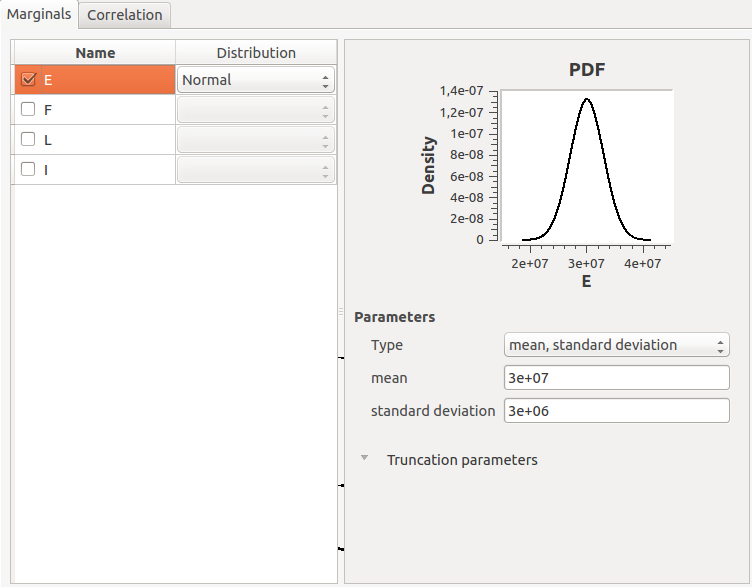

Check all the lines and choose the good distribution in the list and change
the parameters values in the right side of the window.

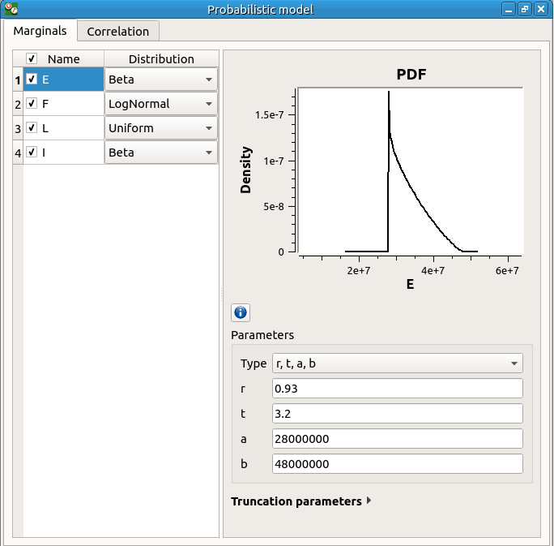

The second tab **Correlation** show the Spearman correlation matrix.
The symmetry of the correlation matrix is automatically handled. The Gaussian
copula is used to model the dependency. By default all variables are independent.
To specify the correlation between the variables :math:`L` and :math:`I`
change the value in the corresponding cell.

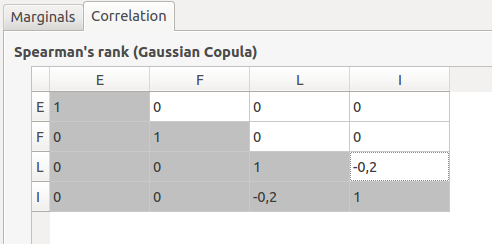


3- Central tendency analysis
````````````````````````````

3-1 Taylor Expansions
'''''''''''''''''''''

For more details on the
`Linear Taylor Expansions <http://doc.openturns.org/openturns-latest/html/ReferenceGuide/cid6.xhtml#uid1006>`_
see the OpenTURNS documentation.

3-1-1 Definition
****************

To perform a central tendency analysis with the Taylor expansions for the
estimation of moments, choose **New central tendency** in the
context menu of the probabilistic model item in the study tree.

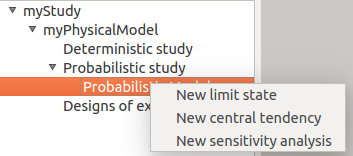

Check the radio button **Taylor expansions** in the wizard which appears.


Click on **Finish** button. A new item with a default name appears in the study
tree and a window is created.

.. image:: taylor_window.png
    :align: center

Click on **Run** button to launch the analysis. When the analysis is finished
a result window is created.

3-1-2 Results
*************

The results window contains a table.

.. image:: taylor_results_table.png
    :align: center

3-2 Monte Carlo
'''''''''''''''

For more details on the `Monte Carlo method <http://doc.openturns.org/openturns-latest/html/ReferenceGuide/cid4.xhtml#uid626>`_
see the OpenTURNS documentation.

3-2-1 Definition
****************

To perform a central tendency analysis with the Monte Carlo method,
click on the **Central tendency** box of the model diagram.

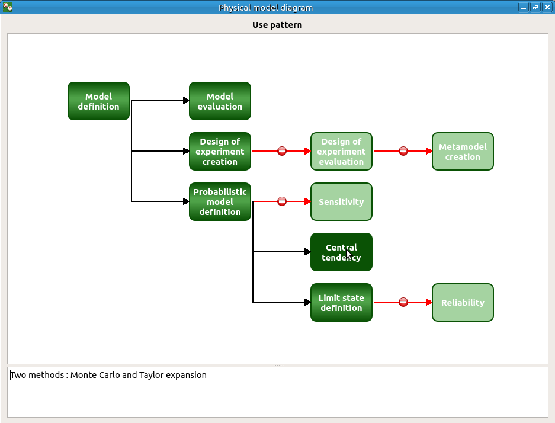

Check the radio button **Monte Carlo** in the wizard which appears.


Click on the **Continue** button to parametrize the Monte Carlo method.

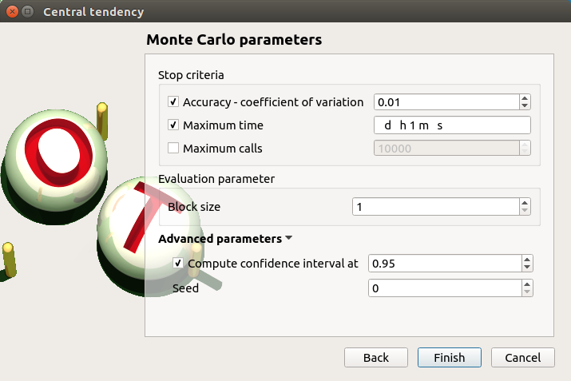

To see advanced parameters, collapse the **Advanced parameters** group.

Click on **Finish** button. A new item with a default name appears in the study
tree and a window is created.

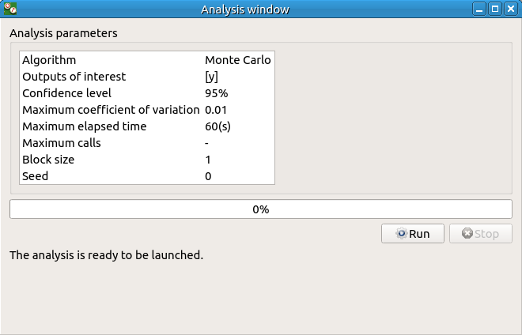

Click on **Run** button to launch the analysis. When the analysis is finished
a result window is created.

3-2-2 Results
*************

The results window contains 8 tabs. The first tab must contain the following
values :

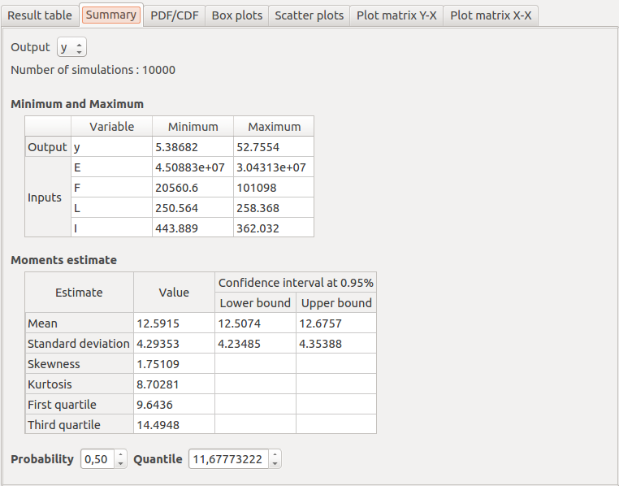


4- Min/Max study with deterministic design of experiments
`````````````````````````````````````````````````````````

For more details on the `Min/Max approach <http://doc.openturns.org/openturns-latest/html/ReferenceGuide/cid4.xhtml#uid599>`_
see the OpenTURNS documentation.

4-1 Definition
''''''''''''''

To perform a Min/Max study, choose **New design of experiments** in the
context menu of the designs of experiments item in the study tree.

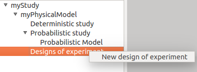

Check the radio button **Deterministic** in the wizard which appears and click on
**Continue** button.

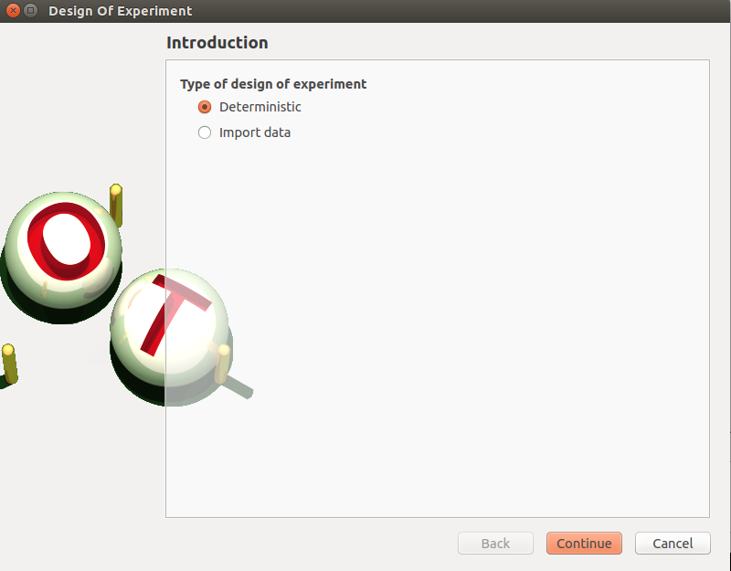

After clicking a table appears.

By default all the lines are unchecked. Thus the design of experiments contains
only one point. Check the **Name** column to make all the inputs variable.

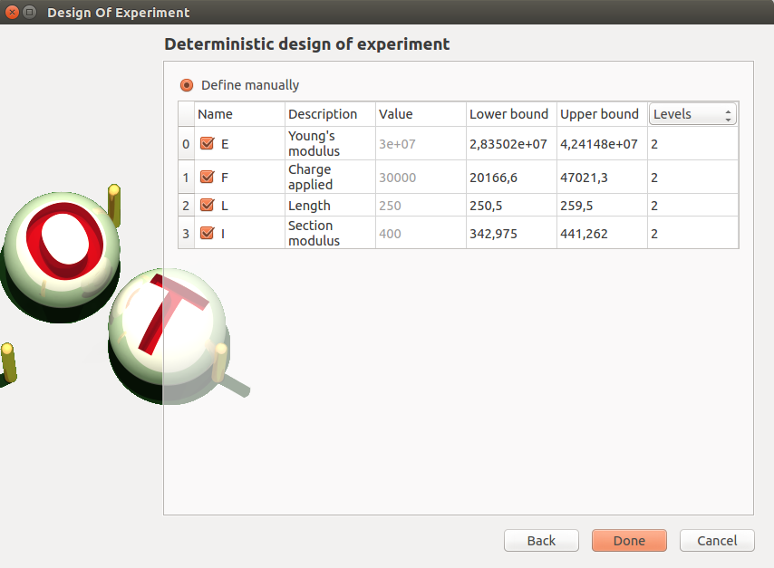

The minimum and the maximum values are computed automatically thanks to
the distribution of the variables. The minimum value is the quantile at the
probability of 0.05 and the maximum one is the quantile at the probability of
0.95. The number of used values per variable is by default 2.

Click on **Finish** button. A new item with a default name appears in the study
tree and a window with a table is created.

4-2 Results
'''''''''''

4-2-1 Input variables
*********************

The results window contains the design of experiments.

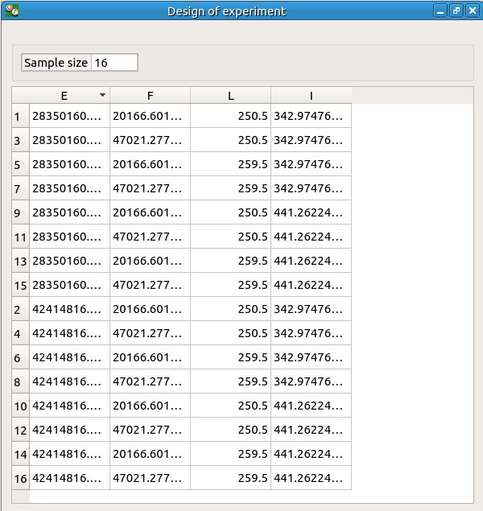

The points are generated according to the structure of a box design of experiments.
This deterministic design of experiments has 16 points obtained by regularly discretizing
the pavement
:math:`[28350160, 42414817] \times [20166.601, 47021.278] \times [250.5, 259.5] \times [342.97477, 441.26225]`.

Click on **Evaluate** in the context menu of the design of experiments item.
Click on the **Finish** button of the window which appears.

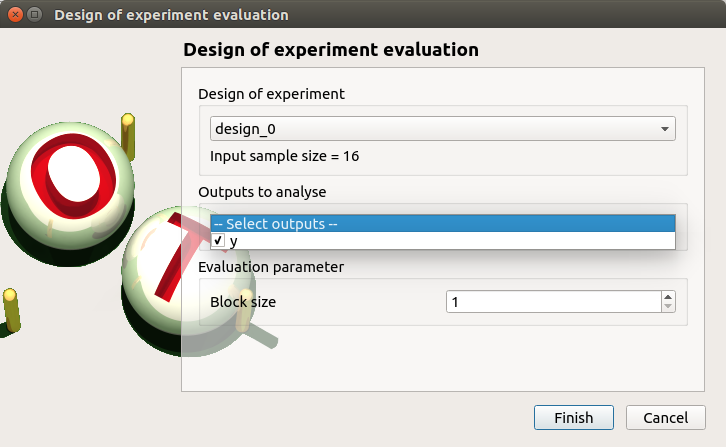

To launch the analysis click on the **Run** button of the new window.

4-2-2 Min/Max values
********************

When the computation is finished, a new window is created.
The **Table** tab contains the input and output values.

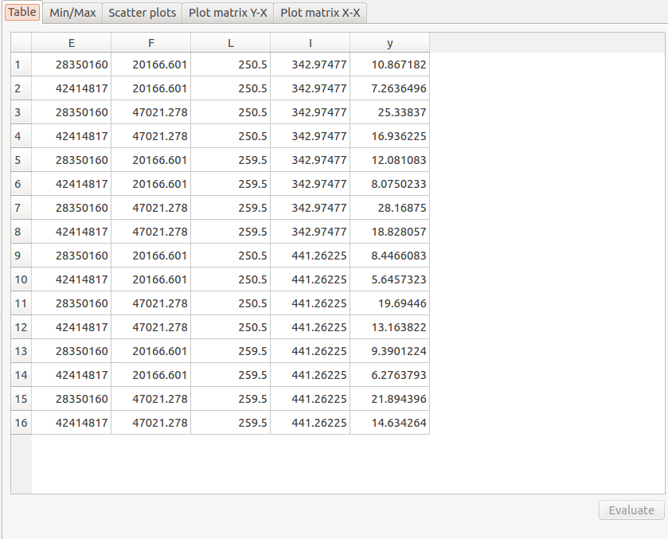

The first tab must contain the following values:

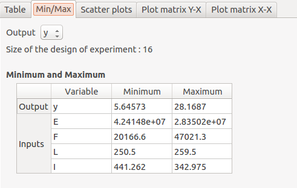


5- Sensitivity analysis
```````````````````````

.. _SobolExample:

5-1 Sobol' indices
''''''''''''''''''

For more details on the computation of the `Sobol' indices <http://openturns.github.io/openturns/master/theory/reliability_sensitivity/sensitivity_sobol.html>`_
see the OpenTURNS documentation.

5-1-1 Definition
****************

To perform a sensibility analysis with the Sobol method, the input variables must
be independent (In the Correlation tab of the probabilistic model window replace
-0.2 by 0). Choose **Sensitivity** in the
context menu of the probabilistic model item in the study tree.


Check the radio button **Sobol** in the wizard which appears.

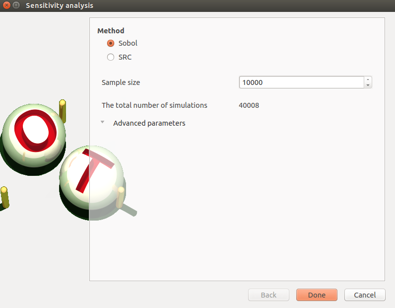

Click on **Continue** button. The new page enables to parametrize the Sobol
method. To see advanced parameters, collapse the **Advanced parameters** group.

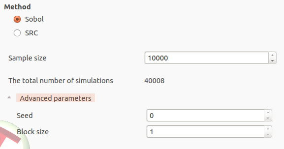

The user has to define at least one criterion to stop the algorithm.

Add the third criterion by selecting the check button **Maximum calls**.
Thus the algorithm will call the model function at the most 10000 times.
Set the block size to 1000.

The maximum number of calls by iteration is updated to 6000.
Indeed the algorithm build two input samples with a size equal to the block size value
and combined these samples to build nbInputs other samples
(nbInputs is the number of input variables).
Thus, the maximum number of calls by iteration is computed with the formula:
:math:`(nbInputs + 2) * blockSize`.

In that case the algorithm will perform two iterations. The second block size
is computed to not exceed the maximum number of calls (10000).

First iteration: (4 + 2) * 1000 = 6000 calls

Second iteration: (4 + 2) * 666 = 3996 calls

Effective maximum total number of calls: 9996

If the maximum number of calls is not given, the block size is always equal to 1000.

Click on **Finish** button. A new item with a default name appears in the study
tree and a results window is created.

5-1-2 Results
*************

The results window contains a table with the first and total order indices value
for each variable. These values are plotted in a graphic.
The values must be:

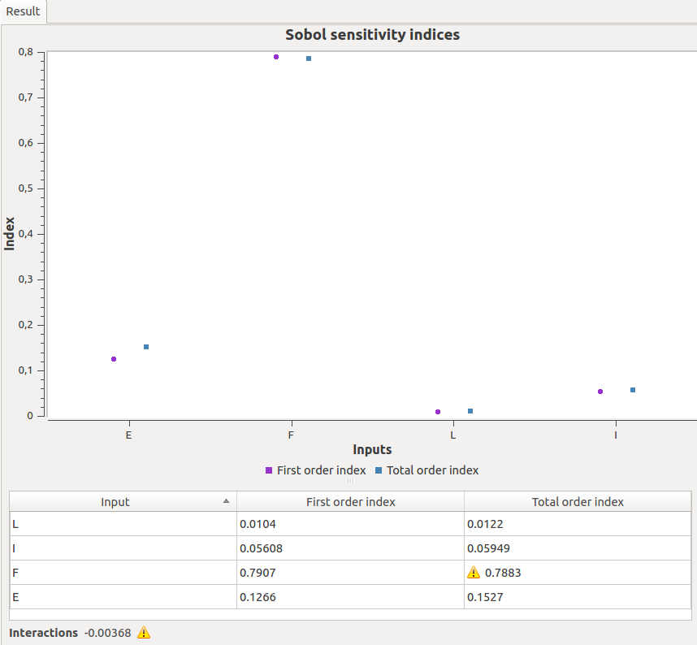

The interaction between the variables are mentioned below the table.
It is the sum of second order indices. It can be visualize on the graphic by
the distances between the first order indices and the total order indices.

The warnings inform the user that a total order index is smaller than the first
order index. When increasing the sample size, these warnings disappear.

On the **Summary** tab the value of the effective stop criteria are written in
a table.

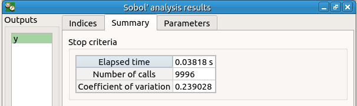

5-1 SRC indices
'''''''''''''''

For more details on the computation of the
`Standard Regression Coefficients <http://doc.openturns.org/openturns-latest/html/ReferenceGuide/cid5.xhtml#uid916>`_
see the OpenTURNS documentation.

5-1-1 Definition
****************

To perform a sensitivity analysis with the SRC method, choose
**Sensitivity** in the
context menu of the probabilistic model item in the study tree.


Check the radio button **SRC** in the wizard which appears.


Click on **Continue** button. The new page enables to parametrize the SRC
method. To see advanced parameters, collapse the **Advanced parameters** group.

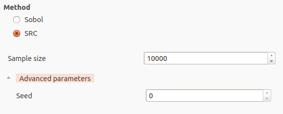

Set the block size to 300. In that case the algorithm will generate a sample
with 34 iterations (33 iterations with a size of 300 and the last iteration with
a size of 100).

Click on **Finish** button. A new item with a default name appears in the study
tree and a results window is created.

5-1-2 Results
*************

The results window contains a table with the SRC indices values
for each variable. These values are plotted in a graphic.

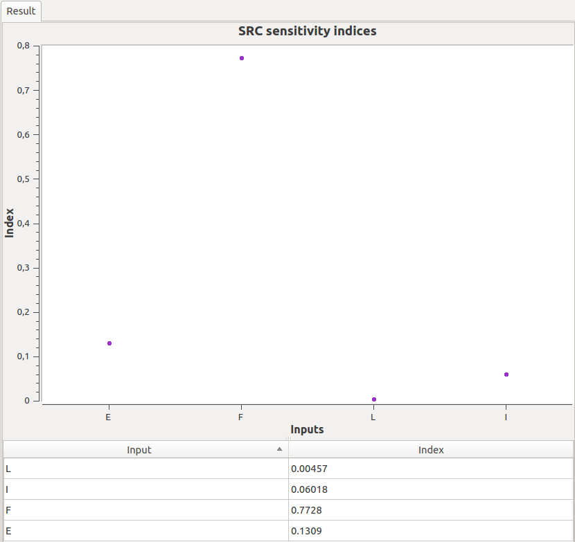

To perform the following analyses use again a Gaussian copula.

6- Threshold exceedance
```````````````````````

6-1 Limit state
'''''''''''''''

To create the limit state function which enables the definition of the failure
event, choose **Limit state** in the context menu of the
probabilistic model item in the study tree.


After clicking, a new item with a default name appears in the study
tree and the following window appears:

.. image:: default_limitState.png
    :align: center

We consider the event where the deviation exceeds :math:`30cm`. Choose the good
operator in the combobox and set the value of the threshold in order to obtain
the following limit state window:

.. image:: good_limit_state.png
    :align: center

6-2 Monte Carlo
'''''''''''''''

For more details on the computation of the failure probability by the method of
`Monte Carlo <http://openturns.github.io/openturns/master/theory/reliability_sensitivity/monte_carlo_simulation.html>`_
see the OpenTURNS documentation.

6-2-1 Definition
****************

To perform the Monte Carlo simulation, choose **Threshold exceedance** in the
context menu of the limit state item in the study tree.

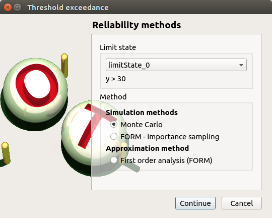

Select the **Monte Carlo** method and click on **Continue** button.
The new page enables to change the parameters of the analysis.

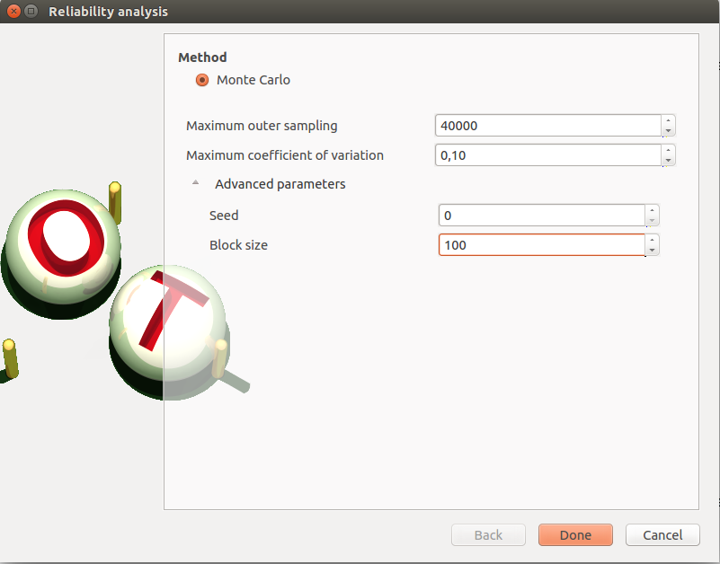

The user has to define at least one criterion to stop the algorithm.

Add the third criterion by selecting the check button **Maximum calls**.
The maximum calls is 10000. Set the block size to 300.

In that case the algorithm will perform 34 iterations with 300 calls to the
model function.

Effective maximum total number of calls: 10200

Click on **Finish** button. A new item with a default name appears in the study
tree and a results window is created.

6-2-2 Results
*************

The results window must contain the following table:

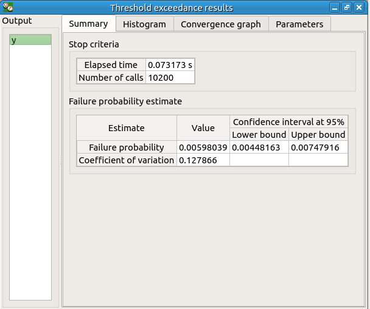

The values of the output :math:`y` computed during the simulation are stored
and plotted in the second tab of the window:

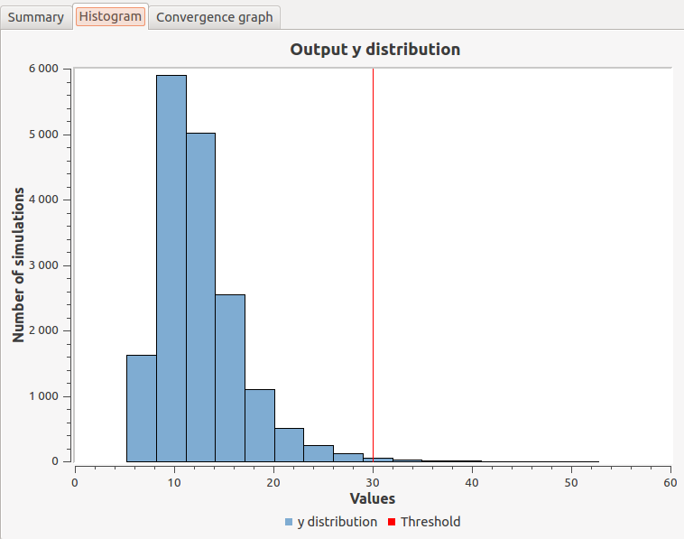


The convergence graph is in the third tab:

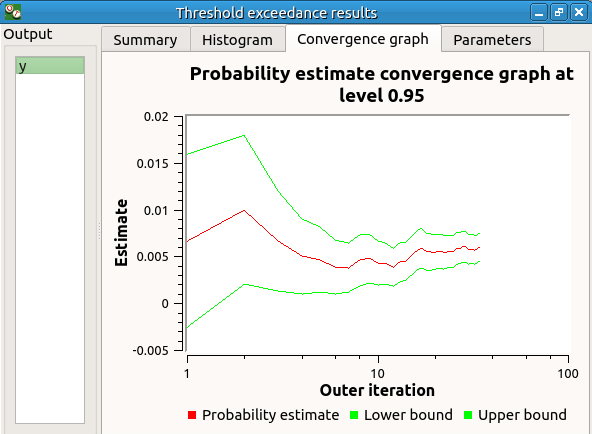

This graph shows the value of the probability estimate at each iteration.

6-3 FORM
''''''''

For more details on the computation of the failure probability by the method of
`FORM <http://doc.openturns.org/openturns-latest/html/ReferenceGuide/cid4.xhtml#docref_C311_Form>`_
see the OpenTURNS documentation.

6-3-1 Definition
****************

To perform the FORM (First Order Reliability Method) analysis, choose **Threshold exceedance** in the
context menu of the limit state item in the study tree.


Select the **FORM** method and click on **Continue** button.
The new page enables to change the parameters of the analysis.

.. image:: FORM_page.png
    :align: center

The starting point is defined by default with the means of the distributions of the stochastic inputs.
:math:`E[E] = 3.38e7; E[F] = 30000; E[L] = 255; E[I] = 397.5`

6-3-2 Results
*************

The results window contains these tables.

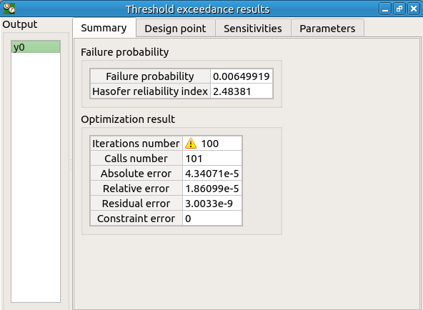

The icon nearby the iterations number value warns the user that the maximum of iterations has been
reached and maybe the optimisation result is not accurate enough.

The **Design point** tab indicates the value of the design point in the standard space and in
the physical space. The table contains the importance factors which are displayed in
the pie chart.

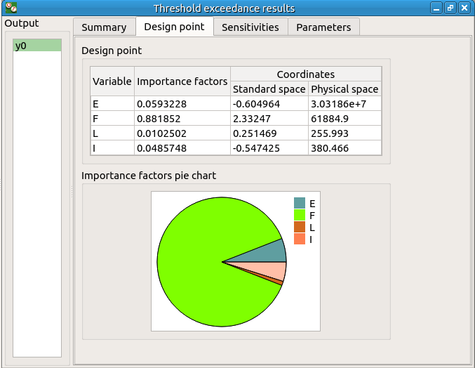

For more details on the `Importance factors <http://doc.openturns.org/openturns-latest/html/ReferenceGuide/cid5.xhtml#uid964>`_
see the OpenTURNS documentation.

The **Sensitivity** tab indicates the sensitivity factors.
For more details on the `Sensitivity factors <http://doc.openturns.org/openturns-latest/html/ReferenceGuide/cid5.xhtml#uid976>`_
see the OpenTURNS documentation.

6-4 FORM-Importance sampling
''''''''''''''''''''''''''''

For more details on the computation of the failure probability by the method of
`Importance sampling <http://doc.openturns.org/openturns-latest/html/ReferenceGuide/cid4.xhtml#docref_C322_TI>`_
see the OpenTURNS documentation.

6-4-1 Definition
****************

To perform the FORM-IS (First Order Reliability Method-Importance sampling) analysis,
choose **Threshold exceedance** in the context menu of the limit state item in the study tree.


Select the **FORM-Importance sampling** method and click on **Continue** button.
The following page enables to change the parameters of the Importance sampling analysis.
Its the same page as for Monte Carlo method.

Click on **Continue** button.
The following page enables to change the parameters of the FORM analysis.
Its the same page as for FORM method.

The analysis consists in performing firstly a FORM analysis, then the computed design point
is used to initialize the Importance sampling analysis.

6-4-2 Results
*************

The FORM-IS result window contains the same tabs as the Monte Carlo result window and a **FORM results**
tab to display the tabs of a FORM result window.

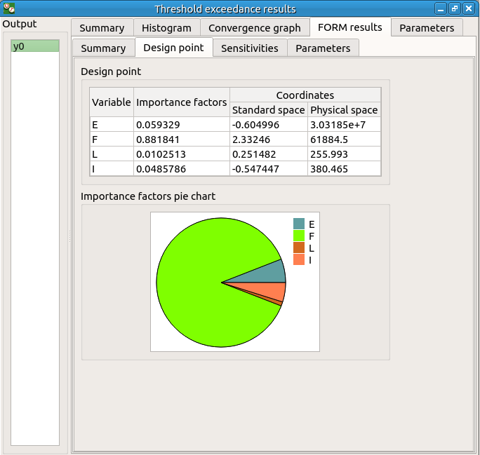

We can see in the following table, the design point from the FORM analysis result.

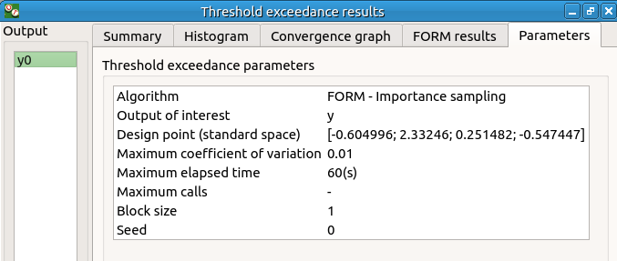

The following histogram shows that on the contrary of the Monte Carlo method,
the sampling is centered at the threshold of the event failure with the Importance sampling method.

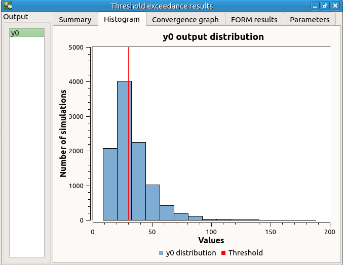

7- Construction of response surfaces
````````````````````````````````````

A response surface is built from samples. So we first create a design
of experiments.

7-1 Design of experiments
'''''''''''''''''''''''''

Create a design of experiments by choosing **New design of experiments** in the
context menu of the **Designs of experiments** item.

.. image:: DOE_proba_wizard.png
    :align: center

Select **Probabilistic** and click on **Continue** button.

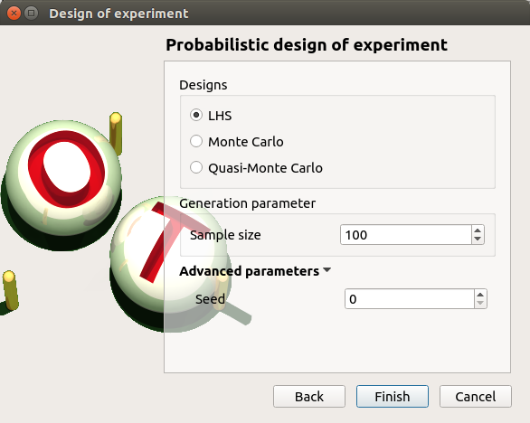

Keep the default values. Click on **Finish** button 

Choose **Evaluate** in the context menu of the new design of experiments item.
Launch the evaluation by clicking on the **Run** button of the window which
appears.


7-2 Functional chaos
''''''''''''''''''''

For more details on the computation of a metamodel by the method of
`Functional chaos <http://doc.openturns.org/openturns-latest/html/ReferenceGuide/cid6.xhtml#docref_SurfRep_PCBasis>`_
see the OpenTURNS documentation.

7-2-1 Definition
****************

Choose **Metamodel** in the context menu of the sub-item **Evaluation** of the
design of experiments item.

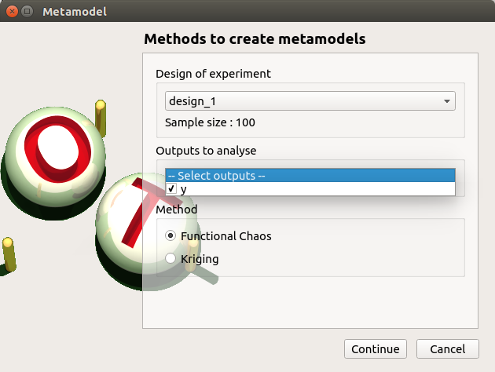

Select the **Functional chaos** method and click on **Continue** button.

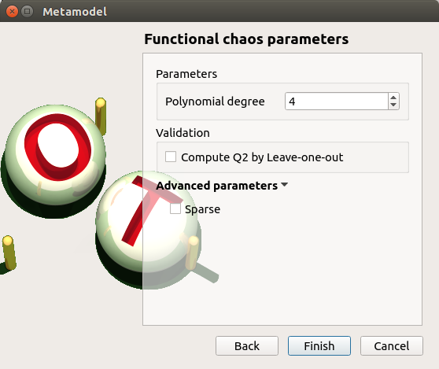

Set the chaos degree to 4 and click on **Finish** button.

Launch the analysis.

7-2-2 Results
*************

The first tab of the result window displays the metamodel.
The relative error enable to check the quality of the metamodel.

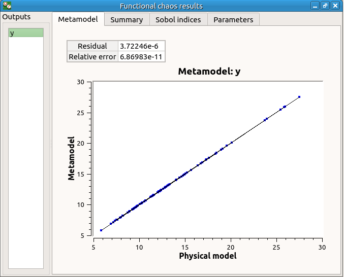

The moments retrieved from the polynomial basis correspond to the result of
the central tendency analyses.

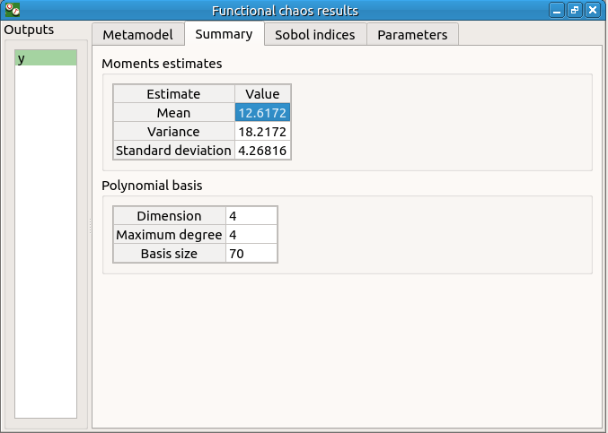

The windows proposes the Sobol indices.

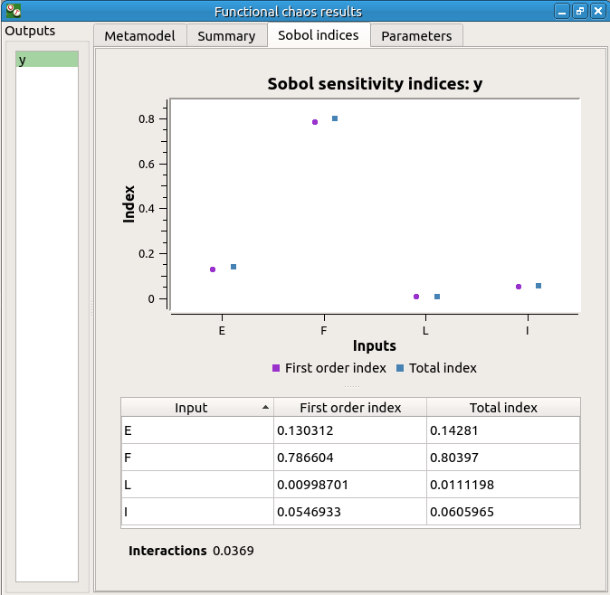

We can see that the values are similar to the ones obtained with the sensitivity analyses.

Click on the context menu of the metamodel item.

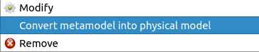

Choose **Convert metamodel into physical model**.
A new item **MetaModel_0** appears in the study tree.
Click on its sub-item **Definition**. A model definition window appears.
Evaluate the model by clicking on the **Evaluate** button.

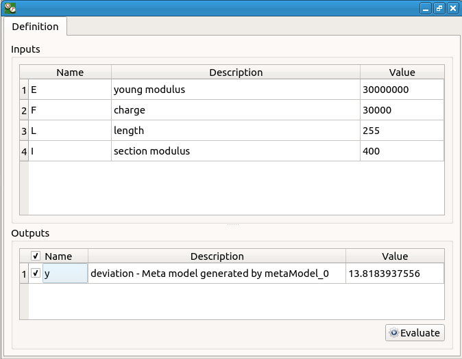

The value is close to the value obtained thanks to the :ref:`analytical formula <evaluationresult>`.


7-3 Kriging
'''''''''''

For more details on the computation of a metamodel by the method of
`Kriging <http://doc.openturns.org/openturns-latest/html/ReferenceGuide/cid6.xhtml#docref_SurfRep_Kriging>`_
see the OpenTURNS documentation.

7-3-1 Definition
****************

Choose **Metamodel** in the context menu of the sub-item **Evaluation** of the
design of experiments item.


Select the **Kriging** method and click on **Continue** button.

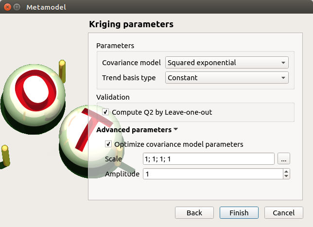

Check the button **Compute Q2 by Leave-one-out**.
Click on **Finish** button.

Launch the analysis.

7-3-2 Results
*************

The computation is expensive because of the Leave-one-out method. Indeed the
algorithm build a metamodel as many times there are input variables.
For more details on the method of
`Leave-one-out <http://doc.openturns.org/openturns-latest/html/ReferenceGuide/cid6.xhtml#uid1063>`_
see the OpenTURNS documentation.

The window contains a tab **Validation** which presents:

    - the metamodel predictivity coefficient: :math:`\displaystyle Q2 = 1 - \frac{\sum_{i=0}^N (y_i - \hat{y_i})^2}{\sum_{i=0}^N {(\bar{y} - y_i)^2}}`
    - the residual: :math:`\displaystyle res = \frac{\sqrt{\sum_{i=0}^N (y_i - \hat{y_i})^2}}{N}`.

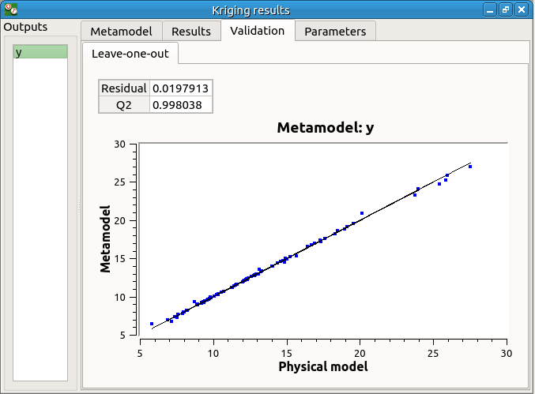

Here the Q2 value is nearby 1, so we can deduce that the metamodel is valid.

The **Results** tab displays the optimized covariance model parameters and
the trend coefficients.

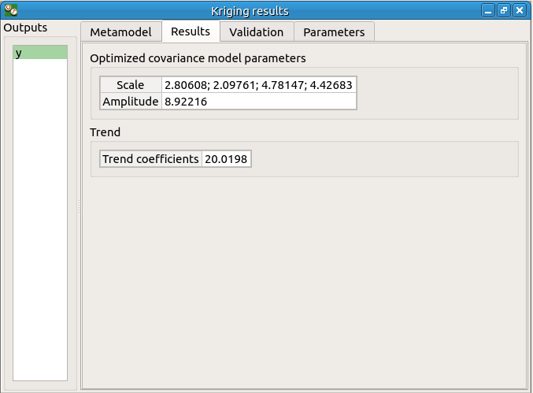


