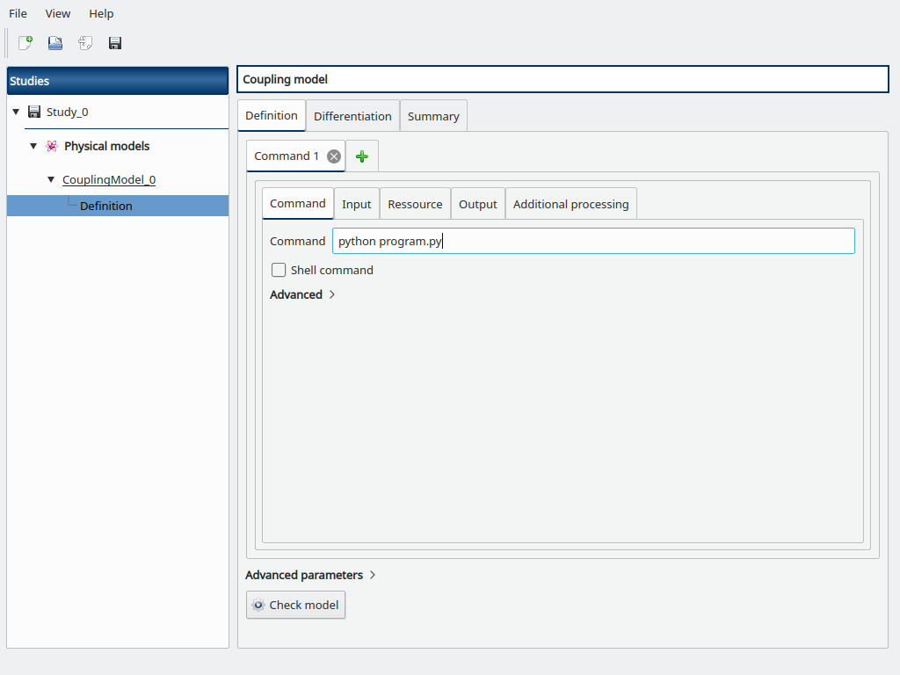
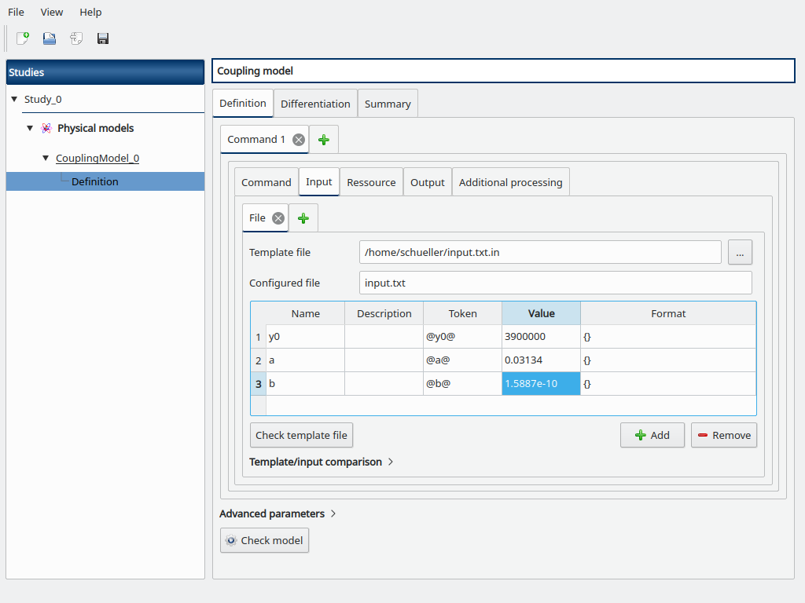
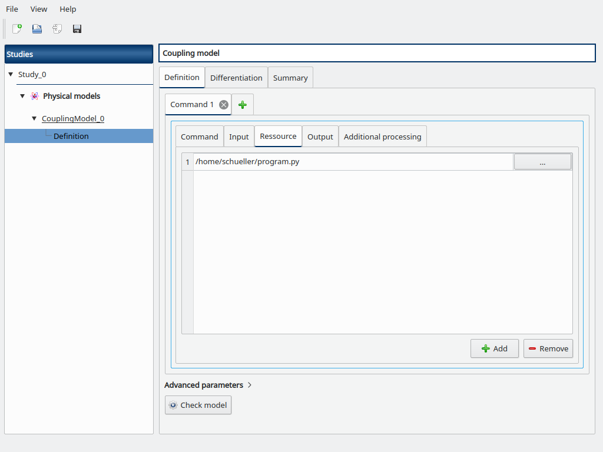
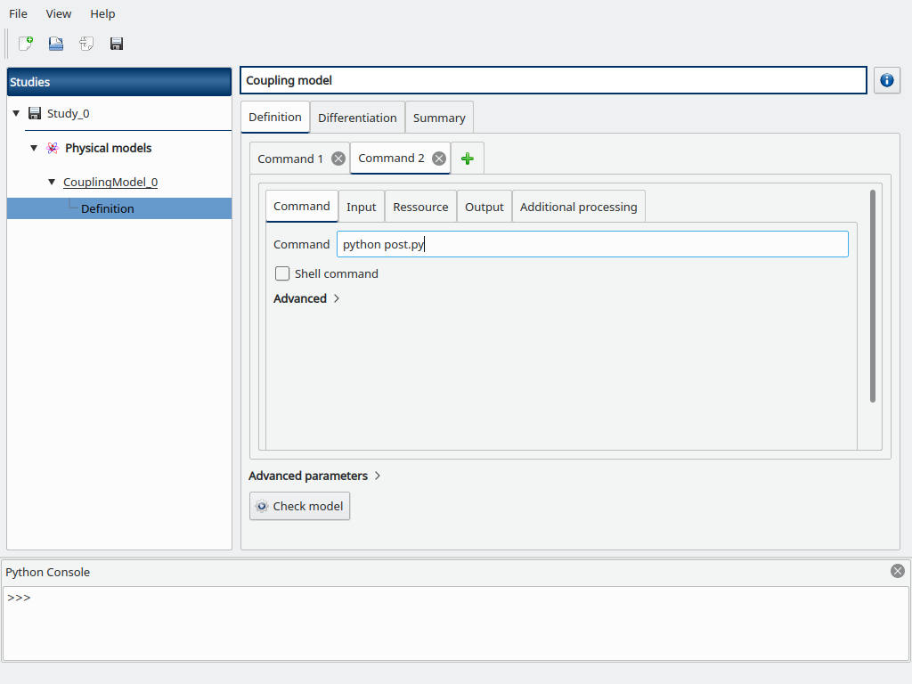
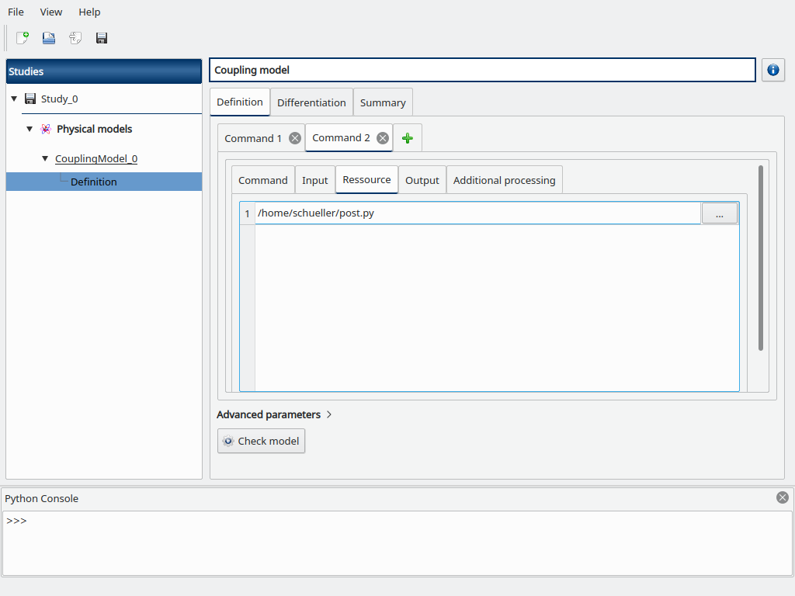
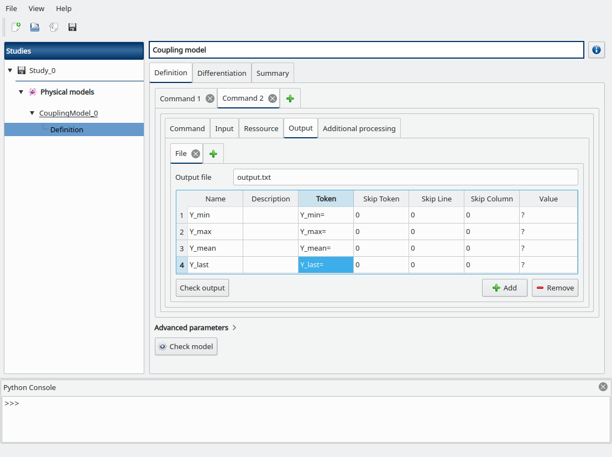
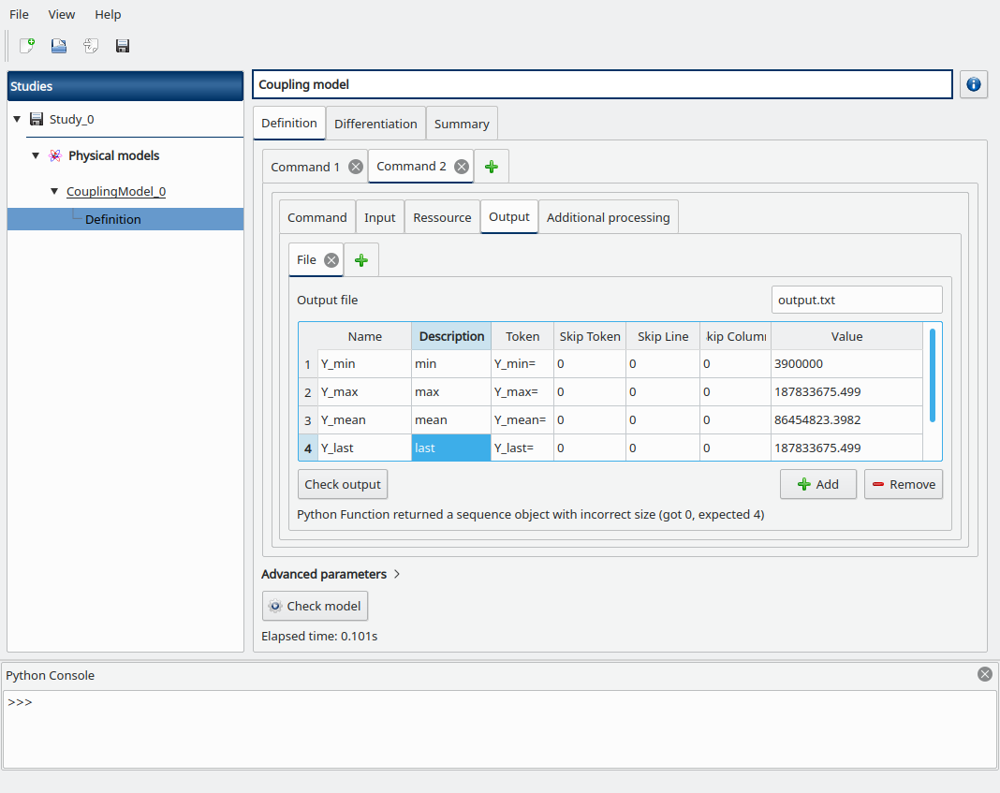

Logistic model
--------------

Here we will demonstrate some coupling model capabilities on the
`logistic model <https://openturns.github.io/openturns/latest/usecases/use_case_logistic.html>`_
from the OpenTURNS documentation.


1- Problem statement
````````````````````

The logistic growth model is the differential equation:

.. math::
   \frac{dy(t)}{dt} = ay(t) - by(t)^2

for any :math:`t\in[t_0, t_{final}]`, with the initial condition:

.. math::
   y(t_0) = y_0

where :

  - :math:`a > 0` and :math:`b > 0` are two real parameters,
  - :math:`y(t)` is the size of the population at time :math:`t`,
  - :math:`t_0` is the initial time,
  - :math:`y_0` is the initial population at time :math:`t=t_0`,
  - :math:`t_{final}` is the final time.

The :math:`a` parameter sets the growth rate of the population. The :math:`b` parameter acts as a competition parameter which limits the size of the population by increasing the competition between its members. 

In [1], the author uses this model to simulate the growth of the U.S. population. To do this, the author uses the U.S. census data from 1790 to 1910. For this time interval, R. Pearl and L. Reed [2] computed the following values of the parameters:

.. math::
   a = 0.03134, \qquad b = 1.5887 \times 10^{-10}.

Our goal is to use the logistic growth model in order to simulate the solution for a larger time interval, from 1790 to 2010:

.. math::
   t_0 = 1790, \qquad t_{final} = 2010

Then we can compare the predictions of this model with the real evolution of the U.S. population.

We can prove that, if :math:`y_0 > 0`, then the limit population is:

.. math::
   y_{limit} =\frac{a}{b}


In 1790, the U.S. population was 3.9 Millions inhabitants:

.. math::
   y_0 = 3.9 \times 10^6.


We can prove that the exact solution of the ordinary differential equation is:

.. math::
   y(t)=\frac{ay_0}{by_0+(a-by_0 ) \exp(-a(t-t_0)) }


for any :math:`t\in[t_0, t_{final}]`.


2- Define the model
```````````````````

We will emulate an external code using a Python script in order to demonstrate the coupling model.

First we need to create a template file named *input.txt.in* for our input variables with a text editor::

    y0=@y0@
    a=@a@
    b=@b@

This file will define the input file passed to the external code with the actual input values.

Then create a Python script named *program.py* that will act as the external code::

    import math as m
    def logisticSolution(t, y0, a, b):
        t0 = 1790.0
        y = a * y0 / (b * y0 + (a - b * y0) * m.exp(-a * (t - t0)))
        return y
    exec(open("input.txt").read())
    Y = [logisticSolution(t, y0, a, b) for t in range(1790, 2011)]
    with open("Y.txt", "w") as f:
        for y in Y:
            f.write("%.17g\n" % y)

This script reads the actual input file *input.txt*, computes the Y time series
according to y0, a, b and writes it into the *Y.txt* file.

Now create a Python script named *post.py* that will allow to post-process the time series values::

    import math as m
    with open("Y.txt") as f:
        Y = [float(line) for line in f.readlines()]
    Y_min = min(Y)
    Y_max = max(Y)
    Y_mean = sum(Y) / len(Y)
    Y_last = Y[-1]
    with open("output.txt", "w") as f:
        f.write("Y_min=%.17g\n" % Y_min)
        f.write("Y_max=%.17g\n" % Y_max)
        f.write("Y_mean=%.17g\n" % Y_mean)
        f.write("Y_last=%.17g\n" % Y_last)

This script reads the Y time series from the *Y.txt* file, computes the interest variables
and write them into the *output.txt* file.

Our coupling will consists in several steps:

- generating input variables from *input.txt.in*
- running *program.py*
- running *post.py*
- reading output values from *output.txt*

2-1 Create the study
''''''''''''''''''''

.. |newButton| image:: /user_manual/graphical_interface/getting_started/document-new22x22.png

Click on the |newButton| in the tool bar to create a new study.

.. image:: /user_manual/graphical_interface/getting_started/window_OTStudy_startUp.png
    :align: center


2-2 Create the coupling physical model
''''''''''''''''''''''''''''''''''''''

To define the physical model, click on the button **Coupling model**
of the window shown above.

The following window appears and a physicalModel item is added in the study tree:

.. image:: /user_manual/graphical_interface/physical_model/physicalModelDiagram.png
    :align: center


Click on the **Model definition** box of the model diagram to create the
following window.



Fill the **Command** box with `python program.py`

Go to the *Input* sub-tab, browse for the path to *input.txt.in* for the
**Template file** field, and the **Configured file** field is automatically set to *input.txt*.

Then add the y0, a and b variables and their token with surrounding @
to mimic the content of *input.txt.in*, and default values y0=3.9e6, a=0.03134, and b=1.5887e-10.



Go to the **Resource** sub-tab, browse for the path to the *program.py* file.



Now add a new **Command** tab (click on the + button) to add a new coupling step,
a new "Command 2" tab is opened.

Fill the **Command** box with `python post.py`



Go to the **Resource** sub-tab, browse for the path to the *post.py* file.



Go to the **Output** sub-tab, fill the *Output file* field with *output.txt*
then add the following output variables we defined in *post.py*, and set their corresponding tokens:

- *Y_min*
- *Y_max*
- *Y_mean*
- *Y_last*



Click on the **Check model** button in the bottom, the elapsed time should
appear on success.
You can go to the **Summary** tab to read the output values.



Another post-processing option to estimate the mean would be to use the
`trapezoidal <https://docs.scipy.org/doc/scipy/reference/generated/scipy.integrate.trapz.html>`_
or `Simpson <https://docs.scipy.org/doc/scipy/reference/generated/scipy.integrate.simps.html>`_ rule
from scipy (in *post.py*)::

    from scipy import integrate
    Y_mean = integrate.trapz(Y)
    Y_mean = integrate.simps(Y)

Now suppose that we want to estimate the mean of the population Y before it
exceeds the threshold to 100 millions inhabitants.
We first have to find the index where *y>100e6*, then compute the mean from the
partial time-series, else we fallback to a null value if the threshold is not
exceeded (in *post.py*)::

    try:
        idx = next(i for i,y in enumerate(Y) if y > 100e6)
        Y_mean = sum(Y[:idx]) / idx
    except StopIteration:
        Y_mean = 0.0
