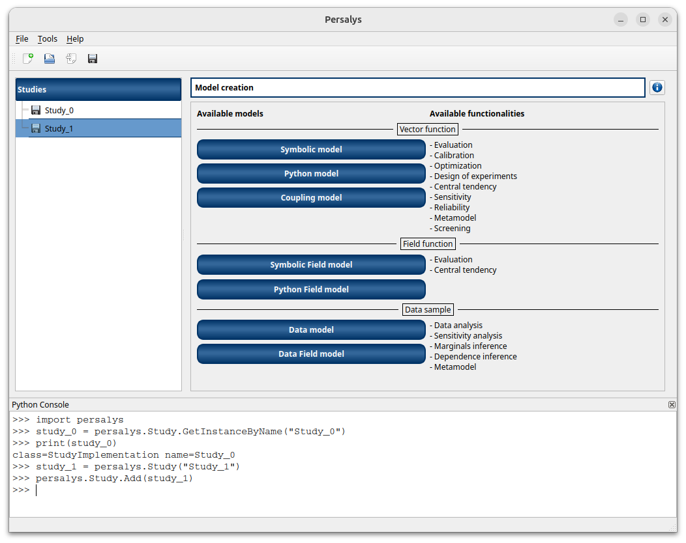
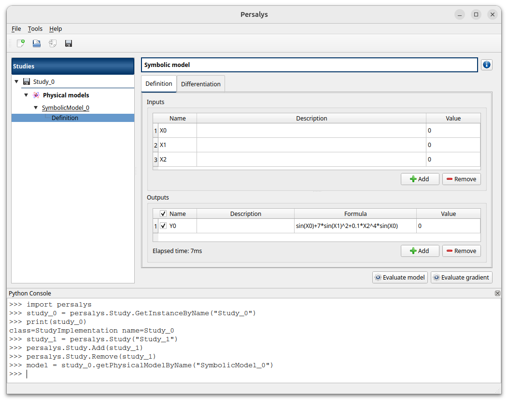
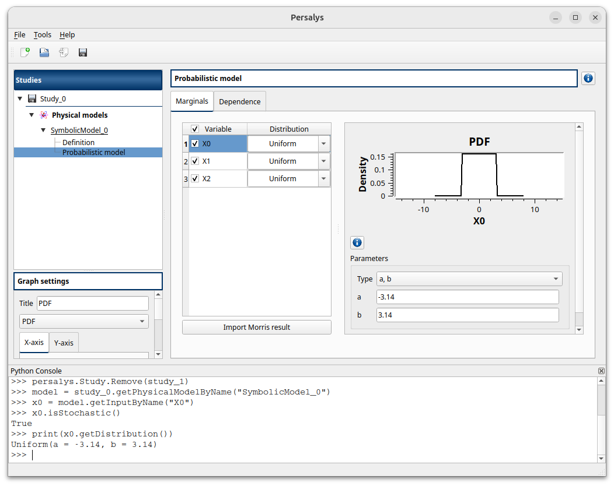
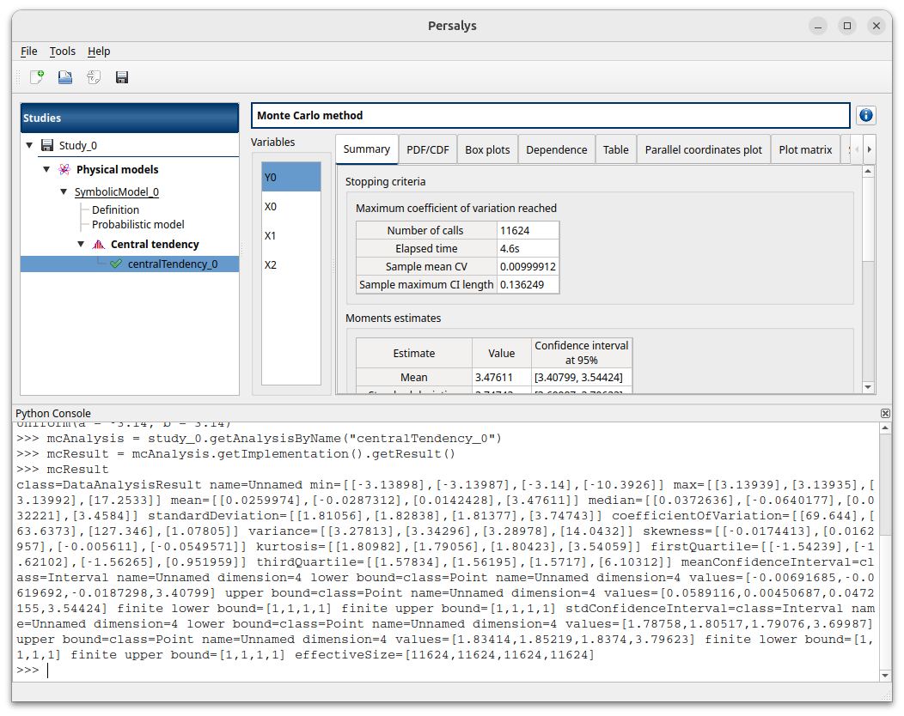

=================================================
User manual - Get started with the Python console
=================================================

In this section, you will learn how to use the Python console to manipulate Persalys objects.
The Python API documentation can be found here: :ref:`user-manual-python-interface`.
If the Python console is not open in Persalys, you can open it from the Tools menu.
The prerequisites for this section are that you are already familiar with Persalys and have basic Python knowledge.

1- Walkthrough example
======================

In this tutorial, we will create a Persalys study and access the objects via the Python API at the same time.

First, import the Persalys Python package.

.. code::

    import persalys

Let's start by opening Persalys and clicking on the New Study button. A study named Study_0 is created.
You can use the static GetInstanceByName method from the :py:class:`persalys.Study` to access it:

.. code::

    study_0 = persalys.Study.GetInstanceByName("Study_0")
    print(study_0)

You can also create a study directly in Python and add it to the tree view:

.. code::

    study_1 = persalys.Study("Study_1")
    persalys.Study.Add(study_1)

Remove study_1:

.. code::

    persalys.Study.Remove(study_1)

Add a Symbolic model to the remaining study and create a definition with one or more input variables and at least one output via the GUI.
You can access the model in Python with:

.. code::

    model = study_0.getPhysicalModelByName("SymbolicModel_0")

Add a distribution to your first input. You can check it in Python via:

.. code::

    x0 = model.getInputByName("X0")
    print(x0.isStochastic())
    print(x0.getDistribution())

Now create a Monte Carlo central tendency analysis and run it. You can retrieve the analysis using:

.. code::

    mcAnalysis = study_0.getAnalysisByName("centralTendency_0")

You can check the result with:

.. code::

    result = mcAnalysis.getImplementation().getResult()
    print(result)

Now that we have covered the basic usage of the Python console,
with the help of the Python interface documentation you should be able to manipulate every Persalys object in Python.
