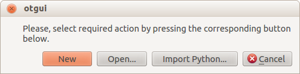

=========================
User manual - First steps
=========================

1- Getting started with the graphical interface
===============================================

1-1 Main window
'''''''''''''''
.. image:: /user_manual/graphical_interface/getting_started/generalOverview.png
    :align: center
    :width: 640px

The main window of the graphical interface consists of a working space in which the other
windows (model definition or result window) open, surrounded by:

- The study tree (on the left),

  .. image:: /user_manual/graphical_interface/getting_started/tree.png
      :align: center

  It contains the OpenTURNS study and all subsequent models defined and analysis performed.
  The name of each element created by can be modified by the user by double-click on the element.
  The element **Deterministic study**, **Probabilistic study** and **Designs of experiment**
  cannot be renamed.
  The right click on these elements gives access the contextual menu of the elements. Any element
  can be removed through this contextual menu.

- The main menubar and toolbar (on top).

  .. image:: /user_manual/graphical_interface/getting_started/menuBar.png
      :align: center

- The Python console (at the bottom) shown by default,

  .. image:: /user_manual/graphical_interface/getting_started/pythonConsole.png
      :align: center

- The graphic settings (below the study tree) which is shown when figures are displayed.

  .. image:: /user_manual/graphical_interface/getting_started/graphicConfiguration.png
      :align: center

1-2 On start up
'''''''''''''''

A dialog box appears when the OTGui is started. It contains 4 items:

- New: Create a new OTStudy

- Open: Display a dialog box for choosing a study
  to load. The loaded study will become the current
  study.

- Import Python...: Display a dialog box for loading an OTGui Python script.

- Cancel: Close the dialog box

1-3 Menus
'''''''''

File Menu
~~~~~~~~~

.. image:: /user_manual/graphical_interface/getting_started/fileMenu.png
    :align: center

The file menu gathers the following shortcuts:

- New OTStudy : Create a new study

- Open OTStudy : Display a dialog box for choosing a study
  to load. The loaded study will become the current
  study.

- Save: Save the current study

- Save As...: Display a dialog box for choosing the directory to save the current project.

- Export Python: Display a dialog box for choosing the directory to export the study as an OTGui Python script.

- Import Python...: Display a dialog box for loading an OTGui Python script.

- Exit: Quit OTGui

View Menu
~~~~~~~~~

.. image:: /user_manual/graphical_interface/getting_started/viewMenu.png
    :align: center

The view menu allows the user to display/hide the Python console.

2- Create a study
=================

.. |newButton| image:: /user_manual/graphical_interface/getting_started/document-new22x22.png

There are three ways to create a new study:

- Use the dialog box which appears when the OTGui is launched;

- Click on |newButton| in the tool bar;

- Click on **New OTStudy** in the file menu.

