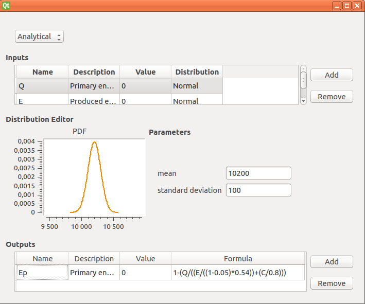
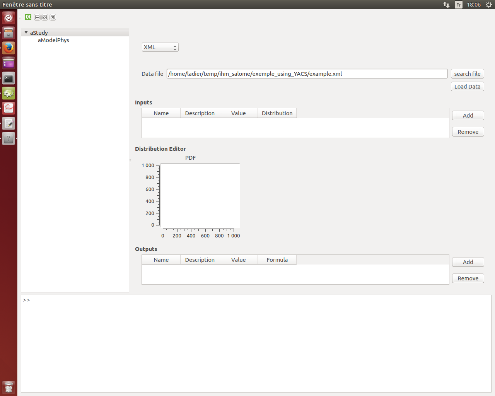
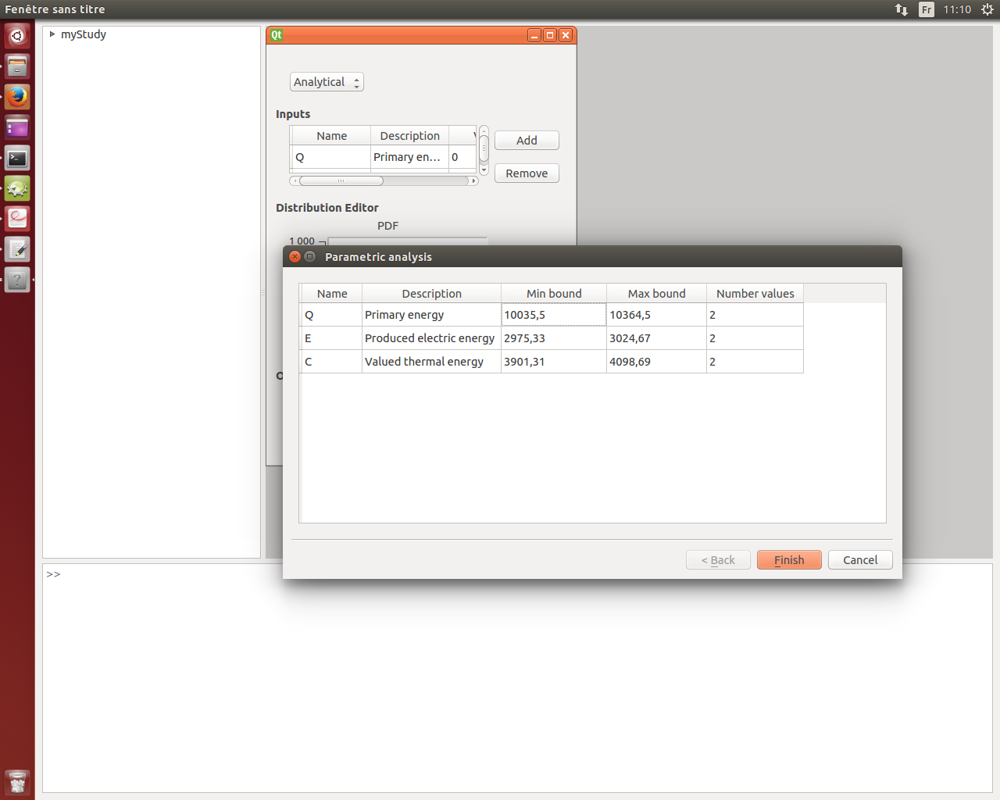
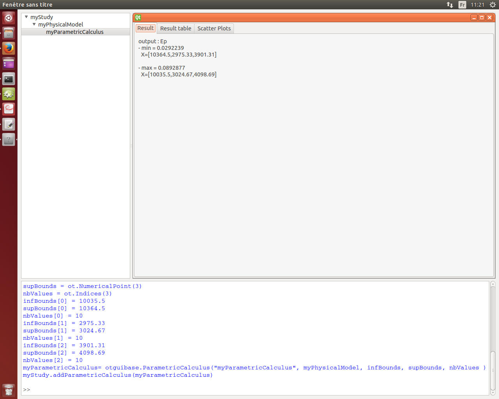
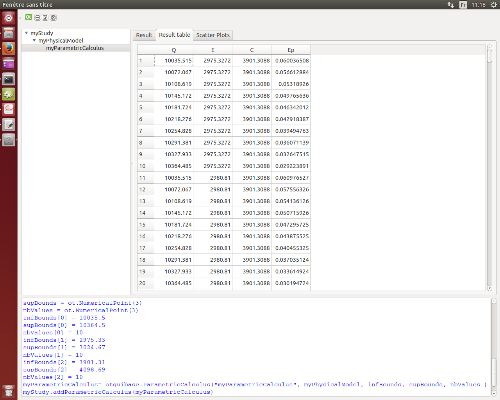
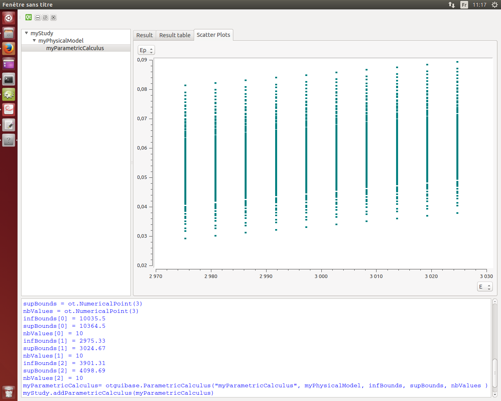

User manual
===========

Interface
---------

1- Create a study
`````````````````

2- Define a physical model
``````````````````````````

There are three ways to define a physical model. This way is chosen thanks to
the combobox which proposes "Analytical", "Python", "XML".

a- "Analytical": define a physical model with analytical formulas
'''''''''''''''''''''''''''''''''''''''''''''''''''''''''''''''''

The first way consists in listing manually all the input and output variables in adding
lines in the two tables "Inputs" and "Outputs".
By default the inputs are deterministic variables equal to 0.



b- "XML": define a physical model with an XML file
''''''''''''''''''''''''''''''''''''''''''''''''''

The second way is to load an XML file, previously generated for example with Salome,
which contains all the data of a deterministic analysis.



3- Realize a parametric analysis
````````````````````````````````

After right cliking on the item of the physical model in the study tree, it is possible to
choose to realize a parametric analysis.
When clicking on this, the following wizard appears:



All the inputs are listed in this table. When they are associated with a distribution
the minimum and the maximum values are computed automatically. The minimum value is the
quantile at the probability of 0.05 and the maximum one is the quantile at the probability of
0.95. The number of used values for each variable is by default 2.








Classes
-------

.. currentmodule:: otguibase

.. autosummary::
    :toctree: _generated/

    OTStudy
    Variable
    PhysicalModel
    Calculus

