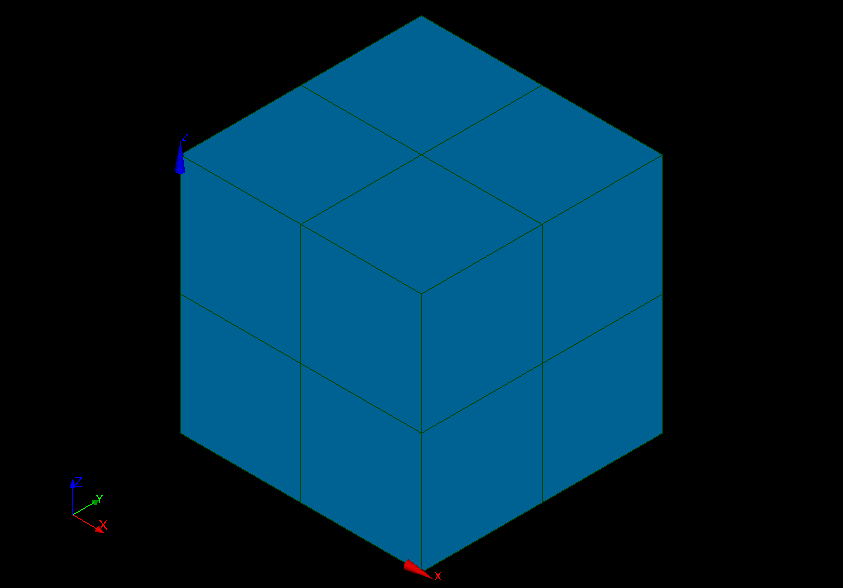

Validation
==========

Test case 1: Cogeneration
-------------------------

The purpose of this example is to check the default values calculated for
the parameters of a parametric analysis. The obtained results must be equal to
the analytical values.

1- Problem statement
````````````````````

a- Inputs
'''''''''

- Stochastics variables:

====== ======================== ==================
 Name  Description              Distribution
====== ======================== ==================
Q      Primary energy           Normal(10200, 100)
E      Produced electric energy Normal(3000, 15)
C      Valued thermal energy    Normal(4000, 60)
====== ======================== ==================

b- Output
'''''''''

Primary energy savings :math:`E_p`

.. math::

    Ep = 1-\frac{Q}{\frac{E}{0.54(1-0.05)}+\frac{C}{0.8}}


2- Deterministic parametric analysis
````````````````````````````````````

a- Inputs
'''''''''

The minimum and the maximum values are computed automatically thanks to
the distribution of the variables. The minimum value is the quantile at the
probability of 0.05 and the maximum one is the quantile at the probability of
0.95. The number of used values per variable is by default 2.

======== ======= ======= ================
Variable Min     Max     Number of values
======== ======= ======= ================
Q        10035.5 10364.5        2
E        2975.33 3024.67        2
C        3901.31 4098.69        2
======== ======= ======= ================

b- Results
''''''''''

======= ======= ======= =========
Q       E       C       Ep 
======= ======= ======= =========
10035.5 2975.33 3901.31 0.0600365
10364.5 2975.33 3901.31 0.0292239
10035.5 3024.67 3901.31 0.0684295
10364.5 3024.67 3901.31 0.037892
10035.5 2975.33 4098.69 0.0812679
10364.5 2975.33 4098.69 0.0511513
10035.5 3024.67 4098.69 0.0892877
10364.5 3024.67 4098.69 0.0594339
======= ======= ======= =========


Test case 2: Gauge
------------------



1- Problem statement
````````````````````

a- Inputs
'''''''''

- Stochastics variables:

====== =========================== =================
Name   Description                 Distribution
====== =========================== =================
conduc Heat conduction coefficient Normal(0.5, 0.01)
====== =========================== =================

b- Output
'''''''''

An average temperature on the superior surface 'temptop'.

2- Analysis
```````````

a- Inputs
'''''''''


b- Results
''''''''''
